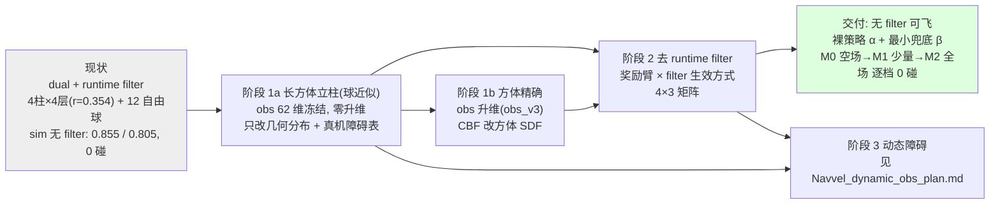

# NavVel CFB 重训指南 —— 阶段 1（长方体立柱）+ 阶段 2（去 runtime filter）

> 版本 2026-09-11 **v2（重构）**。阶段 3（动态障碍）独立成文：`Navvel_dynamic_obs_plan.md`。
>
> **本文结构**
> - **第一部分（本次新增）**：§0 总览与冻结决策、§A 阶段 1 长方体立柱（1a 球近似 / 1b 方体精确）、
>   §B 阶段 2 去 runtime filter（让策略 internalize 安全约束）、§C 统一里程碑与排期、
>   §D 服务器待确认清单、§E 风险与回滚（阶段 1/2）。
> - **第二部分（保留原文，章节号未变）**：§0–§8 真机掉高与速度层诊断、通用训练侧改动、评估协议、
>   导出对拍、真机验收阶梯、服务器待确认、风险回滚。
>   保留原编号是为了不破坏其它文档的交叉引用（`NAVVEL_DEPLOYMENT_PIPELINE.md` §5.8 ↔ 本文 §1.5、
>   `NAVVEL_DEPLOYMENT_RUNBOOK.md` §12 ↔ 本文 §1.1 等）。**阅读时请以"第一部分"为当前计划，
>   第二部分当"真机事实库 + 通用改造清单"用。**
>
> **配套文档**：`NAVVEL_DEPLOYMENT_GUIDE.md`（口径与验收）、`NAVVEL_DEPLOYMENT_RUNBOOK.md`
> （现场手册；§12 = PID 速度层、§14 = 可视化、§15 = 到达交接/几何放宽、§16 = **无 CBF 实飞**）、
> `NAVVEL_DEPLOYMENT_PIPELINE.md`（全链路/频率/指令链；§5.8 = velocity vs full_state 受控实测）、
> `NAVVEL_FLYOVER_PLAN.md`（飞越课程，独立线）。
> **训练仓（不在本工作区）**：`hybrid@10.17.203.52:/home/lz/lzspace/drones/OmniDrones`；
> 本工作区只有部署侧复刻（`navvel/`）+ `server_tools/export_navvel_actor.py`、`server_tools/gen_obstacle_yaml.py`。
> 已确认可用的训练侧符号：`omni_drones/envs/single/nav_vel_obstacles.py::ObstacleManager`
> （`_sample_pillar_mixed` / `_pillar_layer_zs`）、`omni_drones/utils/cbf.py::filter_velocity`。

---

## 0. 总览：三阶段路线与依赖



**建议执行顺序（不要并行改两个变量，见第二部分 §8 原则）**

1. **阶段 1a**：改障碍几何分布（去自由球、底面口径对齐、柱数量/层数/层高/拓扑随机）→ 重训 → 真机方体场地验证。
2. **阶段 2 第一轮**：在 1a 的最终布局上做"奖励臂 × filter 生效方式"矩阵（4×2 → 8 runs），拿到"无 filter 可达"的臂。
3. **阶段 1b**：obs 升维 + 方体 SDF CBF → 重导/重对拍 → 用阶段 2 选出的最优臂复训。
4. **阶段 2 第二轮**：方体精确口径下复验 filter 依赖度 → 真机 N0–N3 逐档 0 碰 → 交付。
5. **阶段 3**：动态障碍（依赖 1a/1b + 阶段 2 的无 filter 成果）。

### 0.1 本次确认的冻结决策（务必先对齐，后续改动走 §D 变更）

| # | 决策项 | 结论 | 影响 |
|---|---|---|---|
| 1 | 方体建模口径 | **分两步**：1a 球近似（obs/CBF 不变）→ 1b 方体精确 | 1a 零升维、零重导；1b 必重导+重对拍 |
| 2 | 方体随机化维度 | 层数/层高、yaw、柱数量与排布（含窄通道、L 形遮挡）；**自由球去除** | 见 §A.3：1a 里 yaw 对策略**不可观测** |
| 3 | 阶段 2 验收 | **分档**：空场 → 少量障碍 → 全场，**逐档 0 碰撞**才交付 | 见 §B.6（N0–N3） |
| 4 | filter 退火 | **两者都做**，作为独立 A/B 因子（always-on vs anneal） | 矩阵 4×3，见 §B.1 |
| 5 | 无 filter 形态 | **两种都报告**：α 裸策略 / β 最小兜底 | 需新增"全关"开关，见 §B.5 #8 |
| 6 | 阶段 3 载体 | 第二架 Crazyflie + 地面移动立柱 + 静态/动态混合 | 见 `Navvel_dynamic_obs_plan.md` §2 |
| 7 | 阶段 3 观测 | 全观测：位置+速度真值 + **恒速外推预测点** | 同上 §3 |
| 8 | 阶段 3 安全层 | 保留 **filter 与无 filter 两条线 A/B** | 同上 §4 |
| 9 | 文档范围 | 仅计划 + 训练侧改动清单（文件级+公式）+ 服务器待确认（可执行命令）+ 里程碑 | 本文与阶段 3 文档同口径 |
| 10 | 本文更新方式 | **重构**：阶段 1/2 为主体，原 §0–§8 降为"第二部分（原版内容，编号未变）" | 本文件 |

---

## A. 阶段 1：长方体立柱（更贴近现场 + 提高多样性与复杂性）

### A.0 现状口径（训练侧可见事实，来自 `server_tools/gen_obstacle_yaml.py`）

```python
# ObstacleManager cfg（run-20260909_191309 口径）
max_slots=8, num_scene=16, radius_choices=[0.2, 0.3, 0.4],
n_pillars=4, pillar_layers=4, pillar_radius=0.354,
pillar_z_lo=0.4, pillar_z_hi=2.6, n_free_obstacles=12,
spawn_xy_range=[[-3,-3],[3,3]], spawn_z_range=[0.6, 2.4], keepout_x=2.5,
drone_radius=0.15, inflation=0.05,
init_clearance=0.15, goal_clearance=0.35, min_gap_between=0.25
```

- `pillar_radius = 0.354 = 0.25·√2` ⇒ 训练里立柱截面 = **0.5×0.5 m 方柱的外接球**。
- 柱层 z 公式（训练/部署同式）：`linspace(z_lo + r, z_hi − r, layers)` = `[0.754, 1.251, 1.749, 2.246]`。
- 现场实体障碍（工作区 v10 记录）：底面 **0.6×0.6 m**、高度可调 ⇒ 外接球 **0.4243**。
  ⇒ **★不一致（0.5 vs 0.6），1a 必须显式决策（§A.3 / §D #1）。**

### A.1 1a：球近似方体（先做，obs 零改动）

**口径**：世界换成"方体障碍"，但**策略看到的仍是外接球**（obs 62 维顺序/缩放不变、CBF 仍球约束、
`export_navvel_actor.py` + `navvel_offline_check.py` 链路不变）。收益 = 真实性与多样性；
成本 = 训练侧采样配置 + 真机障碍表。

**训练侧改动清单（文件级）**

| # | 文件（服务器 `OmniDrones`） | 改动 | 说明 |
|---|---|---|---|
| 1 | `omni_drones/envs/single/nav_vel_obstacles.py::ObstacleManager` | 新增 `n_free_obstacles=0` 开关（或拆出 `_sample_pillars_only`） | 去自由球；`max_slots` 不变 |
| 2 | 同上 `_pillar_layer_zs` | 支持**逐柱独立** `layers / z_lo / z_hi` | 现在是 4 柱同构 ⇒ 要"高度多样性"必须逐柱采样 |
| 3 | 同上 cfg | `pillar_side`（截面边长，默认 **0.6**）替代 `pillar_radius`，`pillar_radius = side·√2/2` 派生 | 对齐真机（§A.3） |
| 4 | 同上 cfg | `n_pillars_range`、`pillar_layers_range`、`z_lo/z_hi_range`、`min_corridor` | 拓扑/高度多样性 |
| 5 | 同上 + 场地生成 | "窄通道 / L 形遮挡"布局模板 | 需配可通行性判据（下） |
| 6 | `omni_drones/utils/cbf.py::filter_velocity` | **不改**（仍是球） | 保住对拍逐字一致 |
| 7 | `cfg/task/*nav_vel*.yaml` | 暴露上述 cfg | A/B 只靠 cfg，不靠改代码 |

> ⚠ **可通行性是硬约束**：去掉自由球 + 引入窄通道后，若通道净宽 < `2·(drone_radius+inflation) + 余量`，
> 任务 **无解**，策略只会学到"绕远/等待"，评估会整体退化。
> 建议：`min_corridor_width ≥ 2·(r_o + drone_radius + inflation) + 0.25 m`；
> 采样后加**可行性检查**（栅格/可见性图连通性，或退化为"起点↔终点存在直线走廊或一次拐弯走廊"）
> 过滤非法布局 —— 复用 `gen_obstacle_yaml.py` 里"起点/终点净空校验"的写法，把校验从净空扩到连通性。

### A.2 1a 的观测与训练口径（保持冻结）

- obs 62 维顺序不变（`navvel_observation.py`）：障碍块 = 最近 `K=8` × `[rpos/5 clip±1, r_o/0.5 clip[0,1]]`。
- **★K=8 的容量风险**：去掉 12 个自由球后，"最近 8 个"可能全落在 1–2 根柱子上（每柱最多 6 层）。
  若层数上限提到 6、柱数 ≥ 3，靠近柱群时"真正相关障碍"可能 > 8 → 两个选项（§D #3）：
  - **(a) 扩 K**：`K=8→10~12`（obs 32→40/48 维）→ **必须重导 + 重对拍**（红线）；
  - **(b) 限制同柱层数**：obs 组装时"同柱最多计入 3 层"（**维度不变**，但要改训练/部署两侧组装逻辑，仍需对齐）。
- `r_o/0.5` 通道：若底面统一为 0.6，该通道**恒为 0.8486**（0.4243/0.5）⇒ **信息量降为 0**（可接受：同类柱）。
  一旦要做"底面尺寸随机"，就必须走 1b（否则策略无法区分障碍大小）。
- `time_encoding` T=1500、动作语义（世界系速度 + 绝对 yaw）、clamp 顺序全部不变。

### A.3 ★两个必须先想清的点：yaw 不可观测、底面尺寸必重训

**(1) yaw 在 1a 里对策略不可观测**
外接球半径与朝向无关，obs 里也没有方体朝向通道 ⇒ **随机 yaw 对 1a 的训练信号零贡献**（对 1b 才有意义）。
所以 1a 的**有效多样性来源只有**：柱数量、柱心位置、层数、层高、场地拓扑。
yaw 可以设（为 1b 铺路/为真机摆放），但**不要指望它提升 1a 的多样性**。
推论：1a 用外接球判定 ⇒ **保守**（球把方体包住，最坏多留 `(√2−1)·side/2 ≈ 0.124 m` @0.6）。
若实飞出现"路径被过度推开 / CBF 介入率虚高"，这正是**转 1b 的信号**。

**(2) 底面 0.5 → 0.6 是 1a 的必做项，不是可选项**

| 选项 | 做法 | 后果 | 评价 |
|---|---|---|---|
| **A（推荐）** | 训练 `pillar_side=0.6`，真机障碍表 `radius=0.4243` | obs 的 `r_o` 通道训练/部署一致（都 0.4243）| 必须重训（现模型没见过 0.4243 的半径通道） |
| B | 训练保持 0.5，真机放 0.6 实体 | ①真机安全余量被压缩 ~0.124 m；②**obs `r_o` 通道训练 0.354 / 部署 0.4243 = 口径不一致（红线）** | ✗ 不推荐 |

### A.4 1a 实验矩阵（单变量递进）

| 组 | 柱数量 | 层数/层高 | 自由球 | 底面 | 期望观察 |
|---|---|---|---|---|---|
| **A0** 复现基线 | 4 固定 | 4 固定 | 12 | 0.5 | 复现 0.891(ON) / 0.855(OFF) |
| **A1** 去自由球 + 口径对齐 | 4 固定 | 4 固定 | 0 | **0.6** | 隔离"去自由球"与"半径口径"的影响 |
| **A2** 高度多样 | 4 固定 | **逐柱 2–6** | 0 | 0.6 | 高度维度泛化 |
| **A3** 拓扑多样 | **2–8** | 逐柱 2–6 | 0 | 0.6 | 布局泛化（含窄通道/L 形） |
| **A4** 推荐交付 | 2–8 | 逐柱 2–6 | 0 | 0.6 | A3 + 可通行性格筛，**≥3 seed** |

### A.5 1a 指标与判据

沿用第二部分 §4 指标表（`arrival@0.50/0.30/0.20`、`hold@0.2(1s)`、`r_min`、`z_err RMSE`、
终端速度、0 碰/0 OOB、CBF 介入率），**新增**：

| 指标 | 定义 | 门槛（建议） |
|---|---|---|
| `arrival@0.2`（A3/A4 新布局） | `r<0.2` 且保持 0.2 s | ≥ 0.85 |
| 0 碰 / 0 OOB | A3/A4 全 seed 全条件 | **必须** |
| CBF 介入率 | 新布局下 | ≤ 现分布（去自由球后应下降） |
| 窄通道通过率 | 对含窄通道布局的成功率 | 记录（回看可通行性约束是否过紧） |
| 路径长度比 | 实际航迹长 / 直线距离 | 记录（判断是否"绕远"） |

### A.6 1b：方体精确建模（1a 达标后再做）

**目标**：obs 知道"这是方体、多大、什么朝向"；CBF/判定改方体 SDF，消除外接球的保守性。

**(1) obs 升维提案（`obs_v3`，必须冻结 + 重导 + 重对拍）**

| 块 | 现在 | 提案（每障碍） |
|---|---|---|
| 静态障碍 | 4 维 `[rpos(3)/5, r_o/0.5]` | **7–8 维**：`[rpos(3)/5, 半尺寸(2~3)/0.6, yaw_sin, yaw_cos]` 或 `[rpos(3)/5, sdf/0.6, 法向(3)]` |

推荐后者（**SDF + 法向**）：与 CBF 用的是同一几何量，训练/部署天然一致，且维度更省。
`K=8` 时障碍块 32 → 56；`K=10` 时 40 → 70（是否扩 K 与 §A.2 同一决策）。

**(2) CBF 改方体（推荐"圆角方体"近似，仍单约束/障碍）**

- 球版：`h_i = ‖Δp_i‖ − r_cbf_i`；方体版：`h_i = sdf_OBB(p) − (drone_radius + inflation + margin)`。
- 关键技巧：`sdf_box⊕sphere`（圆角方体）的零等值面 = 允许位置集合 ⇒ **结构与球版同构**，
  `filter_velocity` 只需把 `dist/n` 换成 `sdf/∇sdf`（分面/棱/角三类梯度），迭代投影与 `alpha` 不动。
- `∇sdf` 有界（单位外法向）→ 数值稳定性与球版同量级，可在 torch 里批量实现。
- 若一定要"多面约束"（每面一个 CBF），约束数 ×6，投影不再是一次解析式 → **不建议 v1 就这么做**。

**(3) 红线**：obs 顺序/缩放、CBF 的 SDF 定义与半径链任一改动 →
必须重跑 `server_tools/export_navvel_actor.py` + `navvel_offline_check.py`（对拍门槛：actor < 1e-5、CBF 0 差），
并在 `navvel_deploy.yaml` / `navvel_obstacles_box.yaml` 同步记录 sha256。

**(4) 部署侧（最小，已有基础设施）**：`navvel_obstacles_box.yaml` 模板 + `*_box` 可视化（v10 已就绪，
含 `box_net` 真实方体净空）⇒ 判定日志**同时报 `d_min`（球口径）与 `box_net`（方体口径）**，两者差值就是保守量。

### A.7 阶段 1 风险与回滚

| 风险 | 表现 | 缓解 |
|---|---|---|
| 窄通道致任务不可行 | 到达率整体下降、策略"等待" | 可通行性格筛 + `min_corridor` 下界 |
| K=8 容量不足 | obs 漏掉最近障碍（**真机安全隐患**） | 扩 K 或限制同柱层数（§A.2） |
| 底面改 0.6 后 `r_o` 通道分布外 | 加载旧模型直接退化 | 1a 必须重训 |
| 外接球保守 | CBF 介入率高、路径被推开 | 记录 `d_min` vs `box_net` 差值，达阈值转 1b |
| 去自由球后几何过"规则" | 策略学到"贴柱飞"（真机柱面更粗糙/有支架） | 真机障碍表加实测余量；必要时 1b 补尺寸随机 |
| 回滚 | — | 训练侧 cfg 入 wandb config；真机保留现 `navvel_obstacles.yaml`(28 球) 作对照；模型 sha256 沿用 runbook 表 |

---

## B. 阶段 2：去 runtime filter（让策略真正 internalize 安全约束）

### B.0 现状基线（必记）

| 臂 | 奖励塑形 | filter ON | filter OFF | 备注 |
|---|---|---|---|---|
| **dual**（当前部署） | `r_cbf` + 动作修正惩罚 | nominal 0.891 / ±20% 0.906 | nominal **0.855** / ±20% **0.805**（0 碰） | ctrlSync-1，**对 filter 依赖最低** |
| filter_only | 仅动作修正惩罚 | 0.941（geo7 空心杯） | — | 旧交付 |
| reward_only | 仅 `r_cbf` | — | — | **待补** |
| naive | 无 | 0.969（阶段一 seed4） | 0.668（**1 碰**） | 高度依赖 filter |
| 备选 ctrlSync-3 | dual | 0.891 | 0.793（1 碰） | — |

**阶段 2 目标**：把"OFF 列"拉到与"ON 列"同档，并让**真机 `--no-cbf` 逐档 0 碰撞**（§B.6）。

### B.1 两个正交因子（决策 #4：都做）

- **F1 奖励塑形臂**（4 档，已存在）：`naive / reward_only / filter_only / dual`
- **F2 训练时 filter 生效方式**（3 档，新增）：`always-on (p=1)` / `anneal (p: 1→0)` / `always-off (p=0)`

> ★**核心设计：把"是否执行 `a_cbf`"与"是否计算 `a_cbf` 用于奖励"解耦**
>
> - `p` **只控制执行**：`a_exec = a_cbf if rand < p else a`；
> - 只要该臂奖励含"动作修正惩罚"，就**始终计算** `a_cbf`（否则 filter_only/dual 在 `p=0` 时没有梯度）。
>
> 于是 `p=0` 也有意义：策略**实际裸奔执行**，却被惩罚"偏离 CBF 建议" ⇒ **软蒸馏 / 无 filter 的模仿**。
> 这正是阶段 2 的核心机制——让策略学会**自己输出已满足约束的动作**（filter 成为恒等映射）。

**矩阵**

- 第一轮：`4 臂 × {p=1, anneal}` = **8 runs**（anneal 用固定的 p 调度，如 1.0→0.0 线性/分段）。
- 第二轮：对 OFF 结果最好的 2 臂补 `p=0` = **+2 runs**。
- 每格 **≥3 seed**；`p=1` 组同时充当"复现基线"。

> ★**PPO 口径警告**：`p>0` 时**实际执行的不是策略采样的动作**（`a_exec = a_cbf(a)`），
> 而 PPO 的似然仍对 `a` 计算 ⇒ 存在"梯度-结果不一致"（等价于 env 内置 action filter）。
> 需要监控并缓解：
> - 监控 `ratio / KL / entropy` 异常，以及 `std(a)` 是否塌缩（策略学会"输出 CBF 不动的小动作"）；
> - 缓解①：`p` 退火与 `clip_range` 同步放宽；
> - 缓解②：加"动作幅度下限"惩罚项，防塌缩成"什么都不做"；
> - 缓解③：`p=1` 与 `p=0` 必须**同 seed 同预算**才可比。

### B.2 奖励项定义（可对拍版本；**以服务器实现为准**，见 §D #7）

记 `Δp_i = p − p_oi`，`d_i = ‖Δp_i‖`，`r_oi` = 训练侧 CBF 球半径（`= r_s + margin`），`h_i = d_i − r_oi`。

**(1) 违反 CBF 约束的惩罚 `r_cbf`**（reward_only / dual）

$$
r_{\mathrm{cbf}} = -\,w_{\mathrm{cbf}}\sum_i \mathrm{relu}(-h_i)^{2}
\quad\text{（+ 可选裕度势能）}\quad
r_{\mathrm{margin}} = -\,w_{h}\sum_i e^{-h_i/\sigma}\ \ \text{或}\ \ -w_h\sum_i \frac{1}{h_i+\varepsilon}
$$

> ★**关键实现建议**：`relu(−h)` 只在**已违反**时给梯度 ⇒ 训练时该项**几乎恒为 0**，
> 等于没有信号。所以**必须配"裕度势能"**（`h>0` 时也给梯度），否则"内化"无从发生。
> 裕度势能把"贴着 CBF 边界飞"改成"留余量"——这对**无 filter 泛化**尤其重要（真机有滞后，
> "贴边界"必撞）。

**(2) CBF 动作修正惩罚**（filter_only / dual）

$$
r_{\mathrm{fix}} = -\,w_{\mathrm{fix}}\,\|a_{\mathrm{cbf}}(a) - a\|_{2}^{2}
\qquad\text{或稀疏版}\qquad
r_{\mathrm{fix}} = +\,w_{\mathrm{id}}\,\mathbb{1}\!\left[\|a_{\mathrm{cbf}}(a)-a\| \approx 0\right]
$$

> 建议**两者叠加**：`L2` 项给连续梯度 + 二值项给强信号（直接奖励"filter 未介入"）。
> `Δa` 与动作同尺度（m/s）：先用与现 run 相同的权重起点（§D #7），再按 §B.4 网格调。

**(3) 调参纪律**
- 权重起点沿用现 run；网格 `{0.5, 1, 2}×`。
- **禁止**与 F2（filter 生效方式）同时调 —— 否则无法归因（第二部分 §8 原则）。

**(4) 不变项**：到达/近场陡化/`z` 误差/终端速度/动作率奖励**全部沿用第二部分 §3.2**，
阶段 2 **只在安全项上做 A/B**。

### B.3 ★训练-部署 CBF 几何一致性（阶段 2 的前提）

| 侧 | `drone_radius` | `inflation` | `margin` | `r_s` | `r_cbf` |
|---|---|---|---|---|---|
| **训练侧**（`ObstacleManager` cfg，2026-09-09 口径） | 0.15 | 0.05 | 0.1 | `r_o+0.20` | `r_o+0.30` |
| **部署侧**（`navvel_deploy.yaml`，2026-09-11 放宽） | 0.10 | 0.02 | 0.05 | `r_o+0.12` | `r_o+0.17` |

含义：**训练时策略被要求留 0.30 m 余量，真机 CBF 只要求 0.17 m**。阶段 2 要"无 filter"，
策略**内化的是训练侧的 0.30**（更严 ⇒ 部署侧会通过，保守安全，但会"过度推开"）。
评估口径必须分清：

- 若用**部署口径**（0.17）算 `d_min`/碰撞 ⇒ **高估**策略安全性；
- **建议同时报两套**：
  - `h_min^train = min_i(d_i − r_cbf^train)` —— 策略是否满足**它被训练约束的那个东西**；
  - `d_min^deploy = min_i(d_i − r_s^deploy)` —— 是否会**撞到实物**。

> ★**决策（§D #2）**：
> - **选项 A（推荐）**：把训练侧放宽到部署口径（0.10/0.02/0.05）⇒ "内化的对象 = 部署的要求"，但要重训；
> - 选项 B：把部署侧收回到训练口径（0.15/0.05/0.1）⇒ 不用重训，但回到"过度保守、路径被推开"的老问题。
> - **推荐 A，并与阶段 1a 的底面 0.6 一起改，一次重训解决两件事**（但注意：几何口径+奖励矩阵要分批做，否则无法归因；
>   建议 **1a 重训时就把几何口径对齐 A**，奖励矩阵留到阶段 2 第一轮）。

### B.4 评估协议（在第二部分 §4 基础上扩展）

**网格**：`{nominal, ±20% DR, DR+滞后/噪声(§3.4)}` × `{filter ON, filter OFF}` × `{4 臂} × {p=1, anneal, p=0}`。
**必须同 goal 分布、同 seed 集**，存 `metrics.json` + 曲线。

新增（阶段 2 专属）指标：

| 指标 | 定义 | 目标（建议交付门槛） |
|---|---|---|
| **filter 依赖度** | `arrival_OFF / arrival_ON`（同 seed 同分布） | **≥ 0.95**（1.0 = 完全不依赖） |
| **修正幅度** | `E‖a_cbf − a‖` p50/p95（filter OFF 时也计算） | 越接近 0 越好（记录趋势） |
| **零介入率** | `1[‖Δa‖ == 0]` 步占比 | ≥ 0.95（filter 基本不动手） |
| `h_min^train` | 全程 `min_i(d_i − r_cbf^train)` | **≥ 0**（策略自身不违反训练约束） |
| `d_min^deploy` | 全程 `min_i(d_i − r_s^deploy)` | 0 碰撞；`≥ 0.10` |
| 0 碰 / 0 OOB | 全条件 | **必须** |

### B.5 训练侧改动清单（文件级）

| # | 文件（服务器） | 改动 | 说明 |
|---|---|---|---|
| 1 | `omni_drones/utils/cbf.py::filter_velocity` | **数学不改**；把"返回值"与"是否应用"分离 | 保住与 `navvel_cbf.py` 的逐字对拍 |
| 2 | env（`nav_vel*.py`） | 控制器层加 `p_filter`（课程调度）：`a_exec = a_cbf if rand<p else a`；把 `a_cbf`、`‖Δa‖` 写入 `info/extras` | 训练/评估同源，指标可直接从 rollout 拿 |
| 3 | reward 实现处 | 加 `r_cbf`（含裕度势能）、`r_fix`（L2 + 二值） | 四臂 = 两个 bool 的组合 |
| 4 | `cfg/task/*nav_vel*.yaml` | `reward.use_r_cbf / use_r_fix / w_cbf / w_fix / w_h`、`filter.p_filter_schedule` | A/B 靠 cfg，不靠改代码 |
| 5 | `scripts/eval.py` | 支持 `filter_mode ∈ {on, off}`，输出 §B.4 全部指标 | 交付门槛 |
| 6 | 评估脚本 | 加"`p=0` 且无任何兜底"的**裸策略**模式 | 对应真机形态 α |
| 7 | `server_tools/export_navvel_actor.py` | obs 不变则无需改；若 §A.2 改 K 或走 1b 则必须改 + 重对拍 | **红线** |
| 8 | 部署侧（最小落地，非本次计划主体） | 新增"全关"开关（`safety.bare: true`：关 accel_limit / 倾角 / z 地板 / OOB abort / yaw 限速 / CBF），只留位姿看门狗 + 软件急停 | 形态 α 需要；形态 β 用现有开关组合即可 |

### B.6 真机验收阶梯（决策 #3：分档，逐档 0 碰撞；决策 #5：两种形态都报告）

**形态定义**
- **β 最小兜底**（先飞）：关掉所有"飞行品质"辅助（CBF / accel_limit / z 地板 / yaw 限速），
  只留 **OOB abort + 位姿看门狗 + 硬件急停**（= 物理安全层）。
- **α 裸策略**（后飞）：连 OOB abort 也关（仅保留手动急停开关）⇒ 需要 §B.5 #8 的 `safety.bare`。

| 档 | 场地 | 命令要点 | 判据 |
|---|---|---|---|
| **N0** 空场 | `navvel_obstacles_empty.yaml` | `--no-cbf --vmax 0.6 --ema 0.3 --yaw-rate 0.8` | 0 碰撞 / 0 OOB / 0 次 abort；到达精度按第二部分 §1.4 口径 |
| **N1** 单柱 | 1 根方柱（实测中心，`radius=0.4243`） | 同上 | 0 碰撞；`min d_min ≥ 0.10` |
| **N2** 少量 | 方体版 `few` 模板 | 同上 | 0 碰撞 |
| **N3** 全场 | 现场方体全布置 + `*_box` 可视化 | 同上，逐步把 `--vmax` 提到 1.0–1.2 | 0 碰撞 + 到达率 ≥ 0.8（≥20 次） |

**记录方式**：每档 5 次 × 2 形态，沿用 runbook 的 A/B 记录表（goal / cmd_mode / vmax / ema / yaw-rate /
`min r_goal` / 终端 `|r|` / `z` 偏差 / `min d_min` / `box_net` / CBF 次数 / abort 次数 / tilt max）。

> ⚠ **禁止**：真机上第一次就试形态 α。先 β 过 N0–N2，再测 α。
> ⚠ 无 CBF 时 `abort_margin_no_cbf_m` 必须有效（当前配置 **0.02**，建议 N1 起用 0.10–0.12，见 §D #14）。
> 现成开关：`--no-cbf`（或 `use_cbf:false`）、`--vmax`、`--ema`、`--yaw-rate`、
> `--arrive-radius 0.15 --on-arrival continue`（评估终端精度别用 `land`）。

### B.7 阶段 2 里程碑与卡点

| 里程碑 | 产出 | 卡点 |
|---|---|---|
| M2.0 | §D 清单填完（服务器现状确认） | **没填完不许开训**（避免改错地方） |
| M2.1 | 几何口径决策落定（§B.3 / §D #2） | 未定 ⇒ 阻塞整个阶段 2 |
| M2.2 | 8 臂 + 3 seed 训练完成，选型（filter 依赖度 ≥ 0.95） | 训练预算未定（§D #12） |
| M2.3 | sim 全条件 0 碰 + `h_min^train ≥ 0` | — |
| M2.4 | 真机 N0–N3 **β 形态**逐档 0 碰 | 现场障碍需实测中心/尺寸 |
| M2.5 | 真机 **α 形态** 0 碰 ⇒ 交付"无 filter"模型 | 依赖 §B.5 #8 |

---

## C. 统一里程碑与排期（阶段 1 + 阶段 2）

| 序 | 里程碑 | 依赖 | 可否并行 | 阻塞项 |
|---|---|---|---|---|
| 1 | **§D 清单填完** | — | — | 训练仓权限/路径确认 |
| 2 | 几何口径决策（底面 0.6；CBF 半径训练=部署） | 1 | — | §D #1/#2 |
| 3 | 1a A0/A1 复现 | 2 | — | K=8 容量决策（§D #3） |
| 4 | 1a A2/A3/A4 达标（≥3 seed） | 3 | — | 可通行性格筛未实现 |
| 5 | 1a 真机方体场地 0 碰 | 4 | 与 6 部分并行 | 现场障碍实测 |
| 6 | 阶段 2 第一轮 8 臂 + 选型 | 2、4 | 与 5 并行 | 训练预算 |
| 7 | 阶段 2 sim 达标（依赖度 ≥0.95、`h_min^train ≥ 0`） | 6 | — | — |
| 8 | 真机 N0–N3（β → α）**逐档 0 碰** | 5、7 | — | — |
| 9 | 1b：`obs_v3` + 方体 SDF CBF + 对拍通过 | 5 | **可与 6–8 并行** | obs 升维冻结 |
| 10 | 阶段 2 第二轮（方体精确口径复验 + 交付） | 9 | — | — |
| 11 | 阶段 3 动态障碍（`Navvel_dynamic_obs_plan.md`） | 8、10 | — | 动态障碍硬件/第二架机 |

**总原则**：一次只改一个变量（几何分布 ≠ 奖励 ≠ DR ≠ obs 维度）；每个里程碑都产出
**可复现的 run 记录（wandb run id + sha256 + cfg 快照）**，写入 `NAVVEL_DEPLOYMENT_RUNBOOK.md`。

---

## D. 服务器待确认清单（阶段 1/2；填完再开训）

```bash
ssh hybrid@10.17.203.52
cd /home/lz/lzspace/drones/OmniDrones

# ① 障碍管理：采样逻辑 / cfg 键名 / 层高公式
grep -rn "class ObstacleManager" -A 20 --include=*.py omni_drones
grep -rn "_sample_pillar_mixed\|_pillar_layer_zs\|n_free_obstacles\|pillar_radius\|max_slots" \
     --include=*.py --include=*.yaml . | head -40

# ② reward：四臂实现位置、r_cbf / 动作修正惩罚的确切定义与权重
grep -rn "r_cbf\|cbf_penalty\|correction\|use_r_fix\|use_r_cbf\|reward" \
     --include=*.py omni_drones/envs/single | head -60
sed -n '1,120p' omni_drones/envs/single/nav_vel*.py

# ③ filter 层：是否已有"概率生效/课程调度"的钩子
grep -rn "filter_velocity\|CBFVelocityFilter\|use_filter\|p_filter\|anneal" \
     --include=*.py omni_drones | head -40
sed -n '1,80p' omni_drones/utils/cbf.py

# ④ obs 组装（62 维顺序、K、缩放、和 whether r_o 用逻辑半径）
grep -rn "_compute_state_and_obs\|obs_dist_norm\|obs_radius_norm\|regroup\|K_slots" \
     --include=*.py --include=*.yaml omni_drones cfg | head -40

# ⑤ DR / ctrlSync
grep -rn "controller_sync_dr\|randomization\|inertia\|t2w\|f2m" --include=*.py --include=*.yaml . | head -40

# ⑥ 评估脚本的指标定义
grep -rn "arrival\|arrive\|success" --include=*.py scripts/eval.py scripts/test_algo.py | head -40

# ⑦ 训练预算与历史 run
ls scripts/wandb/ | tail -40
cat scripts/wandb/run-20260909_191309-hpzc2m3r/files/wandb-metadata.json 2>/dev/null | head -40
```

| # | 待确认 | 现状/推断 | 填 |
|---|---|---|---|
| 1 | **底面尺寸决策**：训练 `pillar_side` 是否改 0.6（A 方案）/ 真机 `radius` 是否改 0.4243 | 训练 0.354（=0.5 方柱）/ 现场 0.4243（=0.6 方柱） | |
| 2 | **CBF 半径口径决策**：训练侧是否放宽到 `0.10/0.02/0.05`（A）/ 部署侧收回（B） | 训练 `r_o+0.20 / r_o+0.30`；部署 `r_o+0.12 / r_o+0.17` | |
| 3 | **K=8 容量**：扩到 10/12（重导）还是"同柱最多 3 层"（不改维度） | `max_slots=8` | |
| 4 | 柱数量/层数/层高随机范围（`n_pillars_range` 等） | 4 / 4 / 固定 z_lo,z_hi | |
| 5 | 自由球是**彻底移除**，还是留少量作 DR 噪声 | `n_free_obstacles=12` | |
| 6 | yaw 是否在训练侧真的随机（1a 无观测效应，是否只为 1b 铺路） | 无 yaw 通道 | |
| 7 | `r_cbf` / 动作修正惩罚的**确切定义与权重**（是否含裕度势能） | 待查（§B.2 给了建议式） | |
| 8 | 四臂在服务器上的实现方式（两个 bool？独立 cfg？四份代码？） | 推断为 cfg 开关 | |
| 9 | 现有 DR 与 `controller_sync_dr` 实现位置与范围 | ±20% inertia/t2w/f2m | |
| 10 | 是否已有"filter 概率生效 / 课程调度"基础设施 | 推断无 | |
| 11 | `scripts/eval.py` 是否支持 filter ON/OFF 双口径 | 推断只报一种 | |
| 12 | 训练预算（num_envs / 步数 / seed / GPU 数） | 阶段二曾 3 seed × 20M | |
| 13 | 评估是否能导出"每步 `‖Δa‖`、`h_min`"（做 §B.4 指标） | 推断需加 | |
| 14 | 真机 `abort_margin_no_cbf_m` 是否由 0.02 提到 0.10–0.12 | `0.02`（v9 曾被改小） | |
| 15 | 「飞越课程」是否与本阶段并行（`NAVVEL_FLYOVER_PLAN.md`） | 独立线 | |

---

## E. 阶段 1/2 风险与回滚（汇总）

| 风险 | 触发条件 | 后果 | 缓解 / 回滚 |
|---|---|---|---|
| 变量耦合导致无法归因 | 同时改几何+奖励+DR+K | 全部结果不可解释 | 严格单变量；cfg 快照 + run id 入 runbook |
| 训练/部署几何口径不一致 | §B.3 未决策 | "内化的东西" ≠ "部署要求" | 先决策后训练；评估报**两套口径** |
| `relu(−h)` 无梯度 | `r_cbf` 只有违反项 | 该项形同不存在 | 加裕度势能（§B.2） |
| PPO 梯度-结果不一致 | `p>0` 时执行 `a_cbf` | KL/entropy 异常、动作塌缩 | 监控 + `clip_range` 同步；动作下界惩罚 |
| 策略学"等待/不动" | 动态障碍 + 静态窄通道都可能 | 到达率虚高、任务失败 | 时间惩罚 + 最小推进奖励 + stall 占比指标 |
| obs 漏障碍 | K 不变而障碍变密 | **真机安全隐患** | 扩 K 或限同柱层数；对拍必须过 |
| 真机过度保守 | 外接球 + 训练口径 0.30 | 路径被推开、介入率虚高 | 走 1b / 对齐口径 A |
| 回滚路径 | — | — | ①模型：`navvel/model/` 保留上一版 `navvel_actor.ts`（改名备份）+ sha256；②配置：真机保留 28 球 `navvel_obstacles.yaml` 对照模板；③代码：训练侧 cfg 全部入 wandb config |

---

# 第二部分：真机诊断与通用训练改造（原版内容，章节号未变）

> 保留原 §0–§8 的编号与文字，供交叉引用（`NAVVEL_DEPLOYMENT_PIPELINE.md` §5.8 ↔ 本文 §1.5、
> runbook §12 ↔ 本文 §1.1 等）。**这一部分回答"真机为什么掉高/为什么停不住"以及通用改造清单**，
> 与第一部分的阶段 1/2 计划互补。


## 0. 结论摘要（先看这段）

1. **PID 控制器不需要继续大改**。本次（`navvel_flight_20260910_170437.json`，velocity 模式）
   z 速度跟踪误差 p50 仅 `0.048 m/s`、有符号偏差 `+0.005 m/s`；水平跟踪的差距主要是
   **滞后**（不是静差）。2026-09-11 受控实测把滞后分解为 **执行段（指令→动捕运动）0.19–0.33 s**
   与 **EKF 速度估计段（动捕运动→`stateEstimate.v`）0.36–0.50 s**，obs 口径合计 **≈0.6–0.8 s**
   （§1.5 / PIPELINE §5.8）。属真机动力学与估计器带宽，不是标定错误。
2. **掉高是策略自己发的指令**：前 3 s `action[2]` 均值 `-0.116 m/s`，实测 `vel_w.z` 与之一致
   （见 §1）。固件 PID 忠实执行了它，所以 `thrustBase=35627` 没有算错。
3. **到达精度上限来自训练口径**：`arrive_radius=0.5 m` + 到达即 `land` 的评估方式，本身就
   不允许"更准"被观测到；训练里的 success/终止阈值是同一量级。**要更准必须从训练下手**（§3）。
4. 在开训之前，先花 30 分钟做 §2 的**三个零成本实验**，把"现状精度"量化出来，
   否则无法判断重训收益与目标。

---

## 1. 现状证据（真机数据，可作为重训基线）

### 1.1 本次 velocity 飞行（空场，goal=(2.0,0.5,1.0)，`--vmax 0.8`）

| 指标 | 值 |
|---|---|
| 起始悬停高度 / 最低高度 | 0.514 m / **0.167 m**（step 320，贴近 `z_min=0.15`） |
| 前 3 s `action[2]`（策略原始垂直动作） | 均值 **-0.116** |
| 下降段 z：指令 vs 实测 | cmd -0.094 / meas -0.089 m/s，有符号误差 **+0.005**，\|err\| p50 **0.048** |
| 爬升段 z：指令 vs 实测 | cmd +0.302 / meas +0.262 m/s |
| z 跟踪互相关 | lag **240 ms**，corr 0.777（lag0 0.728） |
| 水平跟踪滞后 | x/y 最佳互相关都在 lag **240 ms**（lag0 corr 仅 0.20/0.28） |
| 水平有符号偏差（下降段） | x -0.172 m/s、y -0.050 m/s |
| 到达（r≤0.5） | step 583，**min r_goal = 0.212 m** @step 631，随后 `--on-arrival land` |
| 到达时高度 / 目标高度 | 0.752 m / 1.00 m（终端仍差 0.25 m） |
| CBF 介入 | **0 次**（空场，符合预期） |
| 姿态 / 位姿时延 | tilt max 14.6°，pose age ≤ 49 ms |

> 注（2026-09-11 复核）：表中“240 ms”的量级与本次复核的**执行段**（指令→动捕运动，0.19–0.33 s）
> 一致，但它**不含** EKF 速度估计段（0.36–0.50 s）。若参考量是 `stateEstimate.v`（即 obs 口径），
> 合计滞后 **≈0.6–0.8 s**。分解方法与数据见 §1.5 / PIPELINE §5.8。

### 1.2 对照：full_state（Mellinger）成功那版 `navvel_flight_20260910_114208.json`

z 由 Mellinger 外环（位置+速度前馈）闭环，**高度不依赖策略的 vz 偏置** → z 稳定在 0.95~1.08，
`min r_goal = 0.15 m`。这说明：
**同一个策略，在速度层会暴露垂直通道偏置，在位置层被外环兜住。**

### 1.3 由上推出的两条重要结论

- 策略的 `action[2]` 在真机上表现为"**稳态约 -0.1 m/s 的下压偏置**"（而在末段接近目标时能给出
  +0.2~+0.3 的爬升），属于**训练/仿真侧垂直口径与真机不一致**，不是随机噪声。
  → 部署侧可用 `vel_z_assist_kp` / `z_floor_m` 兜底（§6），但**根治要在训练侧**（§3.2/§3.4）。
- 真机滞后分两段（§1.5）：**执行段 0.19–0.33 s** + **EKF 速度估计段 0.36–0.50 s** = obs 口径 **≈0.6–0.8 s**。
  训练侧若按“理想速度跟踪”训，策略天然做不到精细停点（且 obs 的速度通道本身就滞后 ~0.4–0.5 s）。
  → 把**执行延迟 + 速度估计滞后**都写进仿真随机化（§3.4）是提升终点精度的关键一步。

### 1.4 ★现状校正（`navvel_flight_20260911_102817.json`，2026-09-11）

**策略"到得准"，但"停不住"**：

| 量 | 值 |
|---|---|
| `min r_goal` | **0.031 m**（step 925） |
| 在 0.03~0.045 m 区间的持续 | 约 1 s（step 919~930） |
| `r_goal < 0.15 m` 的采样点 | 145 / 861 |
| 末段 40 个采样 | 均值 **0.233 m**（min 0.195 / max 0.248） |

结论：训练侧的**首要缺口不是"到达精度"，而是"到达后保持"**——目标点没有保持激励，
策略靠近后会再次游走（无终态 attractor）。因此：

- 部署侧：在 `r < 0.15 m` 时用**平滑保持**（`--arrive-radius 0.15 --on-arrival hold`，
  保持点已改为到达时的实测位置，见 runbook §15.1）就能钉在 3~5 cm，不需要重训；
- 训练侧：把重点放在**终端抑制**上（§3.2 的 hold 条件 + 终端速度惩罚 + 近场静止奖励），
  而把 success 半径收紧（§3.1）当次要项。

### 1.5 ★受控对照：velocity vs full_state（2026-09-11，同一模型）

同模型（`sha256 3eb8008e…`）、同 `goal [2.5,0.5,1.0]` / `vmax 1.0` / `ema 0.3` / `yaw-rate 0.8` /
11 障碍 / 1600 步，**唯一变量 `cmd_mode`**（起飞点差 4 cm）：
velocity = `..._172526`（PID），full_state = `..._170407`（Mellinger）。完整表见 PIPELINE §5.8。

| 观测 | velocity | full_state | 与训练相关的读法 |
|---|---|---|---|
| 速比（实测/指令速度 p50） | **0.97** | **0.40** | 训练假设 `controller_sync_dr=true`（理想跟踪）；真机 full_state 的 `v_sent` 只是前馈（参考是被 leash 限位的 `p_set`），速度指令未被直接执行 |
| `z` 均值 / std | 0.976 / 0.211 m | 0.875 / 0.289 m | full_state 由 Mellinger 外环兜住竖直偏置（§1.2） |
| tilt p50 / max | 9.8° / 22.6° | 4.0° / 13.9° | velocity 下策略更激进（无外环抑制） |
| `min r_goal` | 0.045 m | 0.281 m | **单次对照，不足以下结论**；到达/保持缺口仍以 §1.4 为准 |
| 感知延迟 `age_ms` p50 | 6.7 ms | 8.4 ms | 两模式同量级 |
| yaw 跟踪滞后 | 0 ms | 0 ms | 上位机航向环本身无滞后 |

**滞后分解（velocity，指令→参考）**：`指令→动捕运动` x230 / y270 / z190 ms
＋ `动捕运动→EKF 速度` x430 / y460 / z420 ms ＝ `指令→EKF` 合计 x690 / y740 / z635 ms。
即 **obs 里的速度比执行器真实运动晚 ~0.4–0.5 s**（`..._170437` 复核为 0.19–0.33 s + 0.36–0.46 s）。

---

## 2. 开训前：三个零成本实验（先量化，再决定改什么）

全部用现成节点，不需要训练。目的：得到 **arrival@r 曲线** 与 **高度偏置大小**。

```bash
source /opt/ros/foxy/setup.bash
source ~/workspace/crazyswarm_simpleflight_foxy_ws/install/setup.bash
cd ~/workspace/crazyswarm_simpleflight_foxy_ws/src/crazyswarm_SimpleFlight/crazyflie_examples
```

**E1｜测"真实终端精度"**（关键：不要用 `land`，否则一进 0.5 m 就降落，看不到收敛）

```bash
python3 -m crazyflie_examples.navvel.navvel_deploy \
    --obstacles navvel_obstacles_empty.yaml \
    --goal 2.0,0.5,1.0 --start -2.0,0,0.0 --steps 1200 \
    --arrive-radius 0.15 --on-arrival continue \
    --vmax 0.8 --ema 0.4 --yaw-rate 1.0
# 读日志: min r_goal / 最后 1 s 的 |r_goal| 均值 / 终端速度 / z 稳态偏差
```

**E2｜测高度偏置能否被辅助修正**（只在 velocity 模式有意义）

```bash
# 在 navvel/config/navvel_deploy.yaml 里设 vel_z_assist_kp: 0.4（或用 --cmd-mode velocity）
python3 -m crazyflie_examples.navvel.navvel_deploy \
    --obstacles navvel_obstacles_empty.yaml \
    --goal 2.0,0.5,1.0 --start -2.0,0,0.0 --steps 1200 \
    --cmd-mode velocity --allow-unsafe-velocity \
    --vmax 0.8 --ema 0.4 --yaw-rate 1.0 --on-arrival land
# 对比 §1.1: z 是否不再掉到 0.2 m 以下; [warn] z<z_floor 是否还出现
```

**E3｜换更接近训练口径的 throttle 观测**

```yaml
# navvel/config/navvel_deploy.yaml
obs:
  throttle_mode: "motor_log"    # 用真实 motor.m1req..m4req 代替常数 0.55
```
再跑 E1 同一条命令，对比 `action[2]` 前 3 s 是否仍为负偏置。
**若负偏置消失** → 说明策略高度行为依赖真实执行器反馈，训练/部署必须统一 throttle 口径。

> 记录格式建议（写进 `saveflight/` + 本文件附录）：goal、cmd_mode、vmax/ema/yaw-rate、
> min r_goal、终端 \|r\|(最后 1 s 均值)、终端速度、z 偏差均值、CBF 次数、tilt max。

---

## 3. 训练侧改动清单（按性价比排序）

> 服务器仓库：`/home/lz/lzspace/drones/OmniDrones`（`hybrid@10.17.203.52`）。
> 任务文件：与 `nav_vel` 相关的 task/env（部署侧复刻自它的 62 维 obs 与 CBF 口径）；
> 待确认项见 §7 —— **下列参数名请以服务器代码为准**。

### 3.1 成功阈值与终止条件（最高优先级，改动最小）

| 项 | 现在（推断） | 改成 | 理由 |
|---|---|---|---|
| 到达/success 半径 | 0.5 m | **0.2 m**（评估再补 0.15/0.3 曲线） | 训练不要求，策略就没动机更准 |
| 终止条件 | `r < 0.5` 即 done | `r < 0.2` **且连续 k=20 步(0.2 s)** 才算 success | 消掉"擦边过线即结束" |
| 超时 | T=1500 (15 s) | 保留，但**近场单独给预算**（见 3.5） | 末端精修需要时间 |

### 3.2 奖励项（把"精度"和"高度"写进目标函数）

建议在现有 reward 基础上叠加（权重为起点值，需用 §4 的评估网格调）：

| 目的 | 项 | 公式（建议） | 权重起点 |
|---|---|---|---|
| 接近目标 | 距离势能 | `- w_d * r_pos` （保留现有） | 现状 |
| **近场精修** | 近场陡化 | `- w_near * r_pos * 1[r<0.6]` | w_near ≈ 1.0 |
| **终端精度** | 成功率 bonus | `+ R_succ * 1[r<0.2 且持续 20 步]` | R_succ ≈ 50（按 episode 归一化） |
| **高度保持** | 竖直误差 | `- w_z * \|z - z_goal\|` | w_z ≈ 1.0 |
| **竖直速度** | 抑制掉高 | `- w_vz * vz²` | w_vz ≈ 0.1 |
| **终点静止** | 终端速度 | `- w_vt * \|\|v_xy\|\| * 1[r<0.3]` | w_vt ≈ 0.5 |
| 平滑 | 动作率 | `- w_s * \|\|a_t - a_{t-1}\|\|²`（若已有则调权重） | w_s ≈ 0.02 |
| 安全 | 碰撞/越界 | 保留现有终止惩罚 | 现状 |

要点：**`- w_z * |z - z_goal|` 是本次掉高问题的直接解**。当前 obs 里只有 `rpos`（goal−pos，含 z 分量）
且被 `/5` 缩放后仅 ~0.1 量级，策略对高度的敏感度天然很低；显式奖励项（并可把 z 误差单独放大，见 3.3）
才能把"高度"变成一等公民。

### 3.3 观测/动作口径冻结（防"训得好、机上不对"）

1. **动作定义写进文档并冻结**：`a = [vx, vy, vz, yaw]`，其中
   - `vx, vy, vz` = **世界系速度 (m/s)**（部署侧即 `send_velocity_world_setpoint` / `FullState.vel`）；
   - `yaw` = **绝对朝向**（部署侧转成 yaw-rate 闭环），范围与裁剪写清楚。
   - 本次真机数据已证明该语义在真机上自洽（z 指令与实测 vz 一致）→ **不要改语义**，改了部署侧要重做对拍。
2. **scale 一致性**：真机 `action[0]`（前向）长期饱和到 10×于 y/z，部署侧靠"模长 clamp"落到 `v_max`。
   请在训练里明确 **per-axis clamp 还是模长 clamp**，并让部署侧完全一致（当前部署：分量 clamp → CBF → 模长 clamp）。
3. **throttle obs**：训练用的执行器反馈必须能在真机拿到（`motor.m*req`）。
   若训练用的是"理想 thrust"，部署侧常数 0.55 就会造成 §1.3 的偏置 → 统一口径（E3 验证）。
4. **obs 维度/顺序冻结**：62 维顺序见 `navvel_observation.py`；**任何顺序/缩放改动都必须重新跑
   `server_tools/export_navvel_actor.py` 导出 + `navvel_offline_check.py` 对拍**（见 §5）。

### 3.4 域随机化（DR）：把真机的"不完美"训进去 ← 提升终点精度的关键

现有 DR（±20% inertia / t2w / f2m + `controller_sync_dr=true`）只覆盖参数偏差。建议增加：

| 随机化项 | 范围 | 模拟对象 |
|---|---|---|
| **速度环一阶滞后（执行段）** | τ ∈ [150, 350] ms（实测 0.19–0.33 s） | 指令→实际运动（PID/Mellinger 带宽） |
| **速度估计滞后（EKF）** | τ_e ∈ [300, 600] ms（实测 0.36–0.50 s） | `stateEstimate.v` → obs 速度通道 |
| **竖直推力偏置** | hover thrust ±10%（即 `thrustBase` 误差） | §1.3 的掉高根因 |
| **位姿/速度延迟** | 40–80 ms + 1% 丢帧 | 动捕 + ROS 链路（实测 pose age ≤49 ms） |
| 速度噪声/偏置 | EKF 速度噪声 σ≈0.05 m/s、偏置 ≤0.05 m/s | stateEstimate |
| 姿态噪声 | roll/pitch 0.5–1° | EKF/振动 |
| 风/推力扰动（可选） | 水平力 ±0.05 N，慢变 | 室内气流 |

实现方式：在 `controller_sync_dr` 那一层加**一阶滞后滤波器 + 偏置**（对速度指令/推力），
并把 throttle obs 从“指令值”改为“经过滞后+偏置后的实际值”；**obs 的速度通道还要再过一道 EKF 滞后**
（执行段 τ 与估计段 τ_e 分开设参，见上表），与真机日志口径一致（§1.5）。

### 3.5 课程学习（curriculum）

1. 高度固定（z_goal = 1.0，起点 z 一致）→ 先学 XY 精确到达；
2. 放开高度误差（z_goal ∈ [0.6, 1.4]、起点 z ∈ [0.4, 0.8]）→ 学高度调节；
3. 障碍：无 → navvel_obstacles_few（3 短柱）→ 28 球；
4. 到达半径：0.5 → 0.3 → 0.2（每阶段达标再收紧）；
5. 目标点分布：先固定在场地中央区域（与真机场地一致），再扩到全场。

### 3.6 训练规模与选型

- 至少 **3 个 seed**；选型**以 §4 的新指标为准**（旧的 arrival@0.5 会掩盖精度差异）；
- 早停看 `arrival@0.2 + hold@0.2(1s) + 0 碰`；
- 记录每次 run 的 sha256 与配置到 `NAVVEL_DEPLOYMENT_RUNBOOK.md`。

### 3.7 建议实验矩阵（A/B，逐个变量）

| 组 | success 半径 | 近场项 | z 奖励 | 滞后 DR | 期望观察 |
|---|---|---|---|---|---|
| A（基线） | 0.5 | — | — | — | 复现 arrival@0.5≈0.89，arrival@0.2 低 |
| B | **0.2** | — | — | — | arrival@0.2 上升，可能终点抖动 |
| C | 0.2 | ✔ | — | — | 抖动下降，r_min 变小 |
| D | 0.2 | ✔ | **✔** | — | 高度偏差显著下降 |
| E | 0.2 | ✔ | ✔ | **✔** | 真机迁移最好（推荐交付） |

---

## 4. 评估协议（必须与部署口径一致）

1. **口径**：`+task.controller_sync_dr=true`（= 真机固件自标定语义），不可省。
2. **三种条件**分别报告：
   - nominal；
   - DR ±20%（现有）；
   - **DR + 滞后/噪声**（§3.4 新增，对应真机）。
3. **指标表（每次评估都出这张表）**：

| 指标 | 定义 | 目标（交付门槛，建议） |
|---|---|---|
| `arrival@0.50` | r<0.5 且保持 0.2 s 的比例 | ≥ 0.95（现状 0.891） |
| `arrival@0.30` | 同上 | ≥ 0.90 |
| **`arrival@0.20`** | 同上 | **≥ 0.85** |
| `hold@0.2(1s)` | 进入 0.2 m 后 1 s 不越出 | ≥ 0.80 |
| `r_min` p50 / p95 | 全程最小距离 | p50 ≤ 0.10 m |
| `z_err` RMSE | 全程 \|z−z_goal\| | ≤ 0.10 m |
| 终端速度 | 最后 0.5 s \|v_xy\| | ≤ 0.15 m/s |
| 碰撞 / OOB | 全程 | **0 / 0** |
| 速度实现比 | 实测 \|v_xy\| / 指令 \|v_xy\|（p50） | 记录（真机 velocity 0.97 / full_state 0.40，§1.5） |
| CBF 介入率 | `filter` 修正量 >0 的步占比 | 记录（不算失败） |

4. **评估必须用同一 goal 分布 + 同一 seed 集**，并保存 `metrics.json` + 曲线，便于跨 run 对比。

---

## 5. 导出与真机一致性检查（沿用现有工具，勿新写）

```bash
# ① 服务器导出 TorchScript + 测试向量(含 CBF 对拍)
python3 server_tools/export_navvel_actor.py --ckpt <新 checkpoint> --out navvel_actor.ts

# ② 传回 NUC 后先离线验收(NUC, 无硬件)
python3 -m crazyflie_examples.navvel.navvel_offline_check
#   门槛: actor 复现误差 < 1e-5; CBF 相对服务器 0 差; obs/layout 用例全 PASS
```

**红线**：obs 顺序/缩放、动作语义、CBF 参数任一改动 → 必须重新导出+重新对拍，并在
`navvel_deploy.yaml` / `navvel_obstacles.yaml` 里同步记录；模型 sha256 写入 runbook。

---

## 6. 真机验收阶梯（配本次新增的兜底开关）

| 阶段 | 命令要点 | 判据 |
|---|---|---|
| M0 线缆/悬停 | `--takeoff-only` | 高度 1.0±0.1 m，无抖动 |
| M1 空场直线（**精度基线**） | `--arrive-radius 0.15 --on-arrival continue --vmax 0.8` | 记录 min r_goal、终端速度、z 偏差 → 填 §2 表格 |
| M2 空场到点（新模型） | 同上 | `arrival@0.2` 实机复现 ≥ 0.8；CBF 0 次 |
| M3 少量矮障碍 | `--obstacles navvel_obstacles_few.yaml` | 0 碰、r_min ≥ 0.25 m |
| M4 28 球全场 | `NAVVEL_PARSE_ONLY=1` 先查净空，再实飞 | 0 碰、到达率 ≥ 0.8（20 次） |

兜底开关（本次新增，见 `navvel_deploy.yaml`）：

- `safety.z_floor_m: 0.35` / `safety.z_floor_climb_mps: 0.3`
  —— 低于 0.35 m 强制爬升，防策略垂直偏置把飞机压到 `z_min=0.15`（本次实测最低 0.167 m）；
  终端会打印 `[warn] z=.. < z_floor=..`，日志 meta 记录 `z_floor_interventions`。
- `vel_z_assist_kp` / `vel_z_assist_max`：仅 velocity 模式，把 vz 往 `goal[2]` 拉（默认 0=关）。
- `--arrive-radius`：评估终端精度时覆盖到达圈（默认 0.5 m）。

> 主路线仍是 `cmd_mode: full_state`（Mellinger，高度由外环兜住）；
> velocity+PID 仅用于"裸跟踪"对照与本文的偏置诊断。

---

## 7. 服务器代码待确认清单（拿到数字后填进 §3）

```bash
ssh hybrid@10.17.203.52
cd /home/lz/lzspace/drones/OmniDrones
# ① 任务/环境文件（reward、阈值、动作语义）
grep -rn "arrive\|success\|threshold" --include=*.py omni_drones/envs | head -30
grep -rn "filter_velocity\|vmax\|v_max" --include=*.py --include=*.yaml . | head -30
# ② 动作 → 低层控制器映射（世界系/机体系、是否 per-axis clamp）
grep -rn "controller_sync\|velocity_command\|setpoint" --include=*.py omni_drones | head -30
# ③ 上次交付 run 的配置（复盘基线）
ls scripts/wandb/run-20260909_191309-hpzc2m3r/files/
cat scripts/wandb/run-20260909_191309-hpzc2m3r/files/wandb-metadata.json 2>/dev/null | head -40
# ④ DR 配置与 ctrlSync 开关
grep -rn "controller_sync_dr\|randomization\|dr_" --include=*.yaml --include=*.py cfg omni_drones | head -30
```

需要落表的量（填好本节再开训，避免"改错地方"）：

| # | 待确认 | 现状值 | 填 |
|---|---|---|---|
| 1 | task/env 文件路径（62 维 obs 定义处） | ? | |
| 2 | success/arrival 阈值常量名与值 | 推断 0.5 m | |
| 3 | 现有 reward 项名与权重（含是否有动作率项） | ? | |
| 4 | 动作定义与 clamp 顺序 | 推断 世界系速度+yaw | |
| 5 | throttle obs 来源（理想/实际执行器） | ? | |
| 6 | `controller_sync_dr` 具体实现（含哪些标定参数） | ? | |
| 7 | DR 配置文件与当前范围 | ±20% inertia/t2w/f2m | |
| 8 | 评估脚本 (`scripts/eval.py`) 的指标定义 | arrival@0.5 | |
| 9 | 上次 run 的训练超参（num_envs/bs/T/lr/seed） | ? | |

---

## 8. 风险与回滚

- **不要**同时改"阈值 + 奖励 + DR"，否则无法归因（按 §3.7 矩阵逐项来）。
- 收紧 success 半径会**降低旧指标**（`arrival@0.5` 可能从 0.891 掉到 0.8x）——这是正常的，
  用多阈值曲线报告，别用单点判断好环。
- 新模型上机前**必须**过 §5 对拍；上机后先 M1 空场，禁止直接进障碍场地。
- 真机如出现新的高度/终点异常：先在 `full_state` 模式复测（隔离策略 vs 控制器），
  再回到 velocity 模式用 `vel_z_assist_kp`、`z_floor_m` 二分定位。
- 回滚：`navvel/model/` 保留上一版 `navvel_actor.ts`（改名备份），runbook 记录 sha256。
