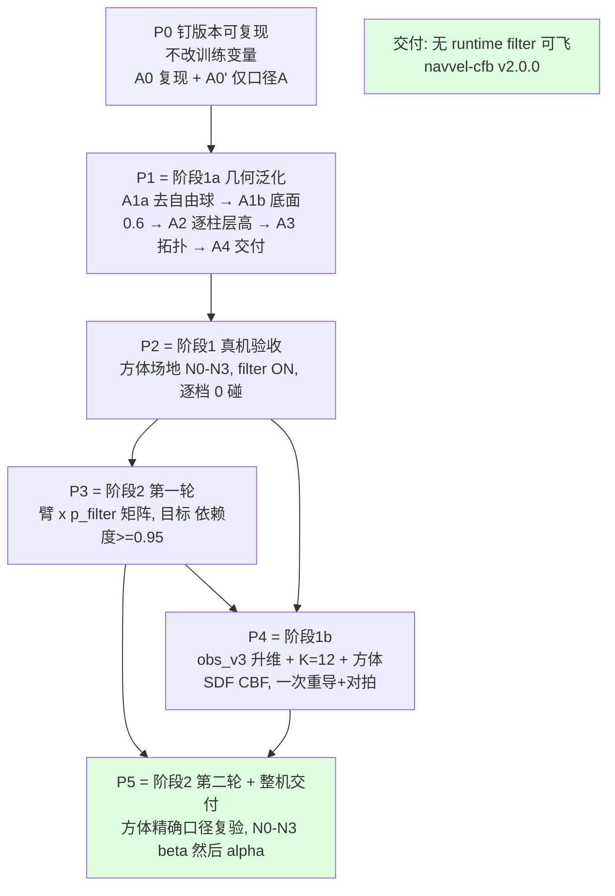

# NavVel 版本管理与重训计划（阶段 1a / 1b / 阶段 2）

> 版本 **2026-09-12 v1（新建）**。**个人执行文档**：现状事实 + 版本管理方案 + 分批重训计划 + 分阶段验收标准。
>
> **范围**：只覆盖 **阶段 1a**（长方体立柱·球近似，obs 62 冻结）、**阶段 1b**（obs_v3 升维 + 方体 SDF CBF）、
> **阶段 2**（去 runtime filter）。**不含阶段 3 动态障碍**（见 `Navvel_dynamic_obs_plan.md`，本计划全部达标后才启动）。
>
> **配套文档**
> - `NAVVEL_RETRAIN_GUIDE.md` —— 决策依据、公式、实验矩阵的原始出处；**本文是其"执行收敛版"**，
>   凡本文与它冲突处，以本文 §附录 B 的裁决记录为准。
> - `project_summary.md` —— 代码现状（模块/奖励/CBF 的详细说明）。
> - `navvel_export/meta.json` —— 当前交付 artifact 的元数据（已核实与本地 ckpt sha256 一致）。
>
> **本文所有"现状"条目均已在本机（`hybrid-5090d:/home/lz/lzspace/drones`）核实**，来源标注为
> `[code]`（读源码）/`[cfg]`（读 cfg 或 run config.yaml）/`[fs]`（读文件系统）/`[待确认]`。

---

## 0. 本文冻结的决策

| # | 决策项 | 结论 | 影响 |
|---|---|---|---|
| 1 | 覆盖范围 | **阶段 1a + 1b + 阶段 2** 三个阶段，含几何口径对齐、实验矩阵、整机验收 | 本文即完整执行计划 |
| 2 | 本文定位 | **个人执行文档**（可操作、可复现、命令级） | 详细到文件/键名/门槛 |
| 3 | 几何口径方向 | **选项 A：训练放宽到部署口径**（`drone_radius 0.10 / inflation 0.02 / r_safety_margin 0.05`，`use_brake_term=false` ⇒ `r_s = r_o+0.12`、`r_cbf = r_o+0.17`） | 必重训；旧"0 碰"与新"0 碰"不可直接比较，必须先重跑基线 |
| 4 | 归因纪律 | **分批重训**，每批只引入一个小变量集；几何变化走 A0→A0′→A1a→A1b→A2→A3→A4 递进 | 轮次多但可归因；总 GPU 时间仍 < 6 h（见 §3.7） |
| 5 | `K=8 → 10/12` 升维批次 | **放 P4（1b）与 obs_v3 合并**，只做一次重导 + 重对拍；1a 保持 obs 62 维 | 保住 1a"零升维、零重导"的卖点；K 扩容不静默丢弃（附录 B-2） |
| 6 | 验收标准 | **阶段 1 与阶段 2 分开定义**：阶段 1 允许 filter ON；阶段 2 必须 filter OFF 达标 | 见 §4.1 差异对照表 |
| 7 | 版本管理对象 | 模型与导出物、部署配置、训练代码与配置快照、文档与计划（**不含**场地/硬件布置图，见 §2.8 待办） | 见 §2 |
| 8 | 资源与粒度 | 单卡 5090；单 run ≈ 20M frames；**每格 ≥3 seed**（候选交付配置 ≥5） | 见 §3.7 预算 |
| 9 | 动态障碍 | **本文与后续重训一律不涉及**；任何动态障碍相关工作不得进入 P0–P5 | 阶段 3 前置条件写在 `Navvel_dynamic_obs_plan.md` |
| 10 | 文档落点 | 本文 `drones/NAVVEL_VERSION_AND_RETRAIN_PLAN.md`；模型注册表另建 `drones/NAVVEL_MODEL_REGISTRY.md` | 见 §2.5 |

---

## 0.5 K1 执行记录（2026-09-12）

> **状态：K1 六项入库动作全部完成 ✅**，卡点 **K1 = 绿**。新增缺口 G13–G21（见 §1.4）。

### 0.5.1 已完成动作（对应 §2.7）

| # | 动作 | 结果 |
|---|---|---|
| 1 | 提交计划文档与脚本副本 | 外层 commit `d47d87e`；文档/`plan_before/`/`figures/`/论文 md 全部入库 |
| 2 | 子模块提交 + 打 tag | 子模块 commit `2a5c1b0`；外层 annotated tag **`navvel-cfb-v1.0.0`** |
| 3 | 迁移导出物 + `SHA256SUMS` + `lineage.json` | `/home/lz/lzspace/navvel_export/navvel-cfb-v1.0.0-dual-p1-s11/`；新增 `run_config.yaml`、`acceptance.md`；`sha256sum -c` 全绿 |
| 4 | 落地 `cfg/profiles/A0-legacy.yaml` | ✅ **142 leaf keys 完整快照**，自包含（base env/sim 已内联）；hydra 可加载为 `task=profiles/A0-legacy` |
| 5 | 建注册表 | `drones/NAVVEL_MODEL_REGISTRY.md`（含 3-seed checkpoint 哈希 + G12 留档） |
| 6 | 建 `_current` 软链 | `navvel_export/_current -> navvel-cfb-v1.0.0-dual-p1-s11` |

### 0.5.2 与文档假设不符之处（执行时修正）

| 项 | 文档假设 | 实际 |
|---|---|---|
| 仓库根 | §2.7-1 写 `git add drones/*.md …`（暗示仓库根 = 工作区根） | **`/home/lz/lzspace` 不是 git 仓库**；仓库根 = `drones/`。故 `drones/*.md` → `*.md`（仓库内） |
| 脚本副本路径 | §2.7-1 写 `export_navvel_actor.py`（工作区根，仓库外） | 已复制到 **`drones/OmniDrones/scripts/export_navvel_actor.py`**（= §1.1 所说"服务器路径"）并入库；工作区根副本保留 |
| profile 路径 | §2.7-4 写 `cfg/profiles/<profile>.yaml` | 内容落在此路径；另加**软链** `cfg/task/profiles -> ../profiles`，使 hydra 能按 task 组加载（`train.yaml` 的 `defaults: - task: <name>` 只认 `cfg/task/`） |
| `algo=ppo` 配置 | （未提及） | **`cfg/algo/ppo.yaml` 不存在且 git 历史从未有过**；PPO 超参由代码内 `ConfigStore` 注册（`omni_drones/learning/ppo/ppo.py:59`）⇒ 见 G15 |
| 子模块状态 | G4 说"有未提交改动" | 执行时**已 clean**，但 HEAD 与外层记录的指针差 15 个 commit（`+774538f`） |

### 0.5.3 附录 A 四条核查命令的结果

| 命令 | 结论 |
|---|---|
| **G1** 部署侧文件定位 | ❌ **仍缺**。在 `/home` 全盘 `find`（`navvel_deploy*.yaml` / `navvel_obstacles*.yaml` / `navvel_cbf.py` / `navvel_offline_check.py`）**零命中**；`navvel*` 目录只找到 `navvel_export`。⇒ K6 仍红 |
| **G6** | `eval_ckpt.py` 指标 | ⚠️ **部分可用**：已有 `+runtime_filter=true|false`（= 文档说的 `filter_mode`，ON/OFF 判据可用），并输出 `arrival_rate`/`collision`/`collision_episodes`/`min_clearance`/`success_rate`/end-cause/`reach`(需 `+record_min_rpos=true`)。**但缺** `intervened` 零介入率、`h_min^train`、`Δa` p50/p95、`stall`、`dropped_relevant` ⇒ §4.2/§4.3 的门槛仍无法直接判。**✅ 2026-09-12 已修（K5）**，见 §0.5.5 |
| **G11/G12** 三 seed 成绩 | ✅ 已取到，但**口径与文档不同**：`wandb-summary.json` 只有训练内 `eval/stats.*`（soft-respawn 窗口口径），3-seed `success_rate` 均值 **0.4320**（0.4766/0.4229/0.3965），`min_clearance` 均值 0.6363，`collision`=0。文档引用的 **ON 0.891 / OFF 0.855 无留档且不可复现** ⇒ 见 G16 |
| **口径 A 半径链自检** | ✅ 本地实跑 `omni_drones.utils.cbf`，与本文数值**完全一致**：`A0-legacy` `r_s=r_o+0.20` / `r_cbf=r_o+0.30`；`A` `r_s=r_o+0.12` / `r_cbf=r_o+0.17` |

### 0.5.4 D-1–D-4 决策（2026-09-12 已确认，见附录 A）

| 项 | 决策 |
|---|---|
| **D-1** | 口径 A **不改** `collision_margin`，保持 `0.05` |
| **D-2** | `K=8→12` 扩容**放 P4**，1a 保持 K=8 |
| **D-3** | `obs_v3` 取 **SDF+法向 7 维** ⇒ obs = 30+7×12 = **114** |
| **D-4** | 阶段 1 真机沿用 `arrival@0.2 ≥ 0.85` |
| **D-5（新增）** | `v1.0.0` 基线 = **补跑 `eval_ckpt.py` 严格单命验收重建**（不用训练内 eval 0.4320） |

### 0.5.5 K5 已完成（2026-09-12）+ v1.0.0 阶段 2 基线实测

**① 指标补齐（K5，修 G6）——已完成 ✅**

| 落点 | 改动 |
|---|---|
| `omni_drones/utils/cbf.py::CBFVelocityFilter` | 新增 `shadow`（算 `a_cbf` 但**不写回**动作）与 `record_diag`（逐步攒 `[‖Δa‖, intervened, h_min, fix_norm]`）；**`filter_velocity` 数学未动** |
| `omni_drones/envs/single/nav_vel_obstacles.py::build_obs` | 暴露 `_obs_win_idx/_obs_win_valid`（滑动窗口选中的槽位）→ 支持 `dropped_relevant` |
| `scripts/eval_ckpt.py` | `runtime_filter=false` 改挂 **shadow 滤波器**（策略行为 == 撤掉 filter，但仍能量"本会介入多少"）；新增 `_AcceptanceCb` 累加 `arrival@0.2/0.3/0.5`、`stall`、`oob/crash ever`、`dropped_relevant`；`+set_seed` 确定性 + `layout_fp` 布局指纹（验证 ON/OFF 同分布）；输出 `[eval_metrics]` JSON 单行 |
| **新增** `scripts/acceptance_eval.sh` | 批量评估 runner（`<seed>:<on\|off>:<ckpt>`，可 `PARALLEL=2`） |
| **新增** `scripts/aggregate_acceptance_eval.py` | 汇总日志 → §4.2/§4.3 表 + 门禁判定 + `eval_metrics.json` |
| `scripts/cbf_test.py` | 新增 `t9_shadow_diag()`（6 项断言，覆盖 shadow/诊断/逐位兼容） |

**② 评估协议（新增，写死，后续批次必须沿用）**

`512 envs × 600 步`、确定性 `MODE`、`eval_points=fixed`（`[-2.8,0,0.5] → [2.8,0,1.0]`）、
`set_seed = 1000+train_seed`（ON/OFF 共用 ⇒ 同一套障碍布局）。
> **显存实测**：`1024×1500` **OOM**；`512×1500` 峰值 26.4 GiB（不能并行）；**`512×600` 峰值 13.6 GiB**
> ⇒ 可 2 进程并行（6 run 共 1m51s，峰值 28.5 GiB）。

**③ v1.0.0 阶段 2 验收结果：不通过 ❌**（3 seed × ON/OFF，证据见
`navvel_export/navvel-cfb-v1.0.0-dual-p1-s11/{acceptance.md,eval_metrics.json,eval_logs/}`）

| 门禁 | 门槛 | 实测（3-seed 均值） | 判定 |
|---|---|---|---|
| filter 依赖度 `OFF/ON` | ≥ 0.95 | **1.0076** | ✅ PASS |
| 零介入率 | ≥ 0.95 | **0.1613** | ❌ FAIL |
| `h_min^train` | ≥ 0 | **−0.0500** | ❌ FAIL |
| `arrival@0.2`（ON） | ≥ 0.85 | **0.3412** | ❌ FAIL |
| 0 碰 | 必须 | ON 0 / OFF **1** | ❌ FAIL |
| 0 OOB | 必须 | 0 | ✅ PASS |
| `min d_min` | ≥ 0.10 m | 0.0512 | ❌ FAIL |
| `stall` | ≤ 10% | 0.0132 | ✅ PASS |
| `dropped_relevant` | < 1% | 0.0000 | ✅ PASS |

> **最重要的解读**：**「依赖度 PASS」≠「可以撤 filter」**。同一次评估里零介入率只有 **0.16**
> ⇒ 滤波器 **84% 的步都在介入**（`‖Δa‖` 中位 0.64、p95 1.45 m/s，`v_max=1.8`），
> 但到达率 ON/OFF 在统计上不可区分（差 2.6e−3，标准误 ≈ 2.1%）。
> 机制：`filter_velocity` 只沿外法向扣除"朝障碍的靠近速度"，**切向（朝目标）进度不受影响**；
> 在 `cbf_extra=0.10` 的保守球 + 28 障碍下几乎总有约束绑定 ⇒ **介入率虚高但无实效**。
> ⇒ 这是「滤波器做无用功」，**不是**「策略已内化安全」——正是 **P3** 要治的对象，
> 也说明 §4.3 必须**同时**看 `依赖度` 与 `零介入率`（本表就是反例）。
>
> 另外 `dropped_relevant ≈ 0` ⇒ **A0 未出现 K=8 容量不足**（A3/A4 柱数升到 8 后需重测）。

### 0.5.6 P0.1 已完成（2026-09-12）—— **逐位完全复现 ✅**

**目的**：复现 `v1.0.0`（含 `+init_ckpt` 续训路径），并验证 `A0-legacy` profile 是交付配置的**完整快照**（G3）。

**命令**（task 侧 100% 来自 profile；非 task 参数只剩 6 项 ⇒ 这本身就是 profile 完整性的证据）：

```bash
cd drones/OmniDrones/scripts
<lz_env>/bin/python train.py task=profiles/A0-legacy algo=ppo headless=true \
  wandb.mode=online wandb.entity=fly-hust wandb.project=env_design_geo10_p01repro \
  wandb.group=NavVel-P0.1-repro wandb.run_name=cfb-dual-DR2-ctrlSync-p01-<1|2|3> \
  seed=<11|12|13> algo.entropy_coef=0.05 total_frames=20000000 save_interval=100 \
  +render_eval=false +init_ckpt=<geo8>/files/checkpoint_19693568.pt
```

> **新增 wandb 项目（后续批次沿用建议）**：`fly-hust / env_design_geo10_p01repro`，
> group `NavVel-P0.1-repro`，run group `run-20260912_195345`（`7wexmcym` / `bd51cg95` / `npgxdjor`）。

| 判据 | 门槛 | 实测 | 结论 |
|---|---|---|---|
| `arrival@0.2`(ON) 3-seed 均值 vs §0.5.5 基线 | ±0.02 | **Δ = 0.0000**（0.3412 vs 0.3412） | ✅ **PASS** |
| `checkpoint_final.pt` sha256 vs 交付 run | 记录 | **3/3 完全相同** | ✅ PASS |
| 训练侧 `eval/stats.*` / `train/stats.*` vs 交付 | 记录 | 逐项相同（`env_frames=19988480`、`entropy`、`cbf_violation` …） | ✅ PASS |
| 流水线（含 `+init_ckpt`）可用 | 必须 | 3/3 正常完成，19:53→20:08 ≈ 15 min | ✅ PASS |

**含义（重要）**：

1. **本机训练逐位确定**：同 (代码 commit, 配置, seed, 硬件, 库版本) ⇒ **权重 sha256 完全相同**
   ⇒ `P0.2 / A1a…A4` 的批次对比是**真单变量**（跨批次运行噪声 = 0），归因能力强于本计划预期。
2. 两点边界：
   - **不**证明跨机器可复现（未换机器/驱动/库版本验证）；
   - 逐位确定 ⇒ 3 seed 只提供**种间差异**（0.3086–0.3887，跨度很大），**不提供运行噪声估计**
     ⇒ §4.2 的 `±0.02` 对"同机重跑"偏宽松，对"换配置重训"才是有效门槛。
3. `A0-legacy` profile 已被证明**忠实且完整**（G3 闭环）。

**证据**：`navvel_export/navvel-cfb-v1.0.0-dual-p1-s11/repro_p01/`
（`REPRO.md` + 3 份训练日志 + 6 份评估日志 + `eval_metrics.json` + `SHA256SUMS`，全部 `sha256sum -c` 通过）。

### 0.5.7 执行注意（本机环境坑，2026-09-12 实测记录）

> P0.2 的**前两次尝试**因此作废：第一次静默卡死在 6.58M/20M 帧，第二次因 `PhysX PxgCudaDeviceMemoryAllocator failed to allocate memory` 崩溃。
> 两者都不是配置问题，而是**进程/资源管理**问题，记录以免重犯：

| # | 坑 | 现象 | 正确做法 |
|---|---|---|---|
| 1 | **`train.py` 调用 `setproctitle`** | 进程名变成 wandb `run_name`，`pgrep -f "train.py"` **找不到运行中的训练** ⇒ 我据此误判"训练已结束"，实际 3 个进程仍活着占 21 GiB | 用 `nvidia-smi --query-compute-apps=pid,used_memory --format=csv,noheader` 判定，再 `ps -p <pid> -o stat=,etime=,cmd=` |
| 2 | **长任务不要 `wait`** | 之后在同一终端执行命令会连带 `wait` 及其子进程一起结束（进程无 traceback 直接消失） | `setsid nohup <cmd> > log 2>&1 < /dev/null &` + `disown -a`，把 pid 写入文件留档；**不 `wait`** |
| 3 | **训练期间不要 import `omni_drones`**（含 `--cfg job`、导出脚本、**任何** Isaac 单测） | 触发 kit/GPU 资源争用：运行中的训练会**静默卡死**（100% CPU 但不写 checkpoint），新进程报 PhysX 显存分配失败 | 训练窗口内只做 `nvidia-smi` / `tail` / `grep` / `git` 等轻量操作；**安全工具白名单**（2026-09-12 实测复核，均只依赖 torch / PyYAML，**不含** Isaac）：`scripts/pillar_layout_check.py`（`importlib` 按文件加载 `nav_vel_obstacles.py`，而后者**只 import torch**）、`scripts/make_geometry_profile.py`（PyYAML）、纯 `py_compile`。**黑名单**：`train.py` / `eval_ckpt.py` / `export_navvel_actor.py` / `train_batch.py` / 任何 `--cfg job`（hydra 组合会 import 包） |
| 3b | **判断"训练是否卡死"要看 checkpoint 时间戳与日志字节数**，不能只看 fps 或行数 | 2026-09-12 我一度误判 A1a 慢了 15×（实际是**自己算错时钟**：`etime` 只有 2:48、已在 6.59M/19.69M 帧）。判据：`ls -l --time-style=+%T <run>/files/*.pt`（无新时间戳 = 可疑）+ `wc -c` 两次间隔比对 + `ps -o stat=,etime=,%cpu=`（`Rl` + ~140% CPU = 在算） | 三步都做完再判定；`Rl`+日志增长 ⇒ 正常 |
| 4 | GPU 基线（启动段） | 3 seed × 1024 env 训练：**稳定后约 3.9 GiB/进程**（干净启动）；若看到 ~7 GiB/进程，说明有其它残留进程在抢显存 | 开训前先确认 `nvidia-smi` 无 compute apps |
| 5 | **长训练末期显存膨胀** ⇒ **并发上限是 2，不是 3** | 单进程显存随训练**单调增长**：~3.9 GiB（启动）→ **~11 GiB（20M 帧末端）**。3 路 ≈ 33 GiB > 32 GiB ⇒ P0.1 侥幸过关，P0.2 的 **s12 在最后一步崩**：`torch.OutOfMemoryError: Tried to allocate 364.00 MiB`，报 "Process 2918516 has 10.98 GiB / Process 2918518 has 10.98 GiB"，崩点在 `tensordict/_torch_func.py stack_fn` | **批次并发默认 `--parallel 2`**。必须 3 路时把 `task.env.num_envs` 降到 512（显存近半）。崩溃点在**收尾**，所以训练其实已跑完，只需单进程重跑该 seed |
| 6 | **`crashreporter` 行数 / `exit=-11` 不是失败判据**（代价 ~2 h，务必先读） | 本机 Isaac **在训练成功的 run 上退出时也会 segfault**：进程 `exit=-11`、日志里成片 `crashreporter` 行，**但训练已跑完且 `checkpoint_final.pt` 已写出**。2026-09-12 我据此把 A2 家族里**已经跑完的 run 全判成"崩溃"**，还顺手 kill 掉了健康的 run，制造了"A2 代码有 bug / 机器被污染"的错误结论 | **成功判据只能是 `checkpoint_final.pt` 是否存在**；`rc≠0 但有 ckpt` 记为 "teardown crash, result OK"。已固化进 `scripts/train_batch.py`（`clear_gpu()` 前/后按 PID 清场并打印 GPU 是否释放）。另：**检查也不能太早** —— `final_eval=0` 常常只是"日志还在长"，要配合 `ps`/时间戳一起看 |
| 7 | **崩溃进程会"改名"存活**，`pkill -f train.py` 抓不到 | 崩掉的 Isaac 进程**不一定退出**：`setproctitle` 已把 cmdline 改成 wandb run 名（如 `NavVel-ppo/09-12_22-29`），它继续占 6–8 GiB，导致后续每个 run 都崩 | 用 `nvidia-smi --query-compute-apps=pid` 取 PID 再 `kill -9`。**反方向也要小心**：改用 PID 批量清场时会**误杀正在正常训练的进程**（我犯过，进一步加深误判） |
| 8 | **`wandb.mode=disabled` 的 run 目录不在 `scripts/wandb`** | 调试用 `train.py ... wandb.mode=disabled` 时，checkpoint 落在 **`/tmp/wandb/run-*/files/`**（`scripts/wandb` 里没有）⇒ 只查 `scripts/wandb/run-*` 会把"已跑完"误判成"没产出" | 找 ckpt **两个根都查**：`scripts/wandb/run-*`（online）与 `/tmp/wandb/run-*`（disabled）。`train_batch.find_final()` 只查前者——因为批量跑一律 `wandb.mode=online` |
| 9 | **批量清场不能"见到显存里的进程就杀"** | `train_batch` 的 parent 只是调度器：每个 seed 是一个 `--child` 进程，各自在启动前调 `clear_gpu()` ⇒ 它会杀掉**同批仍在收尾的兄弟 seed 的 `train.py`**。实测 `cfb-dual-chiA-a2d` 的 `seed 11 rc=-9`（只因 ckpt 已写出才没丢结果） | parent 公布 `NAVVEL_BATCH_ROOT`，`clear_gpu()` 按 `/proc/<pid>/stat` 的 PPID 链**保护**仍连到该根的所有 GPU 进程，只清"脱钩残留"（崩溃 seed 的 `train.py` 被 reparent 到 init 后即失去该祖先链）。已修：子模块 `a8cd6d6` |

**排查纪律（2026-09-12 用 2 h 换来）**：遇到"某配置必崩"时，**第一件事是跑一个已知能跑的对照组**（同代码、同脚本、只改一个变量）。我在 A2 上做了 5 轮变体（`A2z`/`A2l`/`A2z0`…）才想起跑 A1b 对照，而 A1b 在同样条件下同样报 `exit=-11` ⇒ 一步就能把矛头指向**判据/环境**而不是代码。此外每轮实验后**必须 `nvidia-smi` 确认没留下僵尸**。

**作废的 run（仅留档，勿引用）**：
第一次 `cfb-dual-chiA-p02-{1,2,3}` → `run-20260912_202653-{l6e8qgys,km9d5k5e,71obo25e}`（停在 6.58M 帧）；
第二次 `cfb-dual-chiA-p02-r2-{1,2,3}` → `run-20260912_2030{40,40,43}-{zf5njn30,afzw0f99,st1go87f}`（仅启动即崩）；
第三次的 **s12 一支** `bq3qb0ej` 因坑 5 在收尾 OOM（s11/s13 正常出 final），已**单进程重跑**为
`cfb-dual-chiA-p02-2-final2` → `njn50ubq`（见表 §0.5.8③）。本地目录已归档到 `/tmp/navvel_p02/void_runs/`。

### 0.5.8 P0.2（口径 A → `v1.1.0`）执行记录（2026-09-12）

**① 快照派生：`cfg/profiles/A.yaml`**

用 `scripts/make_geometry_profile.py` 新增的 **派生模式**从 `A0-legacy` 复制后**只改指定键**：

```bash
python scripts/make_geometry_profile.py --from-profile cfg/profiles/A0-legacy.yaml \
  --profile-id A \
  --set obstacle.drone_radius=0.10 --set obstacle.inflation=0.02 \
  --set cbf.r_safety_margin=0.05 --set cbf.use_brake_term=false \
  --out cfg/profiles/A.yaml
```

* 工具会打印**实际发生变化的键**（未变的 `--set` 不会被记成改动）：本次为 **3 个键** ——
  `obstacle.drone_radius 0.15→0.10`、`obstacle.inflation 0.05→0.02`、`cbf.r_safety_margin 0.10→0.05`
  （`cbf.use_brake_term` 本来就是 `false`，故无变化）。
* **独立复核**：`diff` 两份 profile 的 YAML 只有 **3 行**；再经 **hydra 组合后**逐键比对**也正好 3 行**。
* `obstacle.collision_margin` **保持 0.05**（D-1）；其余 142 个 leaf key 与 `A0-legacy` 逐位相同。
* 半径链（本地实跑 `omni_drones.utils.cbf` 复核）：**`r_s = r_o + 0.12`、`r_cbf = r_o + 0.17`** ✅ 与计划一致。
* ⚠️ **判撞口径也变了**：`r_s` 从 `r_o+0.20` 降到 `r_o+0.12` ⇒ P0.2 的"0 碰"与 P0.1 **不可直接比较**
  （这正是 §0.5.1 决策 3 要单独成批隔离口径 A 的原因）。`arrival` / 零介入率 / `h_min` 定义不变，
  仍可比。

**② 导出脚本 v2（配置驱动）—— 已完成并通过回归**（§2.4 红线）

v1 把整套 v1.0.0 几何（0.15/0.05/0.10、4×4 柱的固定 xy、K=8、T=1500 …）**硬编码**在脚本里；
口径 A 改了半径链，而 `r_cbf` 要写进 `meta.json` / `cbf_test.npz` 给部署侧 ⇒ **必须参数化**。改动：

| 项 | v1 | v2 |
|---|---|---|
| 几何/控制常量 | 硬编码 | 从 **profile 或 run `config.yaml`** 读（`--profile`，两种格式都认，自动解 wandb 的 `{value:}` 包裹） |
| 测试障碍布局 | 手写 4 柱 xy + 12 个固定自由球 | 用 env 自己的 **`ObstacleManager.sample_layout`（CPU）** 采样 ⇒ 布局天然与训练同规则、结构合法 |
| `obs_dim` / `K` / `obstacle_cfg` | 62 / 8 / 固定 | 由配置推导；`obs_safety != none` 显式报错（本导出器不镜像安全通道） |
| `meta.json` | — | **纯增量**：保留全部 v1 键与取值（`arena_bound_xy` 仍为标量、`cbf.r_si` 键名保留、`r_cbf` 文案在 brake-off 时逐字复现），只新增 `model_id`/`geometry_profile`/`test_vectors` 等 |

> 实现细节：障碍模块用 `importlib` **按文件加载**（与 `scripts/pillar_geometry_test.py` 同法），
> 因为走包路径会执行 `envs/single/__init__.py` → 拉入 Isaac Sim（无 `SimulationApp` 会失败）。

**回归证据（v1.0.0 配置 + v1.0.0 权重）**：

| 检查 | 结果 |
|---|---|
| 旧 `navvel_actor.ts` vs 已提交 `action_test_server.npy`（同一 `obs_test.npy` 输入） | `max|Δ| = 0.000e+00` |
| **新** `navvel_actor.ts` vs 已提交 `action_test_server.npy` | `max|Δ| = 0.000e+00` |
| 新旧 TorchScript 在同一 obs 上互相比较 | `max|Δ| = 0.000e+00` |
| `filter_velocity` 重算已提交 `cbf_test.npz` 的 `v_safe` / `fix_norm` | `max|Δ| = 0.0` |
| `meta.json` geometry/cbf 块 | 17 处差异**全部是新增键**，无一处改值 |
| `meta.json` 丢失的顶层键 | 0（schema 向后兼容） |

**③ 训练**：`task=profiles/A`，与 P0.1 **完全相同的 6 项非 task 参数**（`seed=11/12/13`、
`algo.entropy_coef=0.05`、`total_frames=20M`、`save_interval=100`、`+render_eval=false`、
`+init_ckpt=<geo8>`），wandb `fly-hust/env_design_geo10_p01repro`、group `NavVel-P0.2-chiA`、
run name `cfb-dual-chiA-p02-{1,2,3}-final`，run group **`run-20260912_203247`**
（`7gziinv0` / `bq3qb0ej` / `51rmfdcr`）。
> 前两次尝试的作废原因见 §0.5.7（环境坑，非配置问题）。

**s12 单进程重跑**（因坑 5 收尾 OOM，见 §0.5.7）：`cfb-dual-chiA-p02-2-final2` → run **`njn50ubq`**
（目录 `run-20260912_204807-njn50ubq`），单进程、其它参数逐字相同；日志尾
`Final Eval at 19988480 steps` + `Saved checkpoint to .../checkpoint_final.pt`，无 error。

**三个 seed 的产物（均为 `seed` 固定 + `total_frames=20M`）**：

| train seed | wandb run | `checkpoint_final.pt` sha256 |
|---|---|---|
| 11 | `7gziinv0` | `e05eba92f4d54b478b126397cc583f8edf9f2d7d403d95c872c08f0ff95236b1` |
| 12 | `njn50ubq`（重跑） | `0ed7ce8e2274727e113be13061381b4caa5c05b2c9d9b7dd25083e89547c6019` |
| 13 | `51rmfdcr` | `6f8fb83b3240443e4df03960ea6170eb696fae075b890487a6dfd4d2bd040f33` |

（wandb 汇总里 `env_frames = 19 988 480` 略小于 `20M`，是 update 粒度对齐所致，与 P0.1 的
`19693568` 帧存档点同源，三 seed 一致。）

**④ 结果**：见 §0.5.9。

---

### 0.5.9 P0.2 结果（2026-09-12）—— 口径 A 相对 A0 的收益与代价 **均已量化**

**① 验收评估**：6 次（3 seed × ON/OFF），协议与 P0.1 **逐字同构**（`512 envs × 600 步`、
`set_seed=1000+train_seed`、`eval_points=fixed`、ON/OFF 配对同一布局），6/6 `exit=0`，
`cbf_diag_steps = 307200 = 600×512`（覆盖全部步，非抽样）。`layout_fp` 同 seed 的 ON/OFF 完全一致。

| 指标（ON / OFF 均值） | **v1.0.0**（A0-legacy，`r_cbf=r_o+0.30`） | **v1.1.0**（口径 A，`r_cbf=r_o+0.17`） | Δ |
|---|---|---|---|
| `arrival@0.2` | 0.3412 / 0.3438 | **0.4733 / 0.4245** | **+0.1321** / +0.0807 |
| 零介入率 | 0.1613 / 0.1951 | **0.2429** / 0.2656 | **+0.0816** |
| `corr_p50`（中位修正） | 0.6385 / 0.6974 | **0.4678** / 0.5187 | **−0.1707** |
| **filter 依赖度** `OFF/ON` | **1.0076 ✅ PASS** | **0.8969 ❌ FAIL** | **−0.1107（由过转不过）** |
| `collision_envs` ON / OFF | 0 / 1 | **0 / 5**（s11:3、s12:2） | 判撞半径 0.20→0.12，**不可比** |
| `h_min^train` | −0.0500 | 0.0000 | ⚠️ 见 ③ |
| `stall_frac` / `dropped_relevant` | 0.0132 / 0.0000 | 0.0127 / 0.0001 | ≈ / ≈ |
| `min_clearance_global_min` | 0.0512 / 0.0492 | 0.0508 / 0.0459 | ≈ |
| `oob_envs_ever` / `crash_envs_ever` | 0 / 0 | **0 / 0** | ✅ |

**门禁（§4.1/§4.3）**：依赖度 ❌、零介入率 ❌、`arrival@0.2 ≥ 0.85` ❌、0 碰 ❌（OFF 5 个 env）、
0 OOB ✅、`stall ≤ 10%` ✅、`dropped_relevant < 1%` ✅、`h_min ≥ 0` ⚠️（名义 PASS，按 ③ 不计入）

**② 解读 —— 这是本批次最有价值的产出**

1. **口径 A 显著"松绑"了滤波器**：`r_cbf` 收到 `r_o+0.17` 后介入减少约 40%（零介入率 0.16→0.24），
   中位修正幅度 0.64→0.47 m/s，**到达率 +13.2 个百分点**。与 §0.5.5 的机制解释自洽：A0 的保守球
   几乎每步都绑定约束，扣掉的多是**无用的法向速度**。
2. **依赖度由"过"转"不过"**——**不要读成"变差"**。P0.1 的 1.0076 之所以过关，恰恰是因为滤波器
   **对任务结果毫无贡献**；口径 A 下撤掉滤波器到达率掉 10.3% ⇒ 滤波器**有真实贡献**。
   ⇒ 阶段 2 的命题（撤 filter 可飞）不但**更明确地不成立**，而且**失败原因从"滤波器无用"变成了
   "策略确实依赖滤波器"** —— 这正是 **P3** 要内化的东西，P0.2 为 P3 提供了一个**有信号、未饱和**
   的对照起点（A0 那一列是饱和的：依赖度 1.0076 已经把"滤波器无用"顶到天花板）。
3. OFF 出现 5 个碰撞 env 而 ON 全 0（同批次内可比）⇒ 一致支持"策略未内化安全"。
4. `dropped_relevant ≈ 0` ⇒ K=8 窗口在 M=28 下未把危险障碍挤出窗口，**§3.2 的"K 容量不足"风险在
   A 仍未出现**；`A3/A4` 柱数翻倍后必须重测（G8/G9）。

**③ G20 已闭合（2026-09-12，实测）—— `h_min ≥ 0` 可用；差异来自判据时序**

**疑问**：理论上应严格满足 `h_min = min_clearance − cbf_extra`（两把尺子只差标量）。P0.2 的
**OFF 列**却"反向不一致"：

| 批次 | `cbf_extra` | `min_clearance`(ON) | 预测 | 实测 `h_min` | 一致？ |
|---|---|---|---|---|---|
| v1.0.0 | 0.10 | 0.0512 | −0.0488 | −0.0500 | ✅ 差 0.0012 |
| v1.1.0 ON | 0.05 | 0.0508 | +0.0008 | 0.0000 | ✅ 差 0.0008 |
| **v1.1.0 OFF** | 0.05 | 0.0459 | **−0.0041** | **0.0000** | ❌ 方向相反 |

**诊断**（新增 `scripts/cbf_hmin_diag.py`：shadow + `record_diag` 跑短 rollout，逐 (t,env) 落盘
`h_all`/`dmin_all`/`h_info`/`ep_min`/`done`；离线复算脚本见 §0.5.9 证据）。三次实跑结论：

| 判据 | 结果 |
|---|---|
| **恒等式**（滤波器自记 `h_min` vs `min_t dmin_all − cbf_extra`） | **Δ = −1.12e−08**（512 env × 600 步，float32 精度）✅ **成立** |
| **逐格一致性**（`h_info` vs `dmin_all − cbf_extra`，同一步同一尺子） | **max\|Δ\| = 2.384e−07** ✅ **成立** |
| 两把尺子/障碍集合 | CPU 探针：`ObstacleManager.pos=(4,28,3)`、`r_safe=(4,28)`；`max_slots=8` **只截 obs 块** ⇒ 滤波器与 `clearances()` 同集合、同尺子 ✅ |
| 诊断覆盖 | `cbf_diag_steps = 307200 = 600×512`（全覆盖，非抽样）✅ |

**根因 = 判据的时序差，不是数值错误**：`h_min` 是滤波器**在步进前**用当时位置算出的边界余量；
而 `min_clearance` 是 `dmin = ‖p−p_o‖ − r_s`，在**步进后**的位置上取值，**碰撞判定
（`in_col = dmin < collision_margin`）也用步进后的位置**。当某一步把机体送进判撞区时，
`dmin` 会掉到 `collision_margin` 以下（= 该 env 被判碰撞并 reset/重采布局），而**这个状态滤波器
从来没有机会看到**（下一步该 env 已换布局）⇒ `min_clearance − cbf_extra < h_min` 只可能出现在
**含碰撞的批次**里。
**验证**：本次 512×600 的 OFF 复现中 `dmin` 最小 = **+0.050006 > 0.05**（**0 个碰撞**），
恒等式精确成立 ✅；而真实 P0.2 的 OFF 列有 5 个碰撞 env（s11_off `min_clearance` 0.0381）——
正好落在"有时序差"的那一侧。

**⇒ 处置（推翻本轮早前的临时建议）**：

* **`h_min ≥ 0` 门禁保留、且可作为证据**：它衡量的正是"滤波器在每个**决策时刻**看到的边界余量"，
  即阶段 2 命题（策略自身安全）要的量。P0.2 的 `h_min = 0.0000` 是**真实渐近值**——
  307200 个样本里最小 **+6e−6**，四舍五入到 4 位即 `0.0000`，且**从未穿过 0**（`h = dist − r_cbf`
  代码里**无任何 clamp**，已逐行确认）。
* **`min_clearance_global_min` 降级为"环境侧事后量"**：不得与 `h_min` 直接相减比较；含碰撞的
  批次里它必然偏低。§4.3 记录表应把两者**并列写出并注明差异来源**。
* **新增 G22**（诊断副作用）：用 `cbf_hmin_diag.py` 复现验收世界时**必须同时传 `seed` 与
  `+set_seed`**（`acceptance_eval.py` 两个都传）。只传 `+set_seed=1011` 的那次复现跑出 **0 个碰撞**，
  与真实 `s11_off`（3 个碰撞 env）不同分布 ⇒ 复现验收世界时参数必须逐字对齐。


**④ 交付物**：`/home/lz/lzspace/navvel_export/navvel-cfb-v1.1.0-dual-p1-s11/`
（`navvel_actor.ts`/`obs_test.npy`/`action_test_server.npy`/`cbf_test.npz`/`meta.json` +
`run_config.yaml` + `eval_metrics.json` + `eval_logs/`（6 个）+ `train_s12_retry.log` +
`acceptance.md` + `lineage.json` + `SHA256SUMS`（**16/16 校验通过**））。
导出：TorchScript vs 参考 `max|Δ| = 0.000e+00`；`meta.json` 向后兼容（差异全为新增键 + 口径 A 的
3 个几何键 + 3 个随 run 变化的键）；`meta.sha256 == seed 11` ckpt 哈希 ✅。
**`_current` 仍指向 `v1.0.0`**（阶段 2 未通过 ⇒ 不晋升；`v1.1.0` 状态 = 候选）。

**⑤ 本批次带出的新缺口**：**G20**（上述 `h_min` 口径不一致，见 ③）。
另记录 **G21**：`scripts/acceptance_eval.py` 之前把**相对路径** checkpoint 透传给以
`cwd=scripts/` 运行的 worker，导致 6 次评估全部 `FileNotFoundError` 静默失败（日志里只有
torch 栈，`acceptance_eval` 只在末尾打 WARN）⇒ 已加 `os.path.abspath` 保护；**凡批量脚本向子进程
传路径一律先 absolutize**，且首次运行必须抽查子日志而非只看退出码。

**⑥ 结论**：`v1.1.0` = **候选，未晋升**。P0.2 达成了它的设计目的：**隔离"几何口径"这一个变量**，
量化其收益（+13.2 pt 到达率、−40% 介入）与代价（依赖度转红，暴露了真实的 filter 依赖），
为 P1（几何泛化）与 P3（撤 filter）提供了可比的、未饱和的起点。

---

### 0.5.10 P1（阶段 1a 几何泛化）启动记录（2026-09-12）

**① 新工具（本批次产出，后续全部复用）**

| 工具 | 用途 | 关键约定 |
|---|---|---|
| `scripts/train_batch.py` | 训练批次 runner：N seed × 1 profile，**并发默认 2** | 6 项非 task 参数单一来源固化（`seed/entropy_coef=0.05/total_frames=20M/save_interval=100/+render_eval=false/+init_ckpt=<geo8>`）；自动 `sha256` 最终 ckpt；结束打印 `[train_batch] <seed> exit=… sha256=…` 便于直接抄进注册表/lineage。**并发 2 是硬约束**（坑 5：20M 帧末期 ~11 GiB/进程，3 路必然收尾 OOM） |
| `scripts/pillar_layout_check.py` | 柱世界的 CPU 布局校验（对应 §3.2 的 G8 要求） | 校验 1) 全槽激活 `== M` 2) 起/终点净空 3) 障碍互距（**柱↔柱用 xy 距离**；同柱各层共享 xy 列，不能参与互距）4) 柱间走廊宽度 `dxy − 2·pillar_radius` 5) `--connectivity` 用 2-D 栅格 BFS 判 xy 连通性。失败即非零退出 ⇒ 可当 CPU 门禁用 |

> ⚠️ 两个坑已修：`train_batch` 早期把父进程 `argv` 整体透传，导致 `--seeds` 被子进程 argparse 拒绝
> （`exit=2`、**不占 GPU** 瞬间失败）⇒ 改为**显式转发**公用选项。`pillar_layout_check` 早期把**同柱
> 各层**也算作互距对，得到恒为负的假失败 ⇒ 改为按柱分组。

**② A1a 设置（唯一变量 = 去掉 12 个自由球）**

* `cfg/profiles/A1a.yaml` = 从 `A` 派生，**实质只改 1 键**：`obstacle.n_free_obstacles 12 → 0`
  ⇒ `M = 4×4 = 16`（原 28）。**无需改代码**（`_sample_pillar_mixed` 对 `Mf=0` 有 `if Mf > 0` 守卫）。
* 校验：M=16 全激活 ✅、起终点净空 ✅（0.24 / 0.43 ≥ 0.15 / 0.35）、互距 ≥ 0.25 ✅、
  **xy 连通性 6/6 通过** ✅。柱间走廊宽 0.27–0.52 m —— **低于 A3 的下界 1.198 m，这是预期的**
  （4 根固定柱的世界本来就只有窄缝；该下界属 A3 引入随机柱数时的要求，A1a 不适用）。
* 训练：`task=profiles/A1a`，3 seed（11/12/13）× 20M，2 路并行，warm-start 与 P0.1/P0.2 同一个
  geo8 ckpt ⇒ 与 P0.2 口径 A 基线**真单变量**（只差"有无自由球"）。
  wandb：`fly-hust` / **新项目 `env_design_geo11_p1geom`** / group `NavVel-P1-A1a`，
  run name `cfb-dual-chiA-a1a-{11,12,13}-final`。

**A1a 训练产物（2026-09-12 全部 `exit=0`）**

| seed | run 目录 | 耗时 | `checkpoint_final.pt` sha256（前 16） |
|---|---|---|---|
| 11 | `run-20260912_213657-7uo1xlho` | 529 s | `a2fd56807718f31d…` |
| 12 | `run-20260912_213657-ovfnhe7n` | 535 s | `d7cd481c784d54d9…` |
| 13 | `run-20260912_214547-8ga2jpxv` | 353 s | `ca68f5c5c7cd7849…` |

> `train_batch.py` 的 `find_final` 因按 `run_name: <name>` 精确匹配而**没能认领这三个 run**
> （wandb dump 的 `config.yaml` 不是这个键写法）⇒ 已改为匹配裸 run 名。教训：**产物归属要用
> 现成字段验证**，不能只看 runner 自己打印的 `ckpt=`。
* 预期观察（§3.2 A1a 行）：`r_o` 通道仍 0.708（自由球半径档位与柱半径不同）；**CBF 介入率应下降**
  （障碍数 28→16，约束绑定概率降低）⇒ 零介入率应高于 0.2429；依赖度与 `arrival` 与 P0.2 逐项对照。
* 验收：6 次（3 seed × ON/OFF），协议与 P0.1/P0.2 **逐字相同**（512×600、`set_seed=1000+seed`、
  固定起终点）。**碰撞列与 P0.2 可比**（判撞半径未变，仍是 `r_s=r_o+0.12`）。

**③ A2/A3 代码（已实现并 CPU 验证，A2 可用；A3 待补连通性门禁）**

设计纪律：**新增独立方法** `_sample_pillar_random`，uniform 路径（`_sample_pillar_mixed`）**一行不改**
⇒ A0/A/A1a/A1b 已冻结 profile 的采样分布逐位不变，"单变量"对比成立。新键（全部默认 `null` = 关）：

| 键 | 含义 |
|---|---|
| `obstacle.n_pillars_range` | `[lo,hi]` 每 env 柱数随机（A3） |
| `obstacle.pillar_layers_range` | `[lo,hi]` 每柱层数随机（A2，修 G9） |
| `obstacle.pillar_z_range` | `[[zlo_lo,zlo_hi],[zhi_lo,zhi_hi]]` 每柱 z 跨度随机（A2） |
| `obstacle.min_corridor` | 走廊瓶颈下界 W（A3）——**语义见下，门禁待实现** |
| `obstacle.layout_tries` | 采样重试次数（默认 6，逐次把净空约束 ×0.9^k 放松） |

* 槽位编号：**每柱固定块** `[p·L_max, (p+1)·L_max)`，未用槽 `active=False`
  ⇒ `clearances()` 把它们置 `+inf`、`build_obs` 取最近 K 个，**obs/窗口机制无需改动**。
* `M = n_pillars_max × pillar_layers_max + n_free`：A2 = **24**，A3 = **48**（现状 28）。
* CPU 验证：**A2 PASS**（per-env 激活槽 11–21，随逐柱层数变化；净空/互距/连通性全过）；
  **A0-legacy / A / A1a / A1b / A2 回归全 PASS**（无回归）。
* ⚠️ **A3 的 `min_corridor` 语义已纠正**：它**不是**"柱对间距 ≥ W"。按原写法
  `need_gap = 2r + W = 2.19 m`，6 m 场地里放 8 根 `r_o=0.4243` 的柱**不可能**——实测柱体重叠到
  `gap = −0.80 m`，3 次里有 2 次采样失败。正确语义是**"存在一条起点→终点、瓶颈净宽 ≥ W 的通路"**，
  必须在采样后做**阈值化连通性校验**（栅格 BFS，阻挡判据 `‖xy−p_i‖ < r_o + W/2`），失败则重采/减柱。
  该门禁**尚未实现** ⇒ 现在 `min_corridor` 为 `NotImplementedError` **fail-fast**，避免
  "带着未验证的世界开训"（计划 §3.2 的 G8 硬约束仍未闭环）。
* A3 仍需：上面的连通性门禁 + **M=48 的 3-iter smoke test**（K3 卡点，§3.2 G11）。

---

### 0.5.11 P1-A1a 结果（2026-09-12）—— **阶段 1 指标大涨，阶段 2 依赖度反而更差**

**① 结果**（3 seed × ON/OFF；协议与 P0.1/P0.2 **逐字同构**；`layout_fp` 每个 seed 的 ON/OFF
**完全一致**，6/6 齐全；`active.sum() = 8192 = 512×16` 印证 M=16 全激活）

| 指标（ON / OFF 均值） | v1.0.0（A0, M=28） | v1.1.0（口径 A, M=28） | **A1a（口径 A, M=16）** |
|---|---|---|---|
| `arrival@0.2` | 0.3412 / 0.3438 | 0.4733 / 0.4245 | **0.7865 / 0.6328** |
| `arrival@0.5` | 0.3932 / 0.3678 | 0.5482 / 0.4544 | **0.8294 / 0.6660** |
| **零介入率** | 0.1613 | 0.2429 | **0.6028** |
| `corr_p50` | 0.6385 | 0.4678 | **0.0000** |
| `corr_mean` | 0.6464 | 0.5081 | **0.2534** |
| **依赖度** OFF/ON | 1.0076 ✅ | 0.8969 ❌ | **0.8046 ❌** |
| 碰撞 env（ON / OFF） | 0 / 1 | 0 / 5 | **0 / 2**（s11、s13 各 1） |
| `h_min` | −0.0500 | 0.0000 | 0.0001 |
| `min_clearance` | 0.0512 / 0.0492 | 0.0508 / 0.0459 | 0.0512 / 0.0430 |
| `stall_frac` | 0.0132 | 0.0127 | **0.0095** |
| `dropped_relevant` | 0.0000 | 0.0001 | **0.0000** |

**门禁**：依赖度 ❌ 0.8046、零介入率 ❌ 0.6028、`h_min ≥ 0` ✅、`arrival@0.2 ≥ 0.85` ❌（**0.7865，
差 6.4 pt**）、0 碰 ❌（OFF 2 个 env）、0 OOB ✅、`stall` ✅、`dropped_relevant` ✅。

**② 解读（三条都重要）**

1. **12 个自由球正是"无用介入"的主要来源**：去掉后 ON 到达率 **0.473 → 0.787（+31.3 pt）**，
   零介入率 **0.243 → 0.603**，`corr_p50` 从 0.468 直接归 **0**（>50% 的步完全不需要修正）。
   机制：自由球散布在走廊里，几乎每步都有某个球的约束绑定，而扣掉的都是朝该球的法向分量，
   对朝目标的进度没有贡献 ⇒ 与 §0.5.5 的"滤波器做无用功"诊断完全吻合。
2. **依赖度反而更差（0.897 → 0.805）** —— 这是本批次最有价值的发现：
   **依赖度不是"世界难度"的单调函数**。世界变容易后策略本身飞得好（ON 0.787），但拿掉滤波器
   会掉 **15.4 pt**（OFF 0.633）；而在更难的世界里 ON/OFF 只差 4.9 pt。
   ⇒ 阶段 2（撤 filter）的目标**不能靠"把世界变简单"来达成**，反而要在**保留难度的同时让策略
   自己承担安全约束**——这正是 P3 的命题，也解释了为什么 P3 必须与几何泛化分开做。
3. `arrival@0.2` 已到 **0.7865**，距阶段 1 门槛只差 6.4 pt ⇒ `A1b`（底面 0.6）/`A2`（高度多样性）
   有较大概率把这一项推到过线。`dropped_relevant = 0` 说明 M=16 下 K=8 窗口够用（A3 的 M=48 需重测）。

**③ 本轮踩到并已修的两个工具缺陷（都属"静默出错"，最危险的那类）**

| 缺陷 | 现象 | 修法 |
|---|---|---|
| `aggregate_acceptance_eval.py` **静默丢日志** | 我在最后一个 eval 还没写完时就聚合，它跳过了 `s13_off`，输出了一张**带 `-` 列的错表**，并给出**假的** `layout_fp identical: False`（我差点据此报错） | 新增完整性守卫：期望日志数 ≠ 实际带 `[eval_metrics]` 的数量时**拒绝出表**（`exit 2`，`--allow-partial` 可覆盖）；`layout_fp` 不匹配时**指名哪个 seed** |
| `train_batch.find_final` 匹配写死 | 3 个 A1a run 全部 `exit=0`，但 runner 打印 `ckpt=NONE wandb=?`（wandb 的 `config.yaml` 不写 `run_name: <name>`） | 改为匹配裸 run 名；并确立"**产物归属要用独立字段核对，不能只信 runner 打印**" |

**④ 决策**：A1a 是**中间批次，不单独发布**（发布动作保留在 A4 冻结时）；`_current` 不变。
下一步按 §3.2 开 **A1b**（profile 已派生并 CPU 校验通过，唯一变量 = 底面 0.5→0.6）。

---

### 0.5.12 P1-A1b 结果（2026-09-12）—— **触发"K 容量不足"判据**

**① 训练**：3 seed × 20M，2 路并行，**全部 exit=0**（541 / 544 / 355 s）。
`fly-hust/env_design_geo11_p1geom`，group `NavVel-P1-A1b`；run：
s11 `run-20260912_215541-8j0vwoue`（sha `10ee8ed8ddb30dbf…`）、
s12 `run-20260912_215541-olj5o2hf`（`3d3ffe143bd636fd…`）、
s13 `run-20260912_220442-y9u1hco4`（`e3c194a2d7e3ee57…`）。

**② 结果**（6/6，`layout_fp` 每个 seed 的 ON/OFF 一致）

| 指标（ON / OFF 均值） | A1a（side 0.5, `r_o=0.354`） | **A1b（side 0.6, `r_o=0.4243`）** |
|---|---|---|
| `arrival@0.2` | 0.7865 / 0.6328 | **0.8053 / 0.5846** |
| `arrival@0.5` | 0.8294 / 0.6660 | 0.8307 / 0.6126 |
| 零介入率 | 0.6028 | **0.5831** |
| `corr_p50` / `corr_mean` | 0 / 0.2534 | 0 / 0.2601 |
| **依赖度** OFF/ON | 0.8046 ❌ | **0.7259 ❌** |
| 碰撞 env（ON / OFF） | 0 / 2 | **0 / 1** |
| `min_clearance` | 0.0512 / 0.0430 | 0.0513 / 0.0497 |
| `stall_frac` | 0.0095 | 0.0088 |
| **`dropped_relevant_step_frac`** | **0** | **0.0295**（s11 **0.0718**、s13 0.0167；**仅 ON 列非零**） |

**门禁**：依赖度 ❌ 0.7259、零介入率 ❌ 0.5831、`h_min` ✅、`arrival@0.2 ≥ 0.85` ❌（0.8053，差 4.5 pt）、
0 碰 ❌（OFF 1 个 env）、0 OOB ✅、`stall` ✅、`dropped_relevant_frac` ✅（0.0001 < 1%）。

**③ 三条结论**

1. **底面 0.5→0.6 的收益很小**：ON 到达率 +1.9 pt（0.7865→0.8053），零介入率反而 −2 pt。
   代价是既定的（`r_o` 通道归一化后恒为 0.8486，信息量归零，§3.2 已接受）。
2. **依赖度第 4 次下降（0.897 → 0.805 → 0.726）**。把 4 个批次按"ON 到达率"排序
   （0.3412 → 0.4733 → 0.7865 → 0.8053）与依赖度对照，**两者严格反相关**：
   | 批次 | ON `arrival@0.2` | 依赖度 OFF/ON |
   |---|---|---|
   | v1.0.0 (A0, M28, `r_s=r_o+0.20`) | 0.3412 | 1.0076 ✅ |
   | v1.1.0 (χA, M28) | 0.4733 | 0.8969 |
   | A1a (χA, M16, side 0.5) | 0.7865 | 0.8046 |
   | A1b (χA, M16, side 0.6) | 0.8053 | 0.7259 |
   ⇒ **"策略越强，滤波器的相对贡献越大"**（4 个数据点，单调）。
   机制解释：世界越容易/策略越强，剩下的失败就越是**安全类**的——恰是滤波器能补的那部分。
   **因此阶段 2 的门禁不可能通过"把世界做简单"来达成**，只能靠 P3 把安全约束内化进策略。
   这条现在是**有 4 个实测点支撑的定量结论**，不再是猜测。
3. ⚠️ **`dropped_relevant` 的步占比 0 → 2.95%（s11 7.18%），触发了 §3.2 预设的判据**：
   > "若 … `dropped_relevant > 0` 的步占比 > 1%，则**提前升级 P4 的 K 部分**"

   （`dropped_relevant` = `d_i < danger_radius(0.6)` 却**没进 K=8 的 obs 窗口**的障碍实例）
   含义：底面变大后，每根柱的层间距与 `danger_radius` 同量级，无人机靠近一根柱时
   该柱的 4 层会**同时**吃掉 obs 窗口的槽位，窗口装不下附近所有危险障碍 ⇒ 策略对某个
   危险障碍**完全看不见**。注意**只有 ON 列非零**（OFF 为 0）：被滤波的轨迹更贴障碍飞，
   反而更容易把窗口挤满 —— 这也解释了 ON 列为何仍有 0 碰而 OFF 列撞。
   这与 §3.2 的"`A2/A3` 的 obs 容量风险（决策 5 的代价）"完全一致，且**A2（每柱 2–6 层）
   与 A3（最多 8 柱，M=48）只会更严重**。

**④ 未决分叉（需在 A3 之前定）**：是否**提前实现 K 扩容**（obs 62 → 78，K=8→12）？
- **建议：实现，但排在 A3 之前、A2 之后**。理由：A2 保持 K=8 才能与 A1a/A1b 做单变量对比；
  A3 的 M=48 会让窗口问题必然爆发，且 A3 本就是"两个变量一起动"的批次。
- 代价与红线：K 变 ⇒ **obs 维度变** ⇒ 属 §2.4 红线（须重导 TorchScript + 重跑离线对拍），
  且部署侧 obs 长度随之变化（K6 部署仓库仍不在本机，需与部署同事同步）。
- 若不提前做：A3/A4 的碰撞归因会混入"看不见的障碍"，**阶段 1 的 0 碰门槛可能不可达且原因不可辨**。

**⑤ 成本复核（2026-09-12 实查，比预期便宜）**：K 扩容**不需要改代码** ——
`nav_vel.py:172` 读 `self.K = int(oc["max_slots"])`，`:476` 用 `self.obstacle_obs_dim = 4 * self.K`
派生观测维度 ⇒ **派生一个 `obstacle.max_slots=12` 的 profile 即可，环境自动产出 `30 + 4×12 = 78` 维**。
真正的成本是三项：
1. **重训**（A3/A4 本来就要重训）；
2. **§2.4 红线**：obs 维度变 ⇒ 必须重导 TorchScript + 重跑离线对拍（`export_navvel_actor.py` v2 是
   配置驱动的，`obs_dim` 由 profile 推导，预期可直接支持，但**必须实跑验证**）；
3. **部署侧同步**：obs 长度变化要通知部署侧（K6 部署仓库仍不在本机）。
显存/耗时影响可忽略（观测 +26%，物理与障碍数不变）。
> 注意：**无法在不重训的前提下做 K=12 的端到端冒烟**（现有 ckpt 的 actor 输入固定 62 维），
> 所以 K=12 的首个验证点就是 A3 的首个训练 run。

### 0.5.13 P1-A2 的"必崩"根因（2026-09-12）—— **PhysX GPU 接触/patch 池容量被人为收紧**

**结论先行**：A2 的"33 s 段错误"**不是**布局代码的问题、**不是**柱层重叠、**不是**预留/停车槽位、**也不是**"槽位数 M 偏大"本身，而是
`cfg/base/sim_base.yaml` 的 `gpu_max_rigid_patch_count: 163840`（**上游默认 `33554432` 被注释掉，容量被人为调小约 200×**）在 1024 env 下被**接触 patch 数量撑爆**。PhysX 先报

```
PhysX error: Unexpectedly unregistered an interaction that does not have a valid interaction ID.
```

再在 `sim.step()` 内部**原生段错误**：3/3 次崩溃的 py-spy 栈完全一致 —— `isaac_env.py:270` → `simulation_context.step()` → `physics_context._step()`，即**崩在 PhysX 里，不在我们的代码里**。这正是 §3.2 为 A3 预告过的隐患（"确认 1024 env 下不 OOM、**物理不炸（`sim.gpu_*` 容量）**"），只是提前一步在 A2 撞上了。

#### ① 二分实验（每例 1024 env / 400k 帧 / seed 11 / ~1.7 min）

| case | 柱×层 | M | 停车槽 | 逻辑层重叠 | PhysX 报错 | 结果 |
|---|---|---|---|---|---|---|
| `p2_L6` | 2×6 | 12 | 0 | 高 | 0 | ✅ |
| `ctrl/ctrl2_A1b`、`A2z0`、`A2z` | 4×4 | 16 | 0 | 47% | 0 | ✅ |
| `p4_L5` | 4×5 | 20 | 0 | 高 | 0 | ✅ |
| `deep16`（`r=0.8`，层几乎完全重合） | 4×4 | 16 | 0 | **~90%** | 0 | ✅ |
| `thin6` | 4×6 | **24** | **0** | ~0 | 15 | ❌ |
| `p6_L4` | **6×4** | **24** | **0** | 中 | 13 | ❌ |
| `A2l` / `A2` | 4×2–6 | **24** | 有 | 高 | 18–23 | ❌ |
| `A0`（uniform 路径） | 4×4 + 12 自由球 | 28 | 0 | 47% | 0 | ✅ |

判定逻辑：**M=28 稳而 M=24 崩** ⇒ 不是"槽位数"；**90% 重叠稳而 ~0% 重叠崩** ⇒ 不是"层重叠"；**零停车槽也崩** ⇒ 不是"停车槽位"。剩下唯一与全部 12 个数据点一致的量是**每 env 的接触 patch 数**：`163840 / 1024 = 160 patches/env`，而 M=20 约在 144 以下、M=24 约 168 以上。（`deep16` 的 4 层完全重合只算 1 处重叠，故仍在线下。）

#### ② 修复（**纯缓冲容量，数值中性**）

`gpu_max_rigid_patch_count: 163840 → 2097152`、`gpu_max_rigid_contact_count: 524288 → 2097152`（= 2048 patches/env，对 A3 的 M=48 最坏情况仍有约 6× 余量）。
改动文件：`cfg/base/sim_base.yaml` + `cfg/profiles/{A,A1a,A1b,A2,A3}.yaml`。**`A0-legacy.yaml` 一字节未动**（它是 `v1.0.0` 的冻结锚点，sha256 属于 K1 溯源；且它在 M=28 下只有约 40 patches/env，本就在旧上限之下）—— **若将来提高 A0-legacy 的障碍数，必须同步提容量**。

#### ③ 验证（实跑，不靠推断）

1. **数值不变性**：同一条 A1b 400k/seed11 命令，patch 前后各跑一次，ckpt **逐位相同**：

   | ckpt | patch 前 | patch 后 |
   |---|---|---|
   | `checkpoint_32768.pt` | `5b0f4c7f64d2696a…` | `5b0f4c7f64d2696a…` ✅ |
   | `checkpoint_final.pt` | `cae36ac63f562ab9…` | `cae36ac63f562ab9…` ✅ |

   ⇒ **P0.1 的逐位复现、P0.2/`v1.1.0`、A1a、A1b 全部结果依然有效**，本修复按"非语义基础设施改动"处理（提交信息里写明）。
2. **可训性**：原先必崩的两个 M=24 世界现在都能训完且 **PhysX 报错归零**：
   `p6_L4`（6×4）`rc=0 physx_err=0 ckpt=YES`；`profiles/A2` 原样（4×2–6）`rc=0 physx_err=0 ckpt=YES`。

#### ④ 记录与纠错（代价约 2 h，写下来避免重犯）

- 我在本轮**一度给出过错误结论**（"A2 布局代码有 bug / 机器被污染 / 停车位坐标导致"），并把**已经跑完的 run 判成崩溃**。原因有两条，已写进 §0.5.7 坑 6/坑 7：
  1. **`crashreporter` 行数 / `exit=-11` 不是失败判据** —— 本机 Isaac 在**训练成功**的 run 上退出时也会 segfault，但 `checkpoint_final.pt` 已写出；
  2. 崩溃进程会**改名存活**（`setproctitle` 把 cmdline 换成 wandb run 名），`pkill -f train.py` 抓不到，残留进程继续占显存；而我改用 PID 批量清场时又**误杀了正在正常训练的进程**。
- **排查纪律**：遇到"某配置必崩"，**第一件事是跑已知能跑的对照组**（同代码同脚本只改一个变量）。我做了 5 轮 A2 变体才想起跑 A1b 对照，而 A1b 在同样条件下同样报 `exit=-11` ⇒ 一步就能把矛头指向**判据/环境**而非代码。每轮实验后必须 `nvidia-smi` 确认没留僵尸。
- 提交：子模块 `eeacfc9`（容量修复）、`8aceb90`（停车位改动 + **更正其原 docstring 里被证伪的因果论断**）。
- **A2 批次重跑**：tag `cfb-dual-chiA-a2d`（见 §0.5.14）。

### 0.5.14 P1-A2 结果（2026-09-12）—— **阶段 1 只差 1.6 pt；瓶颈已从"滤波器"转移到"obs 容量"**

**① 训练（容量修复后，3 seed × 20M 帧，`--parallel 2`）**

| seed | run | 耗时 | `checkpoint_final.pt` sha256（前 16） |
|---|---|---|---|
| 11 | `run-20260912_224821-gt5rzce5` | 546 s | `c64a2c3dfdd167fc…` |
| 12 | `run-20260912_224820-hagpq5y8` | 545 s | `5e6b13150c1839a9…` |
| 13 | `run-20260912_225726-9edt4cgf` | 365 s | `437b4b7b31e2d467…` |

- 3/3 跑完 20M 并写出 `checkpoint_final.pt`（判据见 §0.5.7 坑 6）。seed 11 的 `rc=-9` 是 `train_batch` 的 `clear_gpu()` **误杀了同批仍在收尾的兄弟进程** —— 已修（子模块 `a8cd6d6`：parent 公布 `NAVVEL_BATCH_ROOT`，按 `/proc/<pid>/stat` 的 PPID 链保护同批存活进程，只清脱钩残留）。
- **本批意外提供了第二个、也更强的一条逐位证据**：`seed 12` 的 ckpt sha256 **与容量修复之前那次 `cfb-dual-chiA-a2r` 的 seed 12 完全相同**（`5e6b13150c1839a9…`）⇒ 在**真实 A2 配置、完整 20M 帧**上再次证明容量调整**不改变训练**（§0.5.13③ 里 400k A1b 对照是第一条）。

**② 验收（512 env × 600 步，ON/OFF，6/6 `exit=0`，`layout_fp` 逐 seed 一致）**

| 指标 | s11 ON | s11 OFF | s12 ON | s12 OFF | s13 ON | s13 OFF | **ON 均值** | **OFF 均值** |
|---|---|---|---|---|---|---|---|---|
| `arrival@0.2` | 0.8711 | 0.7305 | 0.8281 | 0.7441 | 0.8027 | 0.6992 | **0.8340** | 0.7246 |
| `arrival@0.3` | 0.8867 | 0.7383 | 0.8398 | 0.7559 | 0.8164 | 0.7109 | 0.8476 | 0.7350 |
| `arrival@0.5` | 0.8926 | 0.7559 | 0.8613 | 0.7734 | 0.8457 | 0.7305 | 0.8665 | 0.7533 |
| `collision_envs` | 0 | 0 | 0 | 0 | 0 | 0 | **0** | **0** |
| `oob_envs_ever` / `crash_envs_ever` | 0 | 0 | 0 | 0 | 0 | 0 | 0 | 0 |
| `h_min_train` | 0 | 0 | 0.0001 | 0 | 0.0001 | 0 | 0.0001 | 0 |
| `zero_intervention_rate` | 0.6050 | 0.6059 | 0.6131 | 0.6203 | 0.5742 | 0.5841 | 0.5974 | 0.6034 |
| `intervened_step_frac` | 0.3950 | 0.3941 | 0.3869 | 0.3797 | 0.4258 | 0.4159 | 0.4026 | 0.3966 |
| `corr_mean` | 0.2157 | 0.2631 | 0.2171 | 0.2564 | 0.2311 | 0.2852 | 0.2213 | 0.2682 |
| `corr_p50` | 0 | 0 | 0 | 0 | 0 | 0 | **0** | 0 |
| `min_clearance_global_min` | 0.0565 | 0.0501 | 0.0504 | 0.0502 | 0.0507 | 0.0507 | 0.0525 | 0.0503 |
| **`dropped_relevant_step_frac`** | 0.3589 | 0.0451 | 0.0267 | 0 | 0.1803 | 0.0200 | **0.1886** | 0.0217 |

**门禁**（`scripts/aggregate_acceptance_eval.py`）

```
[VALUE] filter_dependency_OFF_over_ON = 0.8688
[FAIL]  filter_dependency_gate >= 0.95
[FAIL]  zero_intervention_rate_gate >= 0.95
[PASS]  h_min_train_gate >= 0
[FAIL]  arrival@0.2_gate >= 0.85          (0.8340，差 1.6 pt)
[PASS]  zero_collision_gate
[PASS]  zero_oob_gate
[PASS]  stall_gate <= 0.10
[PASS]  dropped_relevant_gate < 0.01      （按"相关障碍被丢弃的比例"算 = 0.0032）
```

**③ 五点趋势（阶段 1 几何逐步泛化，ON 列）**

| 批次 | `arrival@0.2` | OFF `arrival@0.2` | 依赖度 OFF/ON（需 ≥0.95） | 零介入率（需 ≥0.95） | `corr_p50` | `dropped_relevant_step_frac` |
|---|---|---|---|---|---|---|
| `A0`（D-5 基线） | 0.3412 | — | 1.0076 | 0.1613 | 0.6385 | — |
| P0.2（`v1.1.0`，口径 A） | 0.4733 | 0.4245 | 0.8969 | 0.2429 | 0.4678 | — |
| A1a（去 12 自由球） | 0.7865 | 0.6328 | 0.8046 | 0.6028 | **0.0000** | **0.0000** |
| A1b（底面 0.5→0.6） | 0.8053 | 0.5846 | 0.7259 | 0.5831 | 0.0000 | 0.0295（s11 0.0718） |
| **A2（逐柱 2–6 层 + 逐柱 z 跨度）** | **0.8340** | **0.7246** | **0.8688** | 0.5974 | 0.0000 | **0.1886** |

**④ 结论**

1. **阶段 1 只差 1.6 pt**：`arrival@0.2` ON 0.8340（门槛 0.85），比 A1b 涨 2.9 pt，是五点里最高；且 **0 碰撞 / 0 OOB / 0 crash** 在 ON 与 OFF 双侧都保持。
2. **滤波器一侧已经"干净"**：`corr_p50 = 0`（自 A1a 起）、`corr_mean` 仅 0.2213、ON 与 OFF 的 `intervened_step_frac` 几乎相同（0.4026 vs 0.3966）⇒ **无用介入基本清零** —— 这正是拆自由球（A1a）与放大底面（A1b）要达到的效果，A2 没有把它弄坏。
3. **瓶颈已转移到 obs 容量（K=8）**：`dropped_relevant_step_frac` ON = **0.1886**（A1b 0.0295，**6.4×**），且 **ON 远高于 OFF（0.0217，8.7×）** ⇒ 滤波 ON 时无人机被压到柱子附近，K=8 窗口被同柱多层占满，"相关但看不见"的障碍大量出现。**这解释了为什么 `arrival@0.2` 卡在 0.8340 上不去。**
4. **依赖度回升到 0.8688**（A1b 0.7259），因为是 **OFF 侧**从 0.5846 涨到 0.7246 ⇒ 策略自身安全能力确实在增长，不再被滤波器的无效介入"掩盖"。
5. **阶段 2 仍远未达标**（零介入率 0.5974 ≪ 0.95），与"依赖度反相关"结论一致：策略越强，滤波器相对贡献越可见。
6. 验收证据：`/tmp/navvel_p1/eval_a2/`（`agg.json` + 6 份评估日志 + `run.log` + `SHA256SUMS` 8/8 校验通过）。

**⑤ 需决策（计划 §3.2 的升级判据已被触发）**

§3.2 原文：**"若 A3 出现'碰撞但 obs 无对应障碍'的归因，或 `dropped_relevant > 0` 的步占比 >1%，则提前升级 P4 的 K 部分"**。
实测：A1b 已 **2.95%**、A2 已达 **18.86%** ⇒ **远超 1% 的触发线**；而 A3 把柱数上界提到 8、层数上界 6（M=48）后只会更糟。

> **建议：在 A3 之前执行 K 8→12（obs 62→78 维）**。理由：A2 的结论已经把"A3 会被 obs 容量噪声淹没"这件事量化了 —— 不升 K，A3 要引入的拓扑/连通性变量无法与"看不见障碍"的干扰分离。
> 代价（已复核，见 §0.5.12③）：`obstacle.max_slots=12` 是**纯配置**（`self.K = oc["max_slots"]`、`obs = 30+4K`，无需改代码），真实成本 = **重训** + **§2.4 红线重导/对拍** + **部署端 obs 长度同步（K6 仓库仍不在本机）**。

### 0.6 进度快照（**2026-09-14**）—— 当前所处阶段、已完成/未完成、待决策

> **时间点标注**：本节于 **2026-09-14** 核对。上一次实际跑训练/评估是 **2026-09-12 23:06**（A2 验收 6/6 完成，见 §0.5.14）；**2026-09-13 ~ 09-14 之间未跑任何训练**。
> 机器状态（2026-09-14 核对）：`nvidia-smi` 无 compute app、无残留 Isaac 进程；两仓工作区干净且均已推送（子模块 `a8cd6d6`、外层 `617d9cb`）；`cfg/profiles/A0-legacy.yaml` 仍为冻结原样（未受 §0.5.13 容量修复影响）。

#### 0.6.1 现在训练到哪一步了（阶段 1a 阶梯）

| 阶梯 | 状态 | `arrival@0.2`(ON) | 依赖度 OFF/ON（需≥0.95） | 零介入率（需≥0.95） | `dropped_relevant_step_frac` | 备注 |
|---|---|---|---|---|---|---|
| P0.1 复现 `v1.0.0` | ✅ 2026-09-12 | 0.3412 | 1.0076 | 0.1613 | — | **逐位复现**（ckpt sha256 相同） |
| P0.2 口径 A → `v1.1.0` | ✅ 2026-09-12 | 0.4733 | 0.8969 | 0.2429 | — | 交付物已入库 |
| A1a 去 12 自由球 | ✅ 2026-09-12 | 0.7865 | 0.8046 | 0.6028 | 0.0000 | |
| A1b 底面 0.5→0.6 | ✅ 2026-09-12 | 0.8053 | 0.7259 | 0.5831 | 0.0295 | 已触发 K 判据 |
| **A2 逐柱 2–6 层 + 逐柱 z 跨度** | ✅ **2026-09-12** | **0.8340** | 0.8688 | 0.5974 | **0.1886** | **差阶段 1 门槛 1.6 pt** |
| A3 柱数 2–8 + 连通性 | ⏳ **未开始** | — | — | — | — | 需先补连通性门禁 |
| A4 交付配置冻结 | ⏳ **未开始** | — | — | — | — | 需 ≥3（建议 5）seed |

**一句话**：阶段 1a 已走到第 5 个阶梯（A2 完成）；`arrival@0.2` 单点最好 **0.8340**（门槛 0.85，差 1.6 pt），且 ON/OFF 双侧均 **0 碰撞 / 0 OOB / 0 crash**；**阶段 2 仍差很远**（零介入率 0.5974 ≪ 门禁 0.95）。

#### 0.6.2 当前三个卡点

1. **阶段 1 差 1.6 pt，且原因已量化**：`dropped_relevant_step_frac` ON **0.1886** vs OFF 0.0217（**8.7×**）⇒ 滤波 ON 时无人机贴近柱体，`K=8` 观测窗口被同柱多层占满，"相关但看不见"的障碍大量出现。
2. **计划 §3.2 的 K 升级判据已被触发**（`dropped_relevant > 1%` 的步占比）：A1b 2.95%、A2 **18.86%** ⇒ **远超触发线**；A3（M=48）只会更糟。
3. **几何本身在 `r=0.4243` 下不成立**：z 跨度约 1.4 m 里塞 6 层 ⇒ 层间距仅 0.19 m 而球直径 0.85 m ⇒ **重叠约 78%、近乎退化**（这正是撑爆 PhysX patch 池的根因，§0.5.13）。按"非重叠"算，该 z 跨度最多容纳 **2 层**。

#### 0.6.3 两条路线（待选）

| | **路线 B：限制同柱层数（保持 K=8）** | **路线 A：K 8→12（红线）** |
|---|---|---|
| 做法 | `pillar_layers_range=[2,2]`（或按 `L_max = 1 + floor((z_hi-z_lo-2r)/2r)` 与 `r` 联动）⇒ `M ≤ 8 = K` | `obstacle.max_slots=12` ⇒ obs 62→78 维 |
| 是否红线 | ❌ 否（纯配置；**1a 的"零升维/零重导"性质保住**） | ✅ 是：§2.4 重导 TorchScript + 离线对拍 + 部署端 obs 长度同步（K6 仓库仍不在本机） |
| 与 A1a/A1b 可比性 | ✅ 保持单变量 | ❌ 破坏：A0/A/A1a/A1b 都是 62 维 ⇒ **要么重跑整条 1a 阶梯**（12 run ≈ 1 h），要么承认 A3 与 A2 不可单变量对比 |
| 对 `dropped_relevant` | 直接归零（8 个槽全在窗口内） | 降到"K / 每柱层数"的容量比，仍可能丢 |
| 成本 | **~15 min**（重跑 A2：3×20M + 6 次验收） | 完整 1a 重跑 ≈ **1–1.5 h**（与计划 §3.7 的 P1 估时相符） |
| 风险 | 世界变简单 ⇒ 阶段 1 可能"过了但含金量低"；阶段 2 的两个门禁可能因任务变简单而**变好**，但**对真机的说服力下降** | 一次升维把 1a 历史结果全推成"旧口径"；K=12 需部署侧同步，而 K6 仓库未就绪 ⇒ 交付链断 |

> **建议：先走路线 B**（15 min，可把 `dropped_relevant` 归零，并顺手修掉"几何退化"这个真问题），看 `arrival@0.2` 是否越过 0.85。
> **若过** ⇒ 阶段 1 可在**不触发红线**的前提下收口，K 扩容留到 P4 按自己的理由决策；
> **若仍不过**（或希望 A3/A4 的世界是"密度高、必须升 K"的）⇒ 走路线 A，并**一次性重跑 1a 阶梯**。

#### 0.6.4 下一步（按依赖顺序）

1. **（待定）路线 B 或 A** —— 见 §0.6.3。
2. **A3 前的三项准备**（与路线无关，可先做）：
   - 采样侧的**瓶颈连通性门禁**：现在 `min_corridor` 是 **fail-fast**（未实现，见 §3.2/G8/G10）。`scripts/pillar_layout_check.py --connectivity --corridor-clearance W` 已有 CPU 侧实现，缺的是**采样器内部**的拒绝/重采样；
   - **最小激活槽数 ≥ K** 约束（否则 `inf` 填满窗口，等于白送 K 个空位）；
   - **M=48 的 3-iter smoke test**（容量已修，预期可过；这是 §3.2/G11 的硬要求）。
3. **A3 批次**（3 seed × 20M）+ 6 次验收 + 与 A2 单变量对照。
4. **A4**（≥3 seed，建议 5）+ §4.2 全部门槛 ⇒ 阶段 1 交付冻结。
5. **P3（阶段 2 第一轮）**：臂 × `p_filter` 矩阵（需新增 `p_filter` hook）。注意阶段 2 的两个门禁现在离得很远（0.5974 vs 0.95）—— **这是整个计划里最难的 1 项**。


---

## 1. 当前版本现状
### 1.1 交付物与谱系（已核实）

| 项 | 值 | 来源 |
|---|---|---|
| 模型 ID（本文自定，见 §2.2） | **`navvel-cfb-v1.0.0-dual-p1-s11`** | — |
| 模型名（meta.json） | `CFB ctrlSync-1`，dual-CBF PPO | `[fs]` |
| 交付 run | `run-20260909_191309-hpzc2m3r`（seed 11） | `[cfg]` |
| 同组 run（3 seed 并行） | `run-20260909_191309-72s1zkt6`(seed 12, ctrlSync-2)、`-pczh85ou`(seed 13, ctrlSync-3) | `[cfg]` |
| W&B | entity `fly-hust` / project `env_design_geo9` / group `NavVel` | `[cfg]` |
| 上游谱系（warm-start） | `init_ckpt = run-20260909_180042-r02a809m/files/checkpoint_19693568.pt`（`cfb-dual-warm-DR1-20M-s4`，project `env_design_geo8`，seed 4） | `[cfg]` |
| checkpoint sha256 | `4d604d6c30c9480bf1c59e564e1876b5c02dabcad9f72836ff5a2f331d25ed03` —— **与 `navvel_export/meta.json` 完全一致** | `[fs]` |
| 导出产物 | `/home/lz/lzspace/navvel_export/`：`navvel_actor.ts`（[1,62]→[1,4]）、`meta.json`、`obs_test.npy`、`action_test_server.npy`、`cbf_test.npz` | `[fs]` |
| 导出脚本 | 服务器 `OmniDrones/scripts/export_navvel_actor.py`；本工作区根目录有一份副本 `export_navvel_actor.py`（`K_SLOTS=8`、`MAX_STEPS=1500`、对拍门槛 actor `<1e-5`） | `[fs]` |
| 训练耗时（实测） | 19:13 起 → 19:27/19:28 落 `checkpoint_final.pt`，**≈14–15 min / 20M frames（3 run 并行）** | `[fs]` |

> ⚠ **交付模型不是 from-scratch**：它是 `geo8` 组（DR1 warm，20M）的下游 20M 续训。做版本升级判断时，
> `PATCH` 与 `MINOR` 的区别必须按"是否换了世界/口径"来定，而不是按"是否续训"。

### 1.2 交付 run 的完整配置（`v1.0.0` 基线口径，全部已核实）

**几何 / 障碍** `[cfg]`

| 键 | 值 | 备注 |
|---|---|---|
| `obstacle.max_slots` (K) | 8 | obs = 30 + 4K = **62 维** |
| `obstacle.num_scene` (M) | 16 | `n_pillars>0` 时被忽略，`M = 柱层球 + 自由球` |
| `obstacle.n_pillars` | 4 | 固定柱数 |
| `obstacle.pillar_layers` | 4 | **全 batch 同一层数**（`[code]` `_pillar_layer_zs(n)` 只接受单个 `n`） |
| `obstacle.pillar_radius` | 0.354 | = 0.5·√2/2 ⇒ 训练柱 = **0.5×0.5 m 方柱的外接球** |
| `obstacle.pillar_z_lo / z_hi` | 0.4 / 2.6 | 柱层 z = `linspace(0.4+0.354, 2.6-0.354, 4)` = `[0.754, 1.251, 1.749, 2.246]` |
| `obstacle.n_free_obstacles` | 12 | 自由球（`radius_choices [0.2,0.3,0.4]`） |
| **M 实际值** | **28** | 4×4 + 12 |
| `obstacle.drone_radius` / `inflation` | 0.15 / 0.05 | ⇒ `r_s = r_o + 0.20` |
| `obstacle.collision_margin` | 0.05 | `d_min < 0.05` 判撞 |
| `obstacle.danger_radius` | 0.6 | 危险区（log 罚/近障减速） |
| `obstacle.keepout_x` | 2.5 | 柱心 `|x| ≤ 2.5-0.354 = 2.146` |
| `obstacle.obs_dist_norm / obs_radius_norm` | 5.0 / 0.5 | `r_o/0.5` ⇒ 0.354→0.708 |
| `obstacle.obs_safety` | `none` | 无额外安全通道（obs 恒 62） |
| `obstacle.initial_clearance / goal_clearance / min_gap_between` | 0.15 / 0.35 / 0.25 | 可达性硬约束 |
| 场地 | `arena_bound [3,3]`、`z ∈ [0.15, 3]` | 6×6×3 m |
| `episode_sampler` | `edge`（起点 x=−2.8 线 → 目标 x=+2.8 线） | 每局必横穿 |

**CBF / 安全层** `[cfg]`

| 键 | 值 | 含义 |
|---|---|---|
| `cbf.mode` | `hybrid` | = 部署文档里的 "dual" 臂（filter + reward core） |
| `cbf.penalty_src` | `dual` | `w1·viol(v_nom) + w2·(1−exp(−corr²/σ²))` |
| `cbf.reward_weight` (w1) | 0.1 | violation 项 |
| `cbf.correction_weight` (w2) | 0.1 | gaussian correction 项 |
| `cbf.correction_sigma` | 0.5 | ≈0.28·v_max |
| `cbf.r_safety_margin` | 0.1 | |
| `cbf.use_brake_term` | **false** | ⇒ `cbf_extra = 0.10` ⇒ **`r_cbf = r_o + 0.30`** |
| `cbf.alpha / a_max / max_vel / filter_iterations` | 1.0 / 2.0 / 1.8 / 3 | |
| `cbf.h_penalty_weight` / `h_penalty_buffer` | **0 / 0** | **裕度势能已实现但默认关闭**（见 §1.3-①） |
| `filter_grad` | `detach` | env 不反传滤波 |

**奖励 / 训练超参** `[cfg]`

| 键 | 值 |
|---|---|
| `reward_scheme` | `f1`（`reward_fly_weight 1.5` + `reward_zone_weight 1.5`，无距离核） |
| `arrive_bonus` / `arrive_time_bonus` / `arrive_radius` / `arrive_hold_steps` | 40 / 40 / 0.5 / 50 |
| `reward_timeout_penalty` / `reward_crash_penalty` / `reward_oob_penalty` | 60 / 15 / 15 |
| `reward_action_smoothness_weight` | 0.2（速度指令层） |
| `reward_pbrs_weight` / `reward_time_cost` / `reward_gate_weight` | 0 / 0 / 0 |
| `soft_respawn` / `success_terminate` / `max_collisions` | **false / false / 1**（严格单命） |
| `curriculum` | `enabled=false`，`levels=[16]`，锁 M=28 全量 |
| `num_envs` / `max_episode_length` / `max_episode_length`(步) | 1024 / 1500 步 = 15 s @100 Hz |
| `total_frames` | 20 000 000 |
| `action_transform` / `vel_limit` | `velocity` / `max_vel 1.8`、`max_yaw_rate 1.5` |

**域随机化（DR）** `[cfg]`

| 项 | 值 |
|---|---|
| `randomization.drone.train.mass_scale` | `[0.97, 1.03]` |
| `...t2w_scale / f2m_scale / inertia_scale / drag_coef_scale` | `[0.8,1.2]` / `[0.8,1.2]` / `[0.8,1.2]` / `[0.9,1.1]` |
| `dr_noise_sigma`（执行层速度噪声） | **0.15 m/s** |
| `controller_sync_dr` | **true**（`ctrlSync-1` 的来源） |

> ⇒ `v1.0.0` 是 **DR2 + ctrlSync 已开**的模型；DR 不是这一阶段的待改变量，**P1–P5 一律沿用本表不动**。

### 1.3 现状与 `NAVVEL_RETRAIN_GUIDE.md` 假设的差异（必须知道，否则会照错文档干活）

| # | 指南里的说法 | 实际现状 | 影响 |
|---|---|---|---|
| ① | §B.2「`relu(−h)` 只在已违反时给梯度 ⇒ 必须**配**裕度势能，否则内化无从发生」 | **已实现**：`cbf.h_penalty_weight` + `cbf.h_penalty_buffer` → `h_boundary_penalty(dmin, extra, buffer, weight)`（`[code]` `omni_drones/utils/cbf.py:114`），`E1`（buffer=0）与 `E1-v2`（buffer>0）两版都有。交付 run 里两者均为 **0（关）** | 阶段 2 **不需要新写代码**，只需在 cfg 里开 `h_penalty_weight>0` + `h_penalty_buffer∈[0.1,0.2]`；§3.6 清单相应缩水 |
| ② | §B.2「四臂 = 奖励塑形臂」按 `use_r_cbf / use_r_fix` 两个 bool 描述 | 实际是 **`cbf.mode`（none/filter_only/reward_only/hybrid）× `cbf.penalty_src`（nominal/correction/gaussian/dual）**；`dual` 臂 = `mode=hybrid + penalty_src=dual + correction_weight>0` | 实验矩阵的"臂"要用实际键名表达，见 §3.4 |
| ③ | §B.5 #5「`scripts/eval.py` 支持 `filter_mode`」 | `scripts/` 下**没有** `eval.py`，实际是 **`scripts/eval_ckpt.py`** | 改动落点改到 `eval_ckpt.py` |
| ④ | §A.6(4)「`navvel_obstacles_box.yaml` 模板 + `*_box` 可视化（v10 已就绪）」 | **本工作区找不到任何 `navvel_*.yaml` / `navvel_cbf.py` / `navvel_offline_check.py`**（`find` 全盘无结果） | 部署侧代码在另一个仓库/机器上（缺口 G1）；1b 的"已有基础设施"结论**不可假设**，需先定位 |
| ⑤ | §A.1「`n_free_obstacles` 需新增 0 开关」 | 键**已存在**，且 `cfg/task/NavVel.yaml` 仓库默认已是 `n_free_obstacles: 0`；交付值 12 只由命令行 override 带入 | 仓库默认 ≠ 交付口径（缺口 G3），cfg 快照必须入库 |
| ⑥ | §B.1「新增 `p_filter`（概率生效/退火）」 | **确认不存在**：`grep p_filter` 无命中；`cbf.py` 只有 `CBFVelocityFilter` 确定性变换 | 阶段 2 唯一必须新写的训练侧代码，见 §3.4 |
| ⑦ | §A.2「`K=8` 容量风险」 | 已确认 `_pillar_layer_zs` 全 batch 单层数、`M = n_pillars*layers + n_free`；柱数上限由 `M` 与 prim 预算决定 | 缺陷 G9/G10/G11 |

### 1.4 现状缺口清单（G1–G12）

| # | 缺口 | 证据 | 阻塞谁 |
|---|---|---|---|
| **G1** | **部署侧代码不在本工作区**（`navvel/`、`navvel_deploy.yaml`、`navvel_obstacles*.yaml`、`navvel_cbf.py`、`navvel_offline_check.py`） | `[fs]` find 无结果 | 版本对齐自动化、1b 对拍、真机验收记录 |
| **G2** | 无 `p_filter`（训练期 filter 生效概率/退火）钩子 | `[code]` | 阶段 2 第一轮 |
| **G3** | 仓库 `cfg/task/NavVel.yaml` 默认 ≠ 交付配置（`n_pillars: 0` vs 4、`n_free_obstacles: 0` vs 12、`num_scene: 16`） | `[cfg]` | 复现性；交付配置只活在 wandb `files/config.yaml` |
| **G4** | `drones/` 仓库**无 tag、无交付 commit**；`NAVVEL_RETRAIN_GUIDE.md`、`Navvel_dynamic_obs_plan.md`、`project_summary.md`、`plan_before/`、`figures/` 全部 untracked；`OmniDrones` 子模块有未提交改动 | `[fs]` `git log/status` | 整个版本管理方案的前提 |
| **G5** | `navvel_export/` 平铺、无版本号、无 run id、无 `run_config.yaml`、无 `SHA256SUMS` | `[fs]` | 产物不可变与回滚 |
| **G6** | `eval_ckpt.py` 是否输出 `filter 依赖度 / 零介入率 / h_min^train / min TTC` **未确认**；`--no-cbf` 等部署开关也未核 | `[待确认]` | §4 全部量化门槛 |
| **G7** | `radius_choices` 在 `n_free_obstacles=0` 后**语义失效**（没有任何障碍用它） | `[code]` | 1a 的 cfg 清理 |
| **G8** | **柱场拓扑可通行性校验未实现**（`arena1_layout_check.py` 是球布局检查） | `[fs]` scripts 列表 | A3/A4（窄通道不可行 ⇒ 整体退化） |
| **G9** | 逐柱独立 `layers / z_lo / z_hi` **未实现**（全 batch 单一层数） | `[code]` `_pillar_layer_zs` | A2 |
| **G10** | `pillar_side`、`n_pillars_range`、`pillar_layers_range`、`min_corridor` **cfg 键不存在** | `[cfg]` | A1b–A4 |
| **G11** | 柱数/层数上限未做**显存与物理预算预检**：8 柱 × 6 层 = **48 ball/env × 1024 env**（现状 28×1024） | `[code]` 推算 | A3/A4 开训可行性 |
| **G12** | 交付模型的 **3 seed 成绩表**（0.891/0.855 是哪个 seed / 3-seed 均值？）未在仓库内留档 | `[待确认]` | §4.2 A0 复现判据 |
| **G13** ✅已修 | **外层 `drones/` 仓库无 git 提交身份**（`user.name`/`user.email` 全未配置，`git commit` 直接失败） | `[fs]` `git config --get` 空 | K1 可执行性；**已设 repo-local 身份 = 与子模块一致（`pink-L`）** |
| **G14** ✅已修 | `drones/IsaacLab/` = **169 MB、自带 `.git` 的嵌套仓库**，未作为 submodule 登记，永久污染 `git status` | `[fs]` `du -sh`、`IsaacLab/.git` | 版本管理噪音；**已加入 `drones/.gitignore`**；若要钉版本需登记为 submodule |
| **G15** | **`cfg/algo/ppo.yaml` 不存在，且 git 全历史从未有过**；`algo=ppo` 的超参来自**代码内 ConfigStore**（`omni_drones/learning/ppo/ppo.py:59` `cs.store("ppo", node=PPOConfig, group="algo")`，另有 `ppo_priv`/`ppo_priv_critic`） | `[code]` + `[fs]` find 零命中；`train.py --cfg job` 可组合出 `algo:{name: ppo, train_every: 32, ppo_epochs: 4, num_minibatches: 16, entropy_coef: 0.001, …}` | **训练锚 §2.3 必须含代码 commit**，不能只靠 cfg 快照；`run_config.yaml` 里的 `algo.*` 是解析结果、非来源 |
| **G16** | **交付成绩 `ON 0.891 / OFF 0.855` 在仓库内无留档，且无法从 wandb 复现**；`wandb-summary.json` 只有训练内窗口 eval（3-seed `success_rate` 均值 **0.4320**，口径与 §4.2/§4.3 验收不同构） | `[fs]` 3 个 run 的 `wandb-summary.json` | **P0.1 判据原文（"3-seed 均值与交付成绩一致"）不可用**；**✅ 2026-09-12 已按 D-5 重建新基线**（`arrival@0.2` ON **0.3412** / OFF **0.3438**，§0.5.5）—— **旧 0.891/0.855 仍来源不明**（新基线与之不同协议，不可直接比） |
| **G17** | ~~**`scripts/wandb/` 被 `.gitignore`（OmniDrones/.gitignore:135 `wandb/`）** ⇒ 全部 `checkpoint_final.pt` 只存在于磁盘单点，无备份、无校验清单~~ **⚠️ 2026-09-12 复核后降级**：`train.py:262-270` 会把最终 checkpoint 作为 **wandb artifact `NavVel-ppo`** 上传（同时 run files 里也传 `config.yaml`/`output.log`）⇒ **存在异地副本**，风险远低于原描述 | `[fs]` `git check-ignore -v` + `[code]` `train.py` + P0.1 日志 `uploading artifact NavVel-ppo` | 剩余缺口仅"无本地归档/校验清单" —— 本轮已把 sha256 写进注册表与 `lineage.json`、并在各 `SHA256SUMS` 中留档 |
| **G18** | `scripts/arena1_layout_check.py`（CPU 单测）**当前必崩**：`torch.as_tensor(task.fixed_init, ...)` 遇到仓库默认 `cfg/task/NavVel.yaml` 的 `fixed_init: null` | `[fs]` 实跑 `TypeError: must be real number, not NoneType` @ line 27 | 与本次改动**无关**（K5 未触碰该文件/该键）；但会让 CPU 回归套件常红 ⇒ 建议加 `None` 守卫或改从 profile 读 |
| **G19** | **`OmniDrones/.gitignore:150` 忽略 `*.sh`** ⇒ 本仓库内 shell 脚本无法入库（本轮 runner 因此改写为 Python） | `[fs]` `git check-ignore -v` | 后续若需 shell 工具，要么 `git add -f`，要么写 `.py`（已按后者处理） |
| **G20** | ~~**`h_min^train` 与 `min_clearance − cbf_extra` 不一致**~~ **✅ 2026-09-12 已闭合**：恒等式**成立**（Δ = −1.12e−08 / 逐格 max\|Δ\| = 2.38e−07）。差异来自**判据时序**：`h_min` 是滤波器**步进前**的边界余量，`min_clearance`/碰撞判定用**步进后**位置 ⇒ 含碰撞的批次里后者会偏低。**`h_min ≥ 0` 门禁保留且可用**；`min_clearance_global_min` 降级为环境侧事后量，不得与 `h_min` 相减 | 工具 `scripts/cbf_hmin_diag.py` + 离线复算（512 env × 600 步，`/tmp/navvel_g20/`） | 已写进 §0.5.9③ 与 §4.3 注 |
| **G22** | **复现验收世界必须同时传 `seed` 与 `+set_seed`**：只传 `+set_seed=1011` 的诊断跑出 **0 个碰撞**，而真实 `s11_off` 同协议跑出 **3 个碰撞 env** | `[run]` `/tmp/navvel_g20/off512.log` vs `/tmp/navvel_p02/eval/s11_off.log` | 任何"复现验收"的脚本都要逐字对齐参数；诊断结论若依赖布局，必须先用 `layout_fp` 核对 |
| **G21** | **批量脚本向子进程传相对路径会静默全挂**：`acceptance_eval.py` 的 worker 以 `cwd=scripts/` 跑 `eval_ckpt.py`，我传了相对 checkpoint ⇒ `FileNotFoundError`，6 次评估全失败；而 runner 只在末尾打 WARN，只看退出码不会发现 | `[run]` `/tmp/navvel_p02/eval/s11_on.log` 的 torch 栈 | 已在 `run_one()` 加 `os.path.abspath`；**约定：批量脚本向子进程传路径一律先 absolutize，且首次运行必须抽查子日志内容（grep 错误关键字），不能只看 `exit code`** |

### 1.5 现状的一句话总结

> **模型侧**：一个双 seed 谱系下 warm-start 出来的 20M 续训模型（`hybrid+dual`），在 **0.5 m 柱 + 12 自由球 + 训练口径 `r_cbf=r_o+0.30`** 的世界里达到 ON 0.891 / OFF 0.855（0 碰），已导出 TorchScript 且 sha256 可对，**但它的世界与真机（0.6 m 方柱、部署口径 `r_cbf=r_o+0.17`）口径不一致**。
> **工程侧**：训练侧代码完备度高（裕度势能、dual 奖励、obs 安全通道、margin gate 全都已实现），**但版本管理为零**（无 tag、无 cfg 快照入库、产物平铺），**且部署侧仓库不在本工作区**——所以下一步的第一件事不是改几何，而是**把版本与快照钉住**（P0）。

---

## 2. 版本管理方案

### 2.1 版本号语义

`navvel-cfb v<MAJOR>.<MINOR>.<PATCH>`

| 位 | 触发条件 | 是否红线（必须重导+重对拍） | 例子 |
|---|---|---|---|
| **MAJOR** | **obs 维度或顺序**、**动作语义/维度**、**time_encoding 语义**（T）变化 | ✅ 是 | 1b 的 `obs_v3`（62→86/114）；阶段 3 的 `obs_v4` |
| **MINOR** | **世界/几何/安全口径**变化（障碍形状尺寸、柱数与层数分布、场地拓扑、`r_s`/`r_cbf` 半径链、DR 开关） —— obs 维度不变但**输入分布或安全语义变** | ⚠️ 仅当缩放常量变才升级为红线 | P0.2 口径 A（`v1.1.0`）；P1 几何泛化（`v1.2.0`） |
| **PATCH** | 同口径下的**重训 / 超参 / 奖励权重 / seed 扩增** | ❌ 否（但仍要重导 + 更新 sha256，因为权重变了） | P3 的臂与 `p` 调度；同组补 seed |

**附加后缀（不进版本号，进模型 ID）**：`-<arm>-p<filter>-s<seed>`
- `<arm>` ∈ `naive | reward_only | filter_only | dual`
- `p<filter>` ∈ `p1`（always-on）/ `pann`（anneal）/ `p0`（always-off，裸策略）
- 例：`navvel-cfb-v1.2.0-dual-p1-s11`

> **一次重训 = 一个 run group**：同一 `wandb.run_name` 前缀 + ≥3 个 seed 目录。**版本号由 run group 决定，不由单个 seed 决定**；注册表里一行 = 一个 run group（3 seed 均值 ± 极差 + 指向发布的那个 seed）。

### 2.2 产物目录规范（修复 G5）

```
navvel_export/
  <model_id>/
    navvel_actor.ts            # TorchScript actor, [1,obs_dim] -> [1,action_dim]
    meta.json                  # obs/action/geometry/cbf/action_post（沿用现有 schema）
    run_config.yaml            # ★ 交付 run 的 files/config.yaml 原样拷贝（修复 G3）
    obs_test.npy               # 对拍输入
    action_test_server.npy     # 服务器参考输出
    cbf_test.npz               # CBF 参考向量
    SHA256SUMS                 # 覆盖以上全部文件 + checkpoint_final.pt
    lineage.json               # ★ run_id / run_name / seed / init_ckpt / 上游 model_id
    acceptance.md              # ★ 本 model_id 的验收记录（§4.5 模板填写结果）
  _current -> <model_id>       # 软链：当前"现役"指针（回滚只改这里）
```

`lineage.json` 最小模板：

```json
{
  "model_id": "navvel-cfb-v1.0.0-dual-p1-s11",
  "created": "2026-09-09",
  "wandb": {"entity": "fly-hust", "project": "env_design_geo9",
            "run_id": "run-20260909_191309-hpzc2m3r",
            "run_name": "cfb-dual-DR2-ctrlSync-1", "seed": 11},
  "init_ckpt": "run-20260909_180042-r02a809m/files/checkpoint_19693568.pt",
  "ckpt_sha256": "4d604d6c30c9480bf1c59e564e1876b5c02dabcad9f72836ff5a2f331d25ed03",
  "obs_version": "obs_v2", "obs_dim": 62, "action_dim": 4,
  "geometry_profile": "A0-legacy", "cbf_extra": 0.10,
  "arm": "dual", "p_filter": "always-on",
  "status": "retired"
}
```

### 2.3 三类锚点与一致性契约

| 锚点 | 位置 | 必须互相一致的量 |
|---|---|---|
| **训练锚** | git tag `navvel-cfb-v<X.Y.Z>` + `run_config.yaml` + wandb run id | `obs_dim`、`K`、`obs_dist_norm/obs_radius_norm`、`drone_radius/inflation`、`r_safety_margin`、`use_brake_term`、`alpha`、`max_vel`、`time_encoding`(=step/1500)、`action_transform`、clamp 顺序 |
| **导出锚** | `navvel_export/<model_id>/` + `SHA256SUMS` + `meta.json` | 同上 + checkpoint sha256 + 对拍残差 |
| **部署锚** | `navvel_deploy.yaml`（含 `model_id` + `sha256` + 几何常量） | 同上；**启动时自检**：读 `meta.json` 比对本地常量，不一致拒绝起飞 |

**不一致的处理规则**：以 **训练锚** 为准 → 重新导出（不改训练）→ 更新部署锚 → 若训练锚本身要改，则按 §2.1 升版本号并走红线流程。

### 2.4 红线：必须重导 TorchScript + 重跑离线对拍

下列任一改动 ⇒ **必须**重跑 `scripts/export_navvel_actor.py` + `navvel_offline_check.py`：

1. obs 维度/顺序/K/任何归一化常量（`obs_dist_norm`、`obs_radius_norm`、新增通道）
2. `time_encoding`（T）或 `max_episode_length`
3. 动作语义、`vel_limit`、`cbf.max_vel`、clamp 顺序
4. CBF 数学（`alpha`、半径链 `margin/brake/drone_radius/inflation`、投影实现、`filter_iterations`）
5. `controller_sync_dr` / `dr_noise_sigma`（影响"策略实际面对的动作-结果映射"）

**对拍门槛（沿用，不得放宽）**：actor 逐元素 `max|Δ| < 1e-5`；CBF 参考向量 **0 差**。对拍记录写进 `acceptance.md`。

### 2.5 模型注册表（新建 `drones/NAVVEL_MODEL_REGISTRY.md`）

| model_id | 状态 | obs | geometry_profile | arm / p | run_id | ckpt sha256(前 12) | 阶段 1 验收 | 阶段 2 验收 |
|---|---|---|---|---|---|---|---|---|
| `navvel-cfb-v1.0.0-dual-p1-s11` | **现役** | obs_v2/62 | A0-legacy (`r_cbf=r_o+0.30`) | dual / always-on | run-20260909_191309-hpzc2m3r | `4d604d6c30c9` | n/a（旧世界） | 待测（基线） |
| `navvel-cfb-v1.1.0-dual-p1-s11` | **候选**（P0.2 已测，未晋升） | obs_v2/62 | A（`r_cbf=r_o+0.17`） | dual / always-on | `run-20260912_203247-7gziinv0`（seed 11） | `e05eba92f4d5` | n/a（球近似） | ✅ 已测 **不通过**（依赖度 0.8969；见 §0.5.9） |
| …… | | | | | | | | |

状态机：`候选 → 验证中 → 现役 → 退役`（产物**不可变**；晋升只改 `_current` 软链与状态列）。

### 2.6 回滚策略

1. **模型回滚**：改 `navvel_export/_current` 指向上一个"现役" `model_id`，同步 `navvel_deploy.yaml` 的 `model_id/sha256`，跑一次部署侧自检。
2. **训练世界回滚**：每个 `geometry_profile` 保留一份 `cfg/profiles/<profile>.yaml` **完整快照**（不要依赖命令行 override）；回滚 = 换 profile 文件。
3. **代码回滚**：`git tag` 是唯一权威；子模块 `OmniDrones` 的变更必须**先提交再打 tag**（当前它是 `M` 状态，属于未设防状态）。
4. **真机对照保留**：现场保留现有障碍布置，`A0-legacy` 模型与 cfg 不入库**不得**删除。

### 2.7 P0 必须完成的入库动作（修复 G4/G5）

| # | 动作 | 命令/产出 |
|---|---|---|
| 1 | 提交全部计划文档与脚本副本 | `git add drones/*.md plan_before/ figures/ export_navvel_actor.py` → commit |
| 2 | 提交子模块改动并打 tag | `cd drones/OmniDrones && git add -A && git commit -m "navvel: cfb v1.0.0 baseline" `；`cd .. && git tag navvel-cfb-v1.0.0` |
| 3 | 迁移导出物到 `<model_id>/` 目录 + 生成 `SHA256SUMS` + `lineage.json` | 见 §2.2 |
| 4 | 落地 `cfg/profiles/A0-legacy.yaml`（把交付 run 的 override 全部固化） | 从 `run-.../files/config.yaml` 反填 |
| 5 | 建 `NAVVEL_MODEL_REGISTRY.md` 并填第一行 | §2.5 模板 |
| 6 | 建 `navvel_export/_current` 软链 | `ln -sfn navvel-cfb-v1.0.0-dual-p1-s11 _current` |

### 2.8 版本管理范围的明确排除（本次未纳入）

- 场地/硬件布置图、真机障碍实测尺寸表、动捕刚体标定文件 —— 本次**不纳入**统一版本管理，
  仅要求在真机验收记录（§4.5）里以文字/截图留档。若后续现场障碍表复查频繁，再单独建
  `navvel_site_registry.md`。

---

## 3. 重训计划（分批，保留归因）

### 3.0 批次总览



**纪律**：批次内**只有一个变量维度**在动（几何 ≠ 口径 ≠ 奖励 ≠ DR ≠ obs 维度）；`DR / 奖励基座 / 场地尺寸 / T=1500 / 单命制` 在 P0–P5 全程冻结（见 §1.2 表）。

### 3.1 P0 —— 钉住"可复现的现状"（不改任何训练变量）

| 子批 | 配置 | 唯一目的 | 判据 |
|---|---|---|---|
| **P0.1** | `A0` = 交付口径原样（4 柱×4 层 `r=0.354`、12 自由球、`side=0.5`、口径 legacy `0.15/0.05/margin 0.1`、`hybrid+dual`、3 seed 11/12/13） | 复现 `v1.0.0`，确认流水线仍在（含 `init_ckpt` 续训路径） | **✅ 2026-09-12 完成，逐位复现**：`arrival@0.2`(ON) 3-seed 均值 **Δ=0.0000**、3 seed 的 `checkpoint_final.pt` **sha256 与交付完全相同**。详见 §0.5.6。判据已由"±0.02"收紧为"**sha256 相同**"（同机） |
| **P0.2** | `A0′` = A0 + **仅**口径 A（`drone_radius 0.10 / inflation 0.02 / r_safety_margin 0.05 / use_brake_term=false` ⇒ `r_s=r_o+0.12`、`r_cbf=r_o+0.17`） | **隔离"口径 A"这一个变量**，得到阶段 2 的基线；同时产出 `v1.1.0` | **✅ 2026-09-12 完成**（详见 §0.5.9）：ON/OFF 双列已记录；**预期被证实且更细致** —— 到达率 ON 0.3412→**0.4733**、零介入率 0.1613→**0.2429**（介入减 40%）；**依赖度 1.0076(过)→0.8969(不过)**，即失败原因由"滤波器无用"变成"滤波器有真实贡献"；OFF 碰撞 env 1→5（同批次内可比）。判据：三 seed 全出 final + 6/6 验收 `exit=0` ✅ |

> **为什么 P0.2 必须在几何变化之前**：口径 A 会同时改变**碰撞判定半径**（`r_s` 从 `r_o+0.20` → `r_o+0.12`），
> 即"什么算撞"变了 ⇒ 旧 run 的"0 碰"与后续所有"0 碰"**不可直接比较**。先把这条基线单独立出来，后面 A1–A4 的成绩才有参照。
>
> **待你确认的子决策 D-1**：是否连 `collision_margin` 一起对齐？建议 **保持 `0.05`**（只动 `drone_radius/inflation`），
> 以免同时改"判撞阈值"和"判定半径"两个量。

**P0 产出**：`v1.0.0` 入库（§2.7 六项动作全绿）+ `v1.1.0` 候选 + `geometry_profile: A` 快照。

### 3.2 P1 —— 阶段 1a：几何泛化（A1a → A1b → A2 → A3 → A4）

全部在 **口径 A** 上执行（即继承 P0.2），逐组单变量。**obs 保持 62 维、K=8 不变**（红线留到 P4，见决策 5）。

| 子批 | 柱数 | 每柱层数 | 层高 | 自由球 | 底面 `side` | 新增拓扑 | 隔离出的变量 | 期望观察 |
|---|---|---|---|---|---|---|---|---|
| **A1a** | 4 固定 | 4 固定 | 固定 0.4–2.6 | **0** | 0.5 | — | 去自由球 | `r_o` 通道仍 0.708；CBF 介入率应下降 |
| **A1b** | 4 固定 | 4 固定 | 固定 0.4–2.6 | 0 | **0.6** | — | **底面 0.5→0.6**（`r=0.4243`，`r_o` 通道恒 0.8486） | obs 半径通道信息量→0（可接受） |
| **A2** | 4 固定 | **逐柱 2–6** | 逐柱随机 `z_lo/z_hi` | 0 | 0.6 | — | 高度多样性（修 G9） | 高度维度泛化。**✅ 2026-09-12 完成，见 §0.5.14**：`arrival@0.2` 0.8340（+2.9 pt vs A1b），但仍差门槛 1.6 pt；`dropped_relevant_step_frac` 升到 0.1886 ⇒ **触发"K 容量不足"判据**；另发现 r=0.4243 下"2–6 层"几何退化（重叠 ~78%），见 §0.6.2 |
| **A3** | **2–8 随机** | 逐柱 2–6 | 逐柱随机 | 0 | 0.6 | **窄通道 / L 形遮挡 + 可通行性格筛**（修 G8/G10） | 布局多样性 | 布局泛化；观察是否出现"漏障碍" |
| **A4** | 2–8 | 逐柱 2–6 | 逐柱随机 | 0 | 0.6 | 同 A3 + 格筛 | **交付配置冻结** | `≥3 seed`（建议 5）；通过 §4.2 全部门槛 |

**A3/A4 的硬约束（G8，必须实现）**

- 采样后做**可通行性校验**：起点↔终点连通性（栅格/可见性图），或退化为"存在一次拐弯的走廊"；
- 走廊净宽下界：`min_corridor_width ≥ 2·(r_o + drone_radius + inflation) + 0.25 m`（口径 A 下 `r_o=0.4243` ⇒ **≥ 1.10 m**）；
- 保留现有"起点/终点净空 + 障碍互距 + `keepout_x`"校验（`[code]` `_sample_pillar_mixed` 已有），把校验从"净空"扩到"连通性"；
- 新增 `scripts/pillar_layout_check.py`（CPU 单测，风格对齐 `arena1_layout_check.py`）。

**A2/A3 的 `M` 与显存预检（G11）**：`M = n_pillars × layers`（`n_free=0`），最大 `8×6=48`（现状 28）。
⇒ **A3 前先跑 1 次 `n_pillars=8, layers=6` 的 3-iter smoke test**，确认 1024 env 下不 OOM、物理不炸（`sim.gpu_*` 容量）；若超预算，把 `n_pillars_range` 上界降到 6（`M≤36`）。

**A2/A3 的 obs 容量风险（决策 5 的代价）**：K=8 时"最近 8 个"可能全落在 1–2 根柱上（每柱最多 6 层）。
本批**不升 K**，改为**量化风险**：在 `eval_ckpt.py` 里加统计 `dropped_relevant = #{i : d_i < danger_radius 且未进 obs 窗口}`。
若 A3 出现"碰撞但 obs 无对应障碍"的归因，或 `dropped_relevant > 0` 的步占比 >1%，则**提前升级 P4 的 K 部分**。

### 3.3 P2 —— 阶段 1 真机验收（filter ON）

在 A4 冻结布局 + 现场方体场地（`side=0.6` 实测中心/尺寸）上按 §4.4 阶梯 N0–N3 执行，
**使用部署默认配置（filter ON）**，判据见 §4.2；真机判定日志**同时**记录 `d_min`（球口径）与 `box_net`（方体净空），两值之差 = 外接球保守量。

### 3.4 P3 —— 阶段 2 第一轮：臂 × `p_filter` 矩阵（新增代码 G2）

**因子**

- **F1 臂**（实际键名，见 §1.3-②）
  | 臂 | `cbf.mode` | `penalty_src` | `correction_weight` | 说明 |
  |---|---|---|---|---|
  | `naive` | `none` | — | — | 无滤波无 reward core |
  | `reward_only` | `reward_only` | 自动回退 `nominal` | 0 | 不滤波，只罚 `viol(v_nom)` |
  | `filter_only` | `filter_only` | `nominal` | 0 | 滤波 + 罚 violation |
  | `dual` | `hybrid` | `dual` | `w2>0`（起点 0.1） | 滤波 + `w1·viol + w2·gauss` |
- **F2 `p_filter`**（训练期 filter **执行**概率）：`p1`（1.0）/ `pann`（1→0 线性或分段）/ `p0`（0）
- **F3 裕度势能**（`h_penalty_weight` / `h_penalty_buffer`）：起点 `w_h>0`、`buffer≈0.1–0.2`，与 `obs_safety` **不改**（保持 `none`）
  > 为什么 F3 必须开：`relu(−h)` 只在已违反时给梯度 ⇒ 单靠 `dual` 的 violation 项**几乎无梯度**，
  > "内化"不会发生（指南 §B.2 的判断，实现已就绪）。F3 是本轮能否达标的关键开关。

**有效矩阵 = 8 个配置**（不是机械的 4×3=12）

| 臂 \ p | `p1` | `pann` | `p0` |
|---|---|---|---|
| `naive` | ✅（= 纯基线） | —（无 filter 无意义） | —（同 `p1`） |
| `reward_only` | ✅ | —（本就不执行 filter） | —（同上） |
| `filter_only` | ✅ | ✅ | ✅ |
| `dual` | ✅ | ✅ | ✅ |

⇒ **8 配置 × 3 seed = 24 runs ≈ 2 h**。若预算充裕，`p0` 组补到 5 seed（`p0` 是"裸策略"形态 α 的直接来源，最需要统计置信）。

**核心机制（`p` 只控执行，不控计算）**

- `a_exec = a_cbf(a)` if `rand < p` else `a`；
- 只要该臂的奖励含 correction 项（`filter_only` / `dual`），**始终计算** `a_cbf` 与 `‖Δa‖`（否则 `p=0` 时没有梯度）；
- ⇒ `p=0` 也有意义：策略裸奔执行，却被罚"偏离 CBF 建议" = **软蒸馏 / 无 filter 模仿**。

**实现要点（G2）**

| 落点 | 改动 |
|---|---|
| `omni_drones/utils/cbf.py` | `CBFVelocityFilter` 增 `p_filter`（标量或 callable）+ 自身 step 计数；把 `a_cbf`、`‖Δa‖`、`intervened = (‖Δa‖>0)` 写入 `info`。**`filter_velocity` 数学不动**（保对拍） |
| `omni_drones/envs/single/nav_vel.py` | 用**同一** schedule（按 `env.step` 计数）计算 `p`，供奖励 core 与统计使用；`info` 增 `p_filter / a_cbf / corr / intervened` 供 `eval_ckpt.py` 直接取用 |
| `cfg/task/NavVel.yaml` | `cbf.p_filter_schedule: {mode: always_on\|anneal\|always_off, start: 1.0, end: 0.0, anneal_frames: N}`、`cbf.h_penalty_weight`、`cbf.h_penalty_buffer` |
| `scripts/eval_ckpt.py` | 支持 `filter_mode ∈ {on, off}`；输出 §4.3 全部指标 |

> ⚠ **PPO 口径警告（沿用指南 §B.1）**：`p>0` 时实际执行的不是策略采样的动作，而 PPO 似然仍对 `a` 计算 ⇒
> "梯度-结果不一致"。必须监控 `ratio / KL / entropy` 与 `std(a)` 是否塌缩；
> `pann` 需与 `clip_range` 同步放宽；`p1` 与 `p0` 必须**同 seed 同预算**才可比。

### 3.5 P4 —— 阶段 1b：obs_v3 升维 + K 扩容 + 方体 SDF CBF（**一次性红线批**）

三件事**合并成一次**重导 + 重对拍（避免做两遍），产出 `v2.0.0`：

| # | 项 | 具体 |
|---|---|---|
| 1 | `obs_v3` | 障碍块 `4 → 7` 维：`[rpos(3)/5, sdf/0.6, 法向(3)]`（推荐，与 CBF 同几何量）；或 `8` 维 `[rpos(3)/5, 半尺寸(2~3)/0.6, yaw_sin, yaw_cos]`。**必须冻结**后重导 |
| 2 | `K: 8 → 12` | obs 维度：`30 + 7×12 = 114`（SDF 版）/ `30 + 8×12 = 126`（半尺寸版）。同时加"同柱最多计入 3 层"防同柱刷满窗口 |
| 3 | 方体 CBF | `h_i = sdf_OBB(p) − (drone_radius + inflation + margin)`，`∇sdf` 分面/棱/角三类（单位外法向，有界）。**不做**"每面一个 CBF"（约束 ×6，投影失去闭式解） |
| 4 | 导出/对拍 | `export_navvel_actor.py` 的 `K_SLOTS`、obs 布局、CBF 参考向量同步改；门槛不变（actor `<1e-5`、CBF 0 差）；`navvel_deploy.yaml` / `navvel_obstacles_box.yaml` 更新 sha256 |
| 5 | 复训 | 用 **P3 选出的最优臂**（依赖度最高者）+ A4 布局 + 口径 A |

**前置（未满足不许开 P4）**：P2（真机方体场地 filter ON 0 碰）+ P3（`filter 依赖度 ≥ 0.95`）+ G1（部署侧仓库定位）。

### 3.6 P5 —— 阶段 2 第二轮 + 整机交付

1. 方体精确口径下**复验 filter 依赖度**（预期优于 1a，因为消除了外接球保守量 ~0.124 m）；
2. 真机 N0–N3：先 **β 形态**（关 CBF/accel_limit/z 地板/yaw 限速，留 OOB abort + 位姿看门狗 + 硬件急停）→ 再 **α 形态**（连 OOB abort 也关，仅手动急停，需 `safety.bare` 开关）；
3. 逐档 0 碰 ⇒ 发布 `navvel-cfb v2.0.0`，注册表状态转"现役"，`_current` 指向它。

### 3.7 训练侧改动清单（文件级，含批次与红线标记）

| # | 文件（`drones/OmniDrones`） | 改动 | 批次 | 红线 |
|---|---|---|---|---|
| 1 | `cfg/task/NavVel.yaml`（obstacle 段） | `pillar_side`（派生 `pillar_radius = side·√2/2`）、`n_pillars_range`、`pillar_layers_range`、`pillar_z_lo/hi_range`、`min_corridor`；`n_free_obstacles: 0` 设为默认；标注 `radius_choices` 失效（G7/G10） | P1 | ❌ |
| 2 | `envs/single/nav_vel_obstacles.py::_pillar_layer_zs` | 支持**逐柱独立** `layers / z_lo / z_hi`（批内张量各异）（G9） | P1 | ❌ |
| 3 | `envs/single/nav_vel_obstacles.py::_sample_pillar_mixed` | `n_pillars_range` 采样 + 窄通道/L 形模板 + 连通性校验接入 | P1 | ❌ |
| 4 | **新增** `scripts/pillar_layout_check.py` | 可通行性格筛（CPU 单测）（G8） | P1 | ❌ |
| 5 | `cfg/task/NavVel.yaml`（obstacle+cbf 段） | **口径 A**：`drone_radius 0.10 / inflation 0.02`；`cbf.r_safety_margin 0.05`、`use_brake_term false` | **P0.2** | ❌（但**必重导**，因半径链写入 meta） |
| 6 | `utils/cbf.py::CBFVelocityFilter` | 增 `p_filter` + 写 `info(a_cbf, corr, intervened)`；**`filter_velocity` 数学不动**（G2） | P3 | ❌（数学不动） |
| 7 | `envs/single/nav_vel.py` | `p` 调度（step 计数）+ 奖励 core 与执行解耦（始终算 `a_cbf`）+ stats | P3 | ❌ |
| 8 | `cfg/task/NavVel.yaml`（cbf 段） | `p_filter_schedule`、`h_penalty_weight>0`、`h_penalty_buffer 0.1–0.2` | P3 | ❌（`h` 项只进奖励） |
| 9 | `scripts/eval_ckpt.py` | `filter_mode ∈ {on,off}`；输出 §4.2/§4.3 全部指标 + `dropped_relevant` | P2/P3 | ❌ |
| 10 | `scripts/export_navvel_actor.py`（服务器 `scripts/` + 本工作区副本） | obs_v3 布局 + `K=12` + 方体 CBF 对拍向量 | P4 | ✅ |
| 11 | `utils/cbf.py::filter_velocity` | 新增方体 SDF 版（单约束/障碍，`∇sdf` 三等类） | P4 | ✅ |
| 12 | 部署侧（G1 定位后） | `safety.bare`(α 形态)、`navvel_obstacles_box.yaml`、启动自检（`model_id`+`sha256`+几何常量） | P5 | ✅（obs/几何变则重导） |

### 3.8 P0–P5 开训卡点（未过不许开）

| 卡点 | 内容 | 阻塞 |
|---|---|---|
| **K1** | §2.7 六项入库动作全绿（tag / 目录 / SHA256SUMS / profile / 注册表 / `_current`）—— **✅ 2026-09-12 已绿**（见 §0.5） | ~~P0 之外的一切~~ 已解除 |
| **K2** | `geometry_profile: A`（口径 A）数值冻结并写入 `meta.json` 模板 | P0.2、P1 |
| **K3** | `M=48`（8 柱×6 层）smoke test 通过（不 OOM、物理不炸），否则定 `n_pillars_range` 上界（G11） | A3 |
| **K4** | `pillar_layout_check.py` 实现 + CPU 单测通过；`min_corridor` 下界已按 `r_o=0.4243` 算出（G8） | A3/A4 |
| **K5** | `eval_ckpt.py` 指标扩展完成，并用 `v1.0.0` 回归（旧值可复现）（G6）—— **✅ 2026-09-12 已完成**（见 §0.5.5：`shadow` 反事实滤波器 + §4.2/§4.3 全套指标 + `[eval_metrics]` JSON + 批量 runner/汇总器） | 已解除 |
| **K6** | 部署侧仓库定位 + `navvel_deploy.yaml` 可编辑（G1） | P2、P4、P5 |
| **K7** | 真机方体障碍实测（中心/边长/高度）与 `navvel_obstacles_*.yaml` 生成 | P2 |

### 3.9 预算（按实测 ≈15 min/20M frames/run，3 run 并行）

| 批次 | run 数 | 估算 |
|---|---|---|
| P0（A0 3 seed + A0′ 3 seed） | 6 | ~0.5 h |
| P1（A1a/A1b/A2/A3 各 3 seed + A4 5 seed） | 17 | ~1.5 h |
| P3（8 配置 × 3 seed） | 24 | ~2 h |
| P4（复训 3 seed + 对拍/导出自检） | 3–5 | ~0.5 h |
| **合计** | **~50 run** | **≈4.5–5 h GPU** |

⇒ 预算**充裕**：建议把 A4 与 P3 的 `p0` 组提到 **5 seed**，其余保持 3 seed；仍 < 8 h。

---

## 4. 验收标准（阶段 1 与阶段 2 分开）

### 4.1 两阶段验收的差异（核心对照表）

| 维度 | **阶段 1 验收**（几何泛化） | **阶段 2 验收**（无 runtime filter） |
|---|---|---|
| 要证明的命题 | 换到方体世界后**仍能安全到达** | 策略**自身**安全，filter 退化为恒等映射 |
| filter 状态 | **允许 ON**（用部署默认配置） | **必须 OFF 也能达标** |
| 新增核心指标 | 窄通道通过率、路径长度比、`dropped_relevant`、`box_net` 保守量 | `filter 依赖度`、`零介入率`、`h_min^train`、`Δa` p50/p95 |
| 到达率门槛 | `arrival@0.2 ≥ 0.85`（新布局，OVER 全 seed） | ON 与 OFF **均** ≥0.85 且 `OFF/ON ≥ 0.95` |
| 碰撞 | 0 碰 / 0 OOB | 0 碰 / 0 OOB（**OFF 列也要**） |
| 安全余量 | `min d_min ≥ 0.10`（相对**实物**，即 `box_net` 口径） | `h_min^train ≥ 0` **且** `min d_min ≥ 0.10` |
| CBF 介入率 | **记录即可**（允许高） | **零介入率 ≥ 0.95** |
| 真机 | N0–N3，filter ON，逐档 0 碰 | N0–N3，**β 先飞 → α 后飞**，逐档 0 碰 |
| 典型"不通过"信号 | 到达率整体下降、策略"等待"、窄通道通过率塌方 | 依赖度 <0.9、OFF 列出现碰撞、`h_min^train < 0`、stall >10% |

> **为什么必须分开**：阶段 1 的 filter 是**允许的拐杖**，验收看"世界泛化"；阶段 2 的 filter 是**被审查的对象**，
> 验收看"独立性"。用同一套门槛会两头失真 —— 阶段 1 被无谓地卡住，阶段 2 又漏掉"依赖度"这个唯一要害指标。

### 4.2 阶段 1（几何泛化）指标与门槛

| 指标 | 定义 | 门槛 | 适用批次 |
|---|---|---|---|
| `arrival@0.50 / 0.30 / 0.20` | 距目标 < r 且保持 0.2 s | `@0.2 ≥ 0.85`（A3/A4）；`@0.5` 记录 | A3/A4 |
| **0 碰 / 0 OOB** | 全 seed 全条件 | **必须** | A0′–A4 |
| `min d_min` | 全程最小表面净空 | `≥ 0.10 m` | A0′–A4 |
| `min box_net` | 方体口径净空（真机同时报） | `≥ 0.05 m`，并记录与 `d_min` 之差（= 外接球保守量） | P2 |
| CBF 介入率 | `intervened` 步占比 | **记录**（去自由球后应较 A0 下降） | A1a 起 |
| 窄通道通过率 | 对含窄通道布局的成功率 | 记录（用于回看 `min_corridor` 是否过紧） | A3/A4 |
| 路径长度比 | 航迹长 / 直线距离 | 记录（判"绕远"） | A3/A4 |
| `dropped_relevant` | `d_i < danger_radius` 但未进 obs 窗口的障碍数占比 | `< 1%`；超限 ⇒ 提前做 P4 的 K 扩容 | A3/A4 |
| `z_err RMSE` / 终端速度 | 沿用 `NAVVEL_RETRAIN_GUIDE.md` 第二部分 §4 | 不劣于 A0 | 全部 |
| 复现性 | A0 vs 交付成绩 | 3-seed 均值在 ±0.02 内（修 G12） | A0 |

### 4.3 阶段 2（去 runtime filter）指标与门槛

| 指标 | 定义 | 门槛 |
|---|---|---|
| **filter 依赖度** | `arrival_OFF / arrival_ON`（同 seed、同分布） | **≥ 0.95**（1.0 = 完全不依赖） |
| **零介入率** | `1[‖a_cbf − a‖ == 0]` 的步占比（OFF 时也计算） | **≥ 0.95** |
| **`h_min^train`** | 全程 `min_i(d_i − r_cbf^train)`，其中 `r_cbf^train = r_o + 0.17`（口径 A ⇒ **与部署口径合一，无需再报双口径**） | **≥ 0** |
| `min d_min` | 相对实物表面净空 | `≥ 0.10 m` 且 **0 碰** |
| 修正幅度 `E‖Δa‖` | p50 / p95（filter OFF 时也计算） | 记录趋势，越接近 0 越好 |
| stall 占比 | 速度 < 0.05 m/s 且非到达 | **≤ 10%**（防"等待"策略） |
| `arrival@0.2`（OFF） | — | `≥ 0.85` |
| 0 碰 / 0 OOB | 全条件、**ON 与 OFF 都要** | **必须** |
| 动作率 / jerk | — | 不劣于 `v1.0.0` |

### 4.4 真机验收阶梯（N0–N3，两阶段共用的阶梯，判据不同）

**形态定义**

- **β 最小兜底**（先飞）：关 CBF / accel_limit / z 地板 / yaw 限速，只留 **OOB abort + 位姿看门狗 + 硬件急停**。
- **α 裸策略**（后飞）：连 OOB abort 也关，仅保留手动急停（需部署侧 `safety.bare`）。

| 档 | 场地 | 命令要点 | 判据 |
|---|---|---|---|
| **N0** 空场 | `navvel_obstacles_empty.yaml` | `--no-cbf --vmax 0.6 --ema 0.3 --yaw-rate 0.8` | 0 碰 / 0 OOB / 0 abort；到达精度按指南 §1.4 |
| **N1** 单柱 | 1 根方柱（实测中心，`radius=0.4243`） | 同上 | 0 碰；`min d_min ≥ 0.10` |
| **N2** 少量 | 方体版 `few` 模板 | 同上 | 0 碰 |
| **N3** 全场 | 现场方体全布置 + `*_box` 可视化 | 同上，`--vmax` 逐步提到 1.0–1.2 | **0 碰 + 到达率 ≥ 0.8（≥20 次）** |

> ⚠ 阶段 2 的 N0–N3 **先 β 过 N0–N2 再测 α**；禁止第一次就上 α。
> ⚠ 无 CBF 时 `abort_margin_no_cbf_m` 必须有效（当前 0.02 → N1 起建议 0.10–0.12）。

### 4.5 记录表模板（每档 5 次 × 每形态）

| 日期 | model_id | 形态 | 档 | goal | cmd_mode | vmax | ema | yaw-rate | `min r_goal` | 终端 `\|r\|` | `z` 偏差 | `min d_min` | `min box_net` | CBF 次数 | abort 次数 | tilt max | 结论 |
|---|---|---|---|---|---|---|---|---|---|---|---|---|---|---|---|---|---|---|

### 4.6 判定规则

| 结论 | 条件 |
|---|---|
| **通过** | 该阶段**全部**"必须"项绿 + 全部数值门槛达标（含 ≥3 seed 或 ≥20 次真机） |
| **不通过** | 任一"必须"项红（碰撞 / OOB / 依赖度不达标 / `h_min^train<0`） |
| **回转** | 门槛边缘（如 `arrival` 差 ≤0.03、依赖度 0.90–0.95）⇒ **只补 seed，不改变量**；补到 5 seed 仍不过再回上一批 |
| **回上一批** | 出现"归因明确的机制性失败"（如 `dropped_relevant > 1%` ⇒ 回 P4 升 K；CBF 介入率虚高 ⇒ 转 1b 方体精确） |

---

## 5. 风险与回滚

| 风险 | 表现 | 缓解 | 回滚 |
|---|---|---|---|
| **口径 A 使 OFF 列变差** | P0.2 的 OFF 到达率明显低于 0.855 | 预期内（约束放宽）；这正是 P3 的目标。用 F3 裕度势能补偿 | 退回 `A0-legacy` 口径（`v1.0.0`） |
| **窄通道致任务不可行** | 到达率整体下降、策略"等待" | K4 的连通性校验 + `min_corridor ≥ 1.10 m` | 放宽 `min_corridor` 或去掉窄通道模板 |
| **K=8 容量不足（1a 期间）** | `dropped_relevant > 1%`、碰撞但 obs 无对应障碍 | 1a 内限制同柱层数上限；监控该指标 | 提前执行 P4 的 K 扩容 |
| **`M=48` 超显存/物理预算** | OOM 或物理不收敛 | K3 smoke test；`n_pillars_range` 上界降 6 | 缩 `num_envs` 或 `M` |
| **`p>0` 的 PPO 梯度-结果不一致** | `ratio/KL/entropy` 异常、`std(a)` 塌缩 | 监控 + `pann` 与 `clip_range` 同步放宽 + 动作幅度下限惩罚 | 退回 `p1`（= 现状安全配置） |
| **obs_v3 升维后对拍不过** | actor 残差 > 1e-5 | 冻结 obs 顺序后逐块对拍定位 | 保持 `obs_v2`，1b 只改 CBF 不改 obs |
| **"贴柱飞"过拟合规则几何** | 真机柱面粗糙/有支架致擦碰 | 真机障碍表加实测余量；必要时 1b 补尺寸随机 | 加大 `inflation`（= 升 MINOR 版本） |
| **部署侧仓库长期定位不到（G1）** | 版本对齐只能人工、真机验收无法留档 | K6 设为 P2 硬卡点 | 先把训练侧闭环做完（P0/P1/P3 不依赖 G1） |

---

## 附录 A. 待确认项与验证命令（本机可直接跑）

```bash
cd /home/lz/lzspace/drones/OmniDrones

# G1 部署侧仓库/文件在哪（当前 find 无结果）
find / -name "navvel_deploy.yaml" -o -name "navvel_obstacles_box.yaml" -o -name "navvel_cbf.py" 2>/dev/null | head

# G6 eval_ckpt.py 现有指标 & 是否有 --no-cbf 类开关
grep -nE "arrival|arrive|filter_mode|no_cbf|use_cbf|d_min|min_clearance|interven" scripts/eval_ckpt.py | head -40

# G4 子模块是否已有未提交改动需要入库
cd /home/lz/lzspace/drones/OmniDrones && git status --short | head -30

# G11 交付组三 seed 的实际成绩（用于 A0 复现判据，修 G12）
for r in run-20260909_191309-{hpzc2m3r,72s1zkt6,pczh85ou}; do
  echo "== $r"; cat scripts/wandb/$r/files/wandb-summary.json | python3 -m json.tool | head -30
done

# K3 M=48 smoke test（先确认不 OOM 再开 A3）
python scripts/train.py task=NavVel algo=ppo headless=true wandb.mode=disabled \
  task.obstacle.n_pillars=8 task.obstacle.pillar_layers=6 task.obstacle.n_free_obstacles=0 \
  task.obstacle.pillar_radius=0.4243 total_frames=98304 task.env.num_envs=1024

# 口径 A 的参数合法性（r_s = r_o+0.12 / r_cbf = r_o+0.17）自检
python -c "
from omni_drones.utils.cbf import cbf_safety_radius
r_o=0.4243
print('r_s  =', r_o+0.10+0.02)
print('r_cbf=', cbf_safety_radius(r_o,0.10,0.02,0.05,1.8,2.0,use_brake_term=False))
"
```

**人工确认项（2026-09-12 已确认，原为待确认）**

1. **D-1** ✅ 决策：口径 A **不改** `collision_margin`，保持 **0.05**（只动 `drone_radius 0.10` / `inflation 0.02`）
2. **D-2** ✅ 决策：`K=8→12` 扩容**放 P4**；1a 保持 K=8，仅加"同柱层数上限"监控 + `dropped_relevant` 统计
3. **D-3** ✅ 决策：`obs_v3` 取 **SDF+法向 7 维**（`[rpos(3)/5, sdf/0.6, 法向(3)]`）⇒ obs = 30+7×12 = **114**
4. **D-4** ✅ 决策：阶段 1 真机验收沿用 **`arrival@0.2 ≥ 0.85`**
5. **D-5（执行中新发现，见 G16）** ✅ 决策：`v1.0.0` 基线**补跑 `eval_ckpt.py` 严格单命验收重建**，不使用训练内 eval 的 0.4320

---

## 附录 B. 与 `NAVVEL_RETRAIN_GUIDE.md` 的差异与裁决（本文优先）

| # | 指南 | 本文裁决 | 理由 |
|---|---|---|---|
| B-1 | §0.1 决策 4「filter 退火两者都做，矩阵 4×3」 | 收敛为 **8 配置**（`naive`/`reward_only` 的 `p` 轴退化） | `mode=none` 无 filter；`reward_only` 本就不执行 filter，其 `p` 轴无意义 |
| B-2 | §A.2 决策 3「K 扩容 or 限制同柱层数」二选一（暗示可在 1a 做） | **K 扩容放 P4**；1a 仅加"同柱层数上限"监控（不改组装） | 保住 1a 的"零升维/零重导"价值；升维红线只做一次 |
| B-3 | §B.2「必须新增裕度势能，否则内化无从发生」 | **已实现**（`h_boundary_penalty`），只需开 `h_penalty_weight/buffer` | §1.3-①：代码已在，指南写于实现之前的推断 |
| B-4 | §B.5 #5「改 `scripts/eval.py`」 | 改 **`scripts/eval_ckpt.py`** | §1.3-③：`eval.py` 不存在 |
| B-5 | §A.6(4)「`navvel_obstacles_box.yaml` + `*_box` 可视化 v10 已就绪」 | **待验证**（本工作区无该文件，G1） | §1.3-④：不能假设基础设施存在 |
| B-6 | §B.3 选项 A「训练放宽到部署口径」并"与 1a 一起改" | 提前到 **P0.2 单独成批**（先于几何） | 口径 A 改了碰撞判定半径 ⇒ 必须先有同口径基线，否则 A1–A4 无法归因 |
| B-7 | §C 里程碑「§D 清单填完」为第 1 项 | 等价为本文 **K1**（入库动作）+ **K6**（部署侧定位） | 把"填清单"变成可判定的卡点 |

---

**下一步**（2026-09-14 更新，详版见 §0.6）：K1 ✅ / K5 ✅ / P0.1 ✅（逐位复现）/ P0.2 ✅（`v1.1.0`）/ A1a ✅ / A1b ✅ / **A2 ✅（0.8340，差 1.6 pt）**；
**待你决策**：① 路线 B（限制同柱层数、保持 K=8，~15 min）还是 路线 A（K 8→12 红线，须重跑整条 1a 阶梯）；
② 是否现在就实现 **A3 的连通性门禁 + 最小激活槽数约束**（与路线无关，可先做）；③ 阶段 1 收口（A3→A4）与阶段 2 第一轮（P3 臂矩阵）的优先级 —— 阶段 2 门禁目前离得很远（零介入率 0.5974 ≪ 0.95）。

**P0.2 的实际执行（与原计划的差异，均已记录）**：
① profile 未用"手工改 4 键"，而是给 `make_geometry_profile.py` 加了**派生模式**（`--from-profile …
--set k=v`），只改**3 个键**（`use_brake_term` 本来就是 `false`，工具如实报告"未变化"）；
② 3 seed × 20M 续训，wandb `fly-hust/env_design_geo10_p01repro`、group `NavVel-P0.2-chiA`，
run group `run-20260912_203247`（s12 因收尾 OOM 另起 `run-20260912_204807` 单进程重跑）；
③ 6 次验收评估（同 512×600 协议）已跑完并与 §0.5.5 基线对照 —— **预期被证实**：OFF 列变差
（依赖度 1.0076→0.8969 转红）、零介入率 0.1613→0.2429（介入反而减少，因约束放宽）；
④ 已按 §2.1 升 **MINOR** → `navvel-cfb-v1.1.0-dual-p1-s11`，建新 model 目录（16 项 `SHA256SUMS`
全过）+ 注册表新行 §3.4 + tag `navvel-cfb-v1.1.0`；**因阶段 2 未通过，`_current` 不晋升**。
> 另：P0.1 已证明同机逐位可复现 ⇒ P0.2 与 P0.1 的差异**只可能来自那 3 个键**，归因非常干净。

**P0.2 带出的两个新缺口（必须先处理再开 P1）**：**G20**（`h_min` 与 `min_clearance − cbf_extra`
不自洽 ⇒ 安全门禁暂不可信，见 §0.5.9③）与 **G21**（批量脚本传相对路径会静默全挂，已加保护）。

