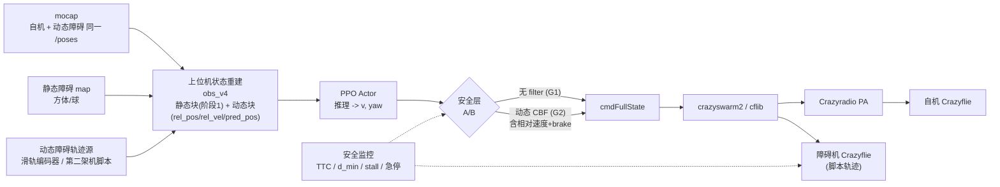

# NavVel 阶段 3：动态障碍避障训练计划

> 版本 2026-09-11（新建）。**本文只做计划**（建模 / 观测 / 安全层 / 课程 / 指标 / 真机可行性 / 里程碑），
> 实现为后续会话。
>
> **前置依赖（未达标不要开阶段 3）**
> - `NAVVEL_RETRAIN_GUIDE.md` §A（长方体立柱，1a 球近似或 1b 方体精确）达标：
>   静态障碍已是**方体世界**、场地拓扑多样（窄通道 / L 形遮挡）、真机场地 0 碰。
> - `NAVVEL_RETRAIN_GUIDE.md` §B（去 runtime filter）达标：
>   **filter 依赖度 ≥ 0.95**、真机 `--no-cbf` N0–N3 逐档 0 碰（β 形态，理想情况含 α 形态）。
> - `NAVVEL_RETRAIN_GUIDE.md` §D 清单填完（训练仓现状确认）。
>
> **配套**：`NAVVEL_DEPLOYMENT_PIPELINE.md`（全链路/频率/指令链；§5.8 = velocity vs full_state 受控实测，
> **滞后分解：执行段 0.19–0.33 s + EKF 速度估计段 0.36–0.50 s**）、`NAVVEL_DEPLOYMENT_RUNBOOK.md`（§16 无 CBF 实飞）、
> `NAVVEL_FLYOVER_PLAN.md`（飞越课程，独立线，需与本文协调场地占用）。
> 训练仓：`hybrid@10.17.203.52:/home/lz/lzspace/drones/OmniDrones`。

---

## 0. 结论摘要（先看这段）

1. **动态障碍只用"真机可复现"的两类载体**（本次确认）：**第二架 Crazyflie** + **地面移动立柱**（滑轨/转台），
   并支持**静态方柱 + 动态障碍混合**场景。仿真专属的"随机游走动球"**不作为主线**（只能当 DR/预训练）。
2. **观测口径 = 全观测**（本次确认）：动态障碍的**位置 + 速度真值**，外加**恒速外推预测点**。
   ★这不是"锦上添花"：真机 obs 的速度通道**滞后 0.36–0.50 s**（PIPELINE §5.8），
   动态场景下这个滞后直接等于"看到过去" ⇒ 必须在 obs 里显式做延迟补偿/外推。
3. **安全层两条线 A/B**（本次确认）：沿用阶段 2 的 **无 filter（策略内化）** 与新增 **动态 CBF（含相对速度项）**。
4. **最大的风险不是算法，而是三件事**：
   - **延迟**（观测滞后 + 位姿链路）：决定"能不能及时避"；
   - **真机复现**（单 Crazyradio PA 驱动两架 + 动捕刚体 + 移动立柱机构与反馈）；
   - **"等待"策略**：策略可能学会"停在原地等障碍走开"（静态场景不会暴露），必须有 stall 检测与时间惩罚。
5. 建议的难度阶梯：`D0 静态达标 → D1 单动态慢速直线 → D2 单动态变向/变速 → D3 双动态+静态混合 → D4 对抗/快速/窄通道`。

### 0.1 本次确认的冻结决策

| # | 决策项 | 结论 |
|---|---|---|
| 1 | 动态障碍载体 | 第二架 Crazyflie + 地面移动立柱（滑轨/转台）+ 静态/动态混合 |
| 2 | 动态障碍观测 | 全观测：`rel_pos` + `rel_vel` + 恒速外推预测点 `pred_pos` |
| 3 | 安全层 | 保留 **filter 与无 filter 两条线** 做 A/B |
| 4 | 文档范围 | 仅计划 + 训练侧改动清单 + 服务器/硬件待确认（可执行命令）+ 里程碑 |
| 5 | 主文档 | 本文独立成文；阶段 1/2 见 `NAVVEL_RETRAIN_GUIDE.md` |

---

## 1. 目标、范围与成功判据

### 1.1 任务定义（在阶段 1/2 的 MDP 上做增量）

- **状态**：自机状态（不变）+ 静态方柱集（阶段 1 口径）+ **$N_d$ 个动态障碍**（位置/速度/几何）。
- **动作**：不变（世界系速度 + 绝对 yaw）——**阶段 3 不主动改动作空间**（改动作空间会让阶段 2 的成果全部作废）。
- **终止**：撞静态 / 撞动态 / OOB / 超时；到达判据不变（`arrival@r` 曲线）。
- **目标**：在动态障碍运动的情况下，**到达 + 0 碰撞**，且不出现"长期停滞"。

### 1.2 成功判据（分层，全部要 sim + 真机一致口径）

| 层 | 判据 | 门槛（建议） |
|---|---|---|
| L1 功能 | 到达率（动态场景，`arrival@0.2`） | ≥ 0.80 |
| L2 安全 | 与动态障碍碰撞率 / 与静态障碍碰撞率 | **0 / 0** |
| L3 安全余量 | 动态 `min d_min` / 静态 `min d_min` | ≥ 0.15 / ≥ 0.10 |
| L4 时效 | `min TTC`（全程最小碰撞时间） | ≥ 0.5 s（记录 p05） |
| L5 行为 | stall（速度 < 0.05 m/s 且非到达）时间占比 | ≤ 10% |
| L6 平滑 | 动作率 / jerk | 不劣于阶段 2 |
| L7 sim2real | 真机 `--no-cbf` 或动态 CBF 下逐档 0 碰 | §7.3 R0–R3 |

### 1.3 与阶段 1/2 的关系

- **obs**：先约定版本命名（贯穿两份文档）——
  | 版本 | 内容 | 来源 |
  |---|---|---|
  | `obs_v2` | **现部署的 62 维**（静态障碍块 = 最近 8 个球 × 4 维） | 现状 |
  | `obs_v3` | 阶段 1b：方体精确（把障碍块换成 SDF/半尺寸+朝向） | `NAVVEL_RETRAIN_GUIDE.md` §A.6 |
  | `obs_v4` | 阶段 3：动态障碍块（本文件 §3） | 本文 |

  **`obs_v4` = 静态块（`obs_v2` 或 `obs_v3`，取决于阶段 1 走到哪一步）+ 动态块**。
  任一变化都 ⇒ **必须重导 TorchScript + 重做离线对拍**（红线）。
- **安全层**：直接复用阶段 2 的"无 filter"成果与现有 `navvel_cbf.py`（只加相对速度项）。
- **几何**：静态障碍沿用阶段 1 的方体口径（1a 用外接球，1b 用方体 SDF）。

---

## 2. 动态障碍建模（仿真侧）

### 2.1 载体 A：第二架 Crazyflie

**为什么选它**：真机可复现（本工作区已支持多机 crazyswarm2 + 动捕刚体），且覆盖"机间避让"这一最实用的场景。

**运动源三档（建议按档推进，不要一次全上）**

| 档 | 运动来源 | 用途 | 优点/缺点 |
|---|---|---|---|
| A-1 | **脚本轨迹**：直线往返 / 圆周 / 正弦 / Lissajous；参数（速度、相位、周期、起点、加速度上限）随机化 | v1 主线 | ✅可复现、可标定；❌学不到"主动规避对手" |
| A-2 | **同策略对手（自博弈）** | v2 进阶 | ✅行为丰富；❌训练不稳、难复现、真机难复刻 |
| A-3 | **对抗策略**（最坏情形/故意堵截） | 鲁棒性测试 | ✅压力测试；❌易学到过度保守 |

**建模精度（★建议 v1 用 kinematic）**

- **v1（推荐）**：障碍机 = **kinematic 刚体**，严格跟踪给定轨迹（位置/速度由轨迹解析给出）。
  目的：**把"对手行为的不确定性"与"对手动力学的不确定性"解耦** —— 先证明"能对已知轨迹避障"，
  再加动力学不确定性（否则出问题无法归因）。
- **v2**：障碍机 = **同构 full dynamics**（同一套 `nav_vel` 动力学，位置控制跟随轨迹），
  轨迹跟踪误差自然进入分布 ⇒ 更接近真机（真机障碍机也会抖/跟不准）。

**域随机化（DR）**

| 项 | 范围（起点） | 说明 |
|---|---|---|
| 轨迹类型 / 形状参数 | {直线, 正弦, 圆周, Lissajous} | 覆盖"可预测"到"周期性但复杂" |
| 速度上限 | 0.3 / 0.6 / 1.0 m/s（分级） | 与难度阶梯绑定 |
| 相位 / 周期 / 起点 | 均匀随机 | 决定"相遇几何" |
| 加速度上限 | ±20% | 限制"瞬停/瞬转"（真机做不到） |
| 轨迹跟踪噪声 | 位置 σ 1–3 cm，速度 σ 3–10 cm/s | 覆盖真机抖动 |
| **起始位置与朝向** | 场地内随机（满足与自机/静态障碍的初始净空） | 避免"一开局就重叠" |
| 机-机安全半径 | `r_cc = 2·(drone_radius + inflation) + margin`（起点 ≈ 0.30–0.40 m，★待定 §10 #4） | 与 CBF 同一口径 |

### 2.2 载体 B：地面移动立柱

**为什么选它**：真机可复现（滑轨/转台），几何与阶段 1 的方柱**同构**，且运动**高度可预测** ⇒ 是"从静态到动态"的
最佳过渡（比第二架机简单：没有对手策略、速度更低、轨迹更规则）。

| 机构 | 运动 | 真机实现要点 | 仿真建模 |
|---|---|---|---|
| **1D 滑轨** | 往复（三角波/正弦 + 端点驻留） | 行程限位 + 编码器反馈 | kinematic，$x(t)$ 解析或查表 |
| **转台** | 圆周（立柱在半径 $R$ 处，$\omega$ 可调） | 角速度/角度反馈 | kinematic，$p(t)=c+R(\cos\theta,\sin\theta)$ |
| **2D 龙门**（可选） | XY 平面任意轨迹 | 成本高，优先级低 | kinematic |

- 几何：与阶段 1 的方柱一致（`pillar_side`、逐段高度、yaw），**加上运动**。
- DR：速度上限、周期、相位、驻留时长、位置噪声（编码器量化 + 机械间隙）。
- 与静态障碍的**碰撞建模**：移动柱与静态柱/场地边界不得干涉（仿真里直接约束行程）。

### 2.3 混合场景与难度分级

| 级 | 静态（阶段 1 口径） | 动态 | 速度 | 轨迹 | 备注 |
|---|---|---|---|---|---|
| **D0** | 方柱全布置 | 0 | — | — | = 阶段 1/2 的达标场景（回归基准） |
| **D1** | 少量（1–2 柱）或空场 | 1（地面柱 或 第二架机） | 0.2–0.3 m/s | 直线往返 | 建立基本避让 |
| **D2** | 少量 | 1 | 0.3–0.6 m/s | 变向 / 正弦 / 圆周 | 学"预测 + 提前量" |
| **D3** | 全布置（含窄通道） | **2** | 0.3–0.6 m/s | 混合（1 地面柱 + 1 第二架机） | 混合干扰 |
| **D4** | 全布置 + 窄通道 | 2–3 | 0.6–1.0 m/s | 对向穿越 / 交叉 | 最难；含 A-2/A-3 对手 |

**场景可行性硬约束（必须实现，否则任务无解）**

1. **动态障碍不得把起点/终点"永久"封死**：采样后做一次**时间可达性检查**
   （粗粒度：把动态障碍在 $t\in[0,T]$ 内离散成若干静止快照，检查起点↔终点在图上的连通性；
   或简化成"起点/终点在障碍轨迹上的最近距离 ≥ 2·安全半径"）。
2. **静态 + 动态总密度上限**：保证"存在一条时间窗可通行的走廊"。
3. **运动方向不得与走廊方向长期同向阻塞**（否则策略只能"跟跑"）。

---

## 3. 观测设计（`obs_v4` 提案）

### 3.1 为什么必须扩 obs

现有 `obs_v2`（62 维）的障碍块只有 `[rpos/5, r_o/0.5]` × 最近 8 个 —— **没有任何速度信息**。
动态场景下策略若不知道障碍往哪走，只能靠历史帧隐式推断（而现有策略是**无记忆 MLP**，PPO actor =
`make_mlp([256,256,256]) + mean(4)`，无 RNN/历史栈）⇒ 必然学不到提前量。所以**必须显式给速度**
（若阶段 1b 已上 `obs_v3`，则本节只是在 `obs_v3` 的静态块之后**追加**动态块）。

### 3.2 提案（维度/顺序冻结，改后重导+重对拍）

在 `obs_v2` 基础上**追加**动态障碍块（保持原有 62 维前缀与顺序**完全不变**，便于复用现有组装代码与对拍用例）：

| 块 | 维度 | 内容 | 缩放 |
|---|---|---|---|
| 动态障碍块 | `K_d × 12` | 每个动态障碍：`rel_pos(3)`、`rel_vel(3)`、`pred_pos(3)`、`r_o(1)`、`active(1)`、预留(1) | 见下 |

$$
\begin{aligned}
\Delta p_i &= p_i^{o} - p_{\text{self}}, &\Delta v_i &= v_i^{o} - v_{\text{self}}\\
\text{pred}_i &= p_i^{o} + v_i^{o}\,\tau_{\text{pred}} - p_{\text{self}}
\end{aligned}
\qquad
\tau_{\text{pred}} \approx 0.4\text{–}0.6\ \text{s}\ \ (\text{★对齐实测观测滞后})
$$

- **缩放**：`Δp/5`、`pred/5`（同静态块）；`Δv` 用 `Δv/1.5`（覆盖 ±1.5 m/s）；`r_o/0.5`；`active ∈ {0,1}`。
- **排序**：按 `‖Δp‖` 升序（同静态块），无效槽补 0（`active=0`）。
- **`K_d` 取值**：`K_d=3` ⇒ +36 维 ⇒ 总维 **98**；`K_d=4` ⇒ +48 ⇒ 总维 110（★待定 §10 #3）。
  依据：D3/D4 最多 3 个动态障碍，取 `K_d = N_d,max`（不需要"最近 K"截断，直接全给）。
- ★**一定要给相对速度**（`v_o − v_self`），不要只给障碍绝对速度：
  相对量对"是否会发生碰撞/需要多大避让"最直接，且与动态 CBF 的约束项同构（§4.2）。
- ★**静态块与动态块分开**：不要把动态障碍混进"最近 8 个静态障碍"里 —— 否则容量（8 个）
  会被动态障碍挤占，静态避障能力（阶段 1 的成果）会退化。

### 3.3 延迟与估计（**阶段 3 成败关键**）

| 环节 | 真机现状 | 训练侧必须模拟 |
|---|---|---|
| 自机速度通道 | obs 里 `stateEstimate.v` **滞后 0.36–0.50 s**（EKF 估计段） | 一阶滞后 τ_e ∈ [300, 600] ms（`RETRAIN_GUIDE` §3.4） |
| 自机执行 | 指令 → 实际运动滞后 0.19–0.33 s | 一阶滞后 τ ∈ [150, 350] ms |
| 动态障碍位置 | mocap 直给（低延迟，同一 `/poses` 流） | 延迟 40–80 ms + 1% 丢帧 |
| 动态障碍速度 | ①刚体速度（mocap 直接给，首选）②位置差分 + 低通 | 同上 + 速度噪声 σ 3–10 cm/s |
| **外推补偿** | 部署侧用 `τ_pred` 补偿"看到的是过去" | **训练侧必须把 `τ_pred` 误差也随机化**（±50%），否则 sim 里"看得见未来"、真机看不见 |

> ★**闭环要点**：训练时若"障碍状态零延迟 + 外推完美"，策略会学成"依赖精确预测"；
> 真机延迟一进来就崩。⇒ **延迟 DR 与外推误差 DR 是本阶段的第一优先项**，比奖励设计更重要。

### 3.4 时间同步

- 动捕同一时钟 ⇒ 自机与动态障碍**同一 `/poses` 消息**，天然时间对齐（不需要额外同步）。
- ROS 侧按**同一 `stamp`** 取位姿；**禁止**用"到达时刻"分别取（会引入可变偏移）。
- 日志里必须记：`stamp`、`pose_age_ms`（自机/障碍各一份）、`τ_pred`、外推前后位置（便于事后归因）。

---

## 4. 安全层（决策 #3：两条线 A/B）

### 4.1 线一：无 filter（沿用阶段 2）

- 策略自身满足约束（阶段 2 的 `h_min^train ≥ 0` 口径）。
- 优点：无额外计算/无 filter 引入的相位滞后（对动态场景尤其重要：filter 会"延迟避让"）。
- 风险：真机滞后 + 预测误差下，"理论上安全"可能变成"实际不安全" ⇒ 必须有 §4.2 兜底或**降速表**。

### 4.2 线二：动态 CBF（含相对速度项）

**静态球 CBF（现状）**：$h_i = \|\Delta p_i\| - r_{\mathrm{cbf},i}$，
$\dot h_i = n_i^\top v$（$n_i = \Delta p_i/\|\Delta p_i\|$），约束 $\dot h_i + \alpha h_i \ge 0$。

**动态球 CBF（本阶段新增）**：障碍在动 ⇒ $\Delta p_i$ 的导数含相对速度：

$$
h_i = \|\Delta p_i\| - r_{\mathrm{cbf},i},\qquad
\dot h_i = n_i^\top (v - v_i^{o}),\qquad
\text{约束：}\quad n_i^\top v \;\ge\; n_i^\top v_i^{o} - \alpha h_i
$$

**与现有实现的差距只有一行**（`navvel_cbf.py` / `omni_drones/utils/cbf.py::filter_velocity`）：

```
现状:  g = (n · v) + alpha * h
动态:  g = (n · (v - v_o)) + alpha * h
```

- 投影仍是"沿 $n$ 加 $\mathrm{relu}(-g)$"，迭代次数/`alpha` 不变 ⇒ **可逐字对拍**（对拍用例加"障碍有速度"的场景）。
- ★**brake term 建议打开**：静态下 `use_brake_term=false` 是"够用"（因为障碍不动，刹不刹得住由 $\alpha$ 保证）；
  动态下"对方迎面而来"会出现**可行域为空**的情况，需要 $v_{\max}^2/(2a_{\max})$ 项给出"必须提前减速"的容量约束，
  否则 filter 会输出"来不及刹"的解（数值上仍满足约束，物理上撞上）。
- **保守化选项**（推荐开）：用**膨胀球** $r_{\mathrm{cbf}} + v_i^{o}\cdot \Delta t_{\mathrm{react}}$
  吸收"感知-决策-执行"的总反应时间（$\Delta t_{\mathrm{react}} \approx 0.3\text{–}0.5$ s，与 §3.3 一致）。
- **速度未知时**：用 §3 的 `Δv`（obs 里的相对速度）代替真值；再差就退化为"扩张球 + 恒速预测"。

### 4.3 A/B 设计

| 组 | 训练（F1 奖励臂，沿用阶段 2） | 训练时动态 filter | 评估时 | 目的 |
|---|---|---|---|---|
| G1 | 阶段 2 选出的最优臂（无 filter 组） | 关 | 无 filter | **内化路线**（目标交付） |
| G2 | 同上 | 开（或退火） | 动态 CBF | 兜底路线 |
| G3 | dual（现部署） | 开 | 动态 CBF | 复现对照 |
| G4 | naive | 关 | 无 filter | 下界（证明安全塑形真的有用） |

**必报指标**：同 §1.2 的 L1–L6 + `RETRAIN_GUIDE` §B.4 的 filter 依赖度 / 修正幅度 / 零介入率 / `h_min`。

---

## 5. 课程与实验矩阵

### 5.1 课程（逐级解锁，每级达标再进下一级）

```
D0 静态（阶段1/2 已达标, 回归基准）
  └─ D1 单动态 · 慢速(0.2–0.3) · 直线/圆周 · 空场或少柱
       └─ D2 单动态 · 中速(0.3–0.6) · 变向/正弦 · 少柱
            └─ D3 双动态 · 中速 · 混合轨迹 · 方柱全布置(含窄通道)
                 └─ D4 双/三动态 · 快速(0.6–1.0) · 对向穿越 · 窄通道 + 对抗(float 可选)
```

**建议的课程自动化**：以 `arrival@0.2 ≥ 0.8 且 0 碰且 stall ≤ 10%` 作为升级判据（滚动窗口），
不达标就回退一级（避免"课程升太快 → 全崩 → 归因不了"）。

### 5.2 消融矩阵（在 D2/D3 上做，单变量）

| 因子 | 档位 | 关注 |
|---|---|---|
| `τ_pred` 误差 DR | {0, ±25%, ±50%} | **最敏感因子**（决定策略是否依赖完美预测） |
| 障碍速度 | {0.3, 0.6, 1.0} m/s | 速度上限的可行性边界 |
| 障碍数量 | {1, 2, 3} | obs 容量（`K_d`）是否够 |
| 轨迹类型 | {直线, 正弦, 圆周, Lissajous} | 泛化 |
| 运动建模 | {kinematic, full dynamics} | 对手动力学不确定性代价 |
| 安全层 | {无 filter, 动态 CBF} | G1 vs G2 |

每格 ≥3 seed；**禁止**同时改两个因子（同 `RETRAIN_GUIDE` §8 原则）。

---

## 6. 指标（动态专属）

| 指标 | 定义 | 门槛（建议） |
|---|---|---|
| 碰撞率（动态 / 静态） | `d < collision_margin` 分开统计 | **0 / 0** |
| `min TTC` | 全程 $\min_t \mathrm{TTC}(t)$（$\mathrm{TTC} = \max(0, -\|\Delta p\|^2/\frac{d}{dt}\|\Delta p\|^2)$） | ≥ 0.5 s（记录 p05） |
| `min d_min`（动态 / 静态） | 分开统计 | ≥ 0.15 / ≥ 0.10 |
| 到达率 | `arrival@0.2`（动态场景） | ≥ 0.80 |
| **stall 占比** | `\|v\| < 0.05 m/s` 且非到达的步占比 | ≤ 10% |
| 反应距离 / 反应 TTC | 首次明显避让（横向动作 > 阈值）时的 `d` / `TTC` | 记录（判断"提前量"是否合理） |
| 绕行代价 | 航迹长度 / 直线距离；平均速度 | 记录（对照 D0） |
| 平滑性 | 动作率、jerk | 不劣于阶段 2 |
| CBF 介入率 | 动态 CBF 线 | 记录（不算失败） |
| obs 容量饱和率 | `K_d` 槽位被占满且仍有未编码动态障碍的步占比 | **必须为 0** |

> ★**"等待"策略必须显式检测**：`stall 占比` + "到达时间分布" + "与障碍相遇前的速度剖面"。
> 若策略学会"停着等障碍走开"，在静态场景的指标上是**看不出来的**（到达率甚至更高）。
> 缓解：时间惩罚（每步小负奖励）+ 最小推进奖励（接近目标方向的速度分量）+ 课程里刻意设计
> "障碍长时间挡住直线路径"的场景，逼它学会绕行而不是等待。

---

## 7. 真机可行性

### 7.1 第二架 Crazyflie

| 项 | 方案 | 风险/注意 |
|---|---|---|
| 指令来源 | ①独立脚本进程（航点/圆周，最简）②同一上位机进程双机同步下发 | ②更容易做"时间对齐"的实验 |
| 无线链路 | 单 Crazyradio PA 驱动两架 | **带宽/时隙**：建议指令 50–100 Hz，**大幅削减日志频率**（日志才是带宽大头） |
| 动捕 | 两个刚体（如 `cf4` / `cf5`），同一 mocap 世界系 | 刚体命名/标记配置要与 `motion_capture.yaml` 对齐（本工作区有踩坑记录） |
| 时间同步 | 两机位姿在**同一 `/poses` 消息**里 ⇒ 天然对齐 | 不要各自订阅不同话题再拼 |
| 安全 | 物理隔离/网罩 + 双机速度上限 + 先"障碍机静止"再动 | 建议障碍机先 `--takeoff-only` 悬停做静态对照 |
| 高度差 | 可让障碍机在不同高度层飞（降低碰撞后果） | 会削弱"真实避障"的难度，只作首飞 |

### 7.2 地面移动立柱

| 项 | 方案 | 风险/注意 |
|---|---|---|
| 机构 | 1D 滑轨（推荐先做，最简）/ 转台 | 转台会把"线性往复"变成"圆周运动"，更接近"横穿" |
| 位置反馈 | 编码器（直给）或 mocap 标记（推荐，与自机同源） | **用 mocap 标记 ⇒ 位置+速度直接来自动捕，与训练口径一致** |
| 速度 | 由编码器差分或 mocap 差分 + 低通（对齐 §3.3） | 差分噪声会放大 ⇒ 必须滤波 |
| 安全 | 行程限位 + 硬件急停 + 软限位（ROS 层） | 人也可能被撞 ⇒ 网罩/警戒区 |
| 与静态障碍 | 滑轨行程不得与静态柱/边界干涉 | 仿真里也要加同样约束 |

### 7.3 分级验收（真机，逐档 0 碰撞）

| 档 | 场景 | 形态 | 判据 |
|---|---|---|---|
| **R0** 动态链路静态对照 | 动态障碍**静止在轨上/悬停不动**，但走**新的 obs_v4 链路** | β 最小兜底 | 结果应与 D0 持平（验证"只是换了观测链路"没引入回归） |
| **R1** 单动态慢速 | 地面柱 0.2–0.3 m/s 直线往返；或第二架机慢速直线 | β → α | 0 碰撞；动态 `min d_min ≥ 0.15`；无 stall |
| **R2** 单动态变向 | 圆周/正弦，0.3–0.6 m/s | β → α | 同上 + `min TTC ≥ 0.5 s` |
| **R3** 双动态 + 静态混合 | 1 地面柱 + 1 第二架机 + 方柱全布置 | β（+动态 CBF）→ α | 0 碰撞 + 到达率 ≥ 0.8（≥20 次） |

- **先 β 后 α**（同 `RETRAIN_GUIDE` §B.6 原则）；α 形态（彻底无 filter）只在 R1/R2 稳定后测。
- 每档记录：`stamp` / `pose_age_ms` / `τ_pred` / 动态障碍实测轨迹 / `min TTC` / `min d_min` /
  `box_net` / CBF 或 abort 介入 / stall 占比 / tilt max。
- 可视化：`navvel_live3d_box.py`（实时）+ `navvel_replay3d_box.py`（回放）已支持方体；
  **动态障碍需要新增绘制**（运动柱/第二架机 + 其预测点 + TTC 曲线），属后续实现项（§10 #8）。

---

## 8. 里程碑与依赖

| # | 里程碑 | 依赖 | 产出 |
|---|---|---|---|
| P3.0 | 场景可行性检查器（时间可达性）实现 | 阶段 1 场景生成 | 合法 D1–D4 场景可批量生成 |
| P3.1 | kinematic 动态障碍（地面柱 + 第二架机）进 sim + DR | P3.0 | D1 可训 |
| P3.2 | `obs_v4` 冻结 + 导出/对拍通过（actor < 1e-5） | P3.1 | 可上真机的新链路 |
| P3.3 | 延迟/外推误差 DR 落地（§3.3） | P3.2 | sim 结果可信（这是**最关键的里程碑**） |
| P3.4 | D1/D2 达标（0 碰 + `min TTC ≥ 0.5` + stall ≤10%） | P3.3 | 基础避让成立 |
| P3.5 | 动态 CBF（相对速度 + brake + 膨胀球）实现 + 逐字对拍 | P3.2 | 兜底线可用 |
| P3.6 | D3/D4 达标（G1 无 filter 与 G2 动态 CBF 对照） | P3.4、P3.5 | 交付候选 |
| P3.7 | 真机 R0→R3 逐档 0 碰 | P3.6 + 硬件就绪（§7.1/§7.2） | 交付 |
| P3.8 | （可选）A-2 自博弈 / A-3 对抗 | P3.6 | 鲁棒性上界 |

**关键路径**：`P3.3（延迟 DR）` 与 `P3.7（硬件）` 是两条最容易卡住的路径，建议**并行推进**
（软件侧先做 P3.0–P3.6，硬件侧同时采购/改造滑轨与第二架机）。

---

## 9. 风险与回滚

| 风险 | 表现 | 缓解 / 回滚 |
|---|---|---|
| **延迟 DR 不足** | sim 里 100% 成功，真机 R1 就撞 | P3.3 列为最高优先；宁可 sim 指标低一点也要覆盖延迟 |
| **依赖完美预测** | `τ_pred` 误差 ±25% 时指标断崖 | obs 给 `Δv`（不只给 `pred_pos`）+ 误差 DR + 裕度势能奖励 |
| **"等待"策略** | 到达率反而更高、stall 占比高 | stall 指标 + 时间惩罚 + 最小推进奖励 + 对抗场景 |
| **obs 容量不足** | 动态障碍挤占静态块 / `K_d` 不够 | 静态块与动态块分离（§3.2）；`K_d = N_d,max`；饱和率指标必须为 0 |
| **PPO 退回阶段 1 水平** | 加入动态障碍后静态能力下降（灾难性遗忘） | D0 场景按比例混入训练（如 20% 概率采样 D0/D1）+ 定期回归评估 |
| **真机链路带宽** | 双机丢包、位姿超龄（`pose_age` 报警） | 降指令频率、砍日志、先单机再双机 |
| **移动立柱机械风险** | 撞人/撞柱/超行程 | 网罩 + 硬急停 + 行程限位 + 低速起步 |
| **阶段 2 成果被破坏** | 无 filter 能力下降 | 阶段 3 不改动作空间、不改静态块 obs（只追加）；D0 回归评估作为门槛 |
| **回滚** | — | ①模型：保留阶段 2 的 `navvel_actor.ts` + sha256（可随时切回静态版）；②obs：`obs_v2`/`obs_v4` 两套组装代码并存（靠 cfg 切换）；③场景：D0–D4 分级 cfg，可单独关闭动态障碍 |

---

## 10. 待确认清单（服务器 + 硬件；可执行命令）

### 10.1 服务器（训练侧）

```bash
ssh hybrid@10.17.203.52
cd /home/lz/lzspace/drones/OmniDrones

# ① 多智能体 / 多无人机基础设施（能否复用为"第二架机"动态障碍）
ls omni_drones/envs/
ls omni_drones/envs/single/
grep -rn "num_envs\|n_drones\|num_agents\|Heterogeneous" --include=*.py omni_drones/envs | head -30

# ② 已有"动态/移动障碍"的实现（若有，优先复用）
grep -rniE "moving|dynamic_obs|moving_obstacle|trajectory" --include=*.py omni_drones/envs | head -30
sed -n '1,120p' omni_drones/envs/formation_dodging.py   # 可能是"躲避"相关的最接近实现

# ③ 现有 env 的调度/课程机制（决定课程怎么写）
grep -rn "curriculum\|resample\|command\|schedule" --include=*.py --include=*.yaml omni_drones/envs cfg | head -40

# ④ obs 组装处（追加 obs_v4 的位置与对拍用例生成）
grep -rn "_compute_state_and_obs\|obs_buf\|get_observations" --include=*.py omni_drones/envs/single | head -30

# ⑤ DR 实现与现有滞后模拟（阶段 2 §3.4 是否已落地）
grep -rn "randomization\|delay\|lag\|filter_velocity" --include=*.py --include=*.yaml omni_drones cfg | head -40

# ⑥ 评估/导出脚本对新 obs 维度的适配点
grep -rn "obs_dim\|obs_shape\|num_obs" --include=*.py omni_drones/envs/single cfg | head -30
```

### 10.2 待确认表

| # | 待确认 | 现状/推断 | 填 |
|---|---|---|---|
| 1 | 是否已有"多无人机/异构智能体"env 可复用为第二架机 | 未知（`envs/` 下有 `formation*` / `pinball*` 等） | |
| 2 | 是否已有"移动障碍"实现或轨迹工具 | 推断无 ⇒ 需新写 `MovingObstacleManager` | |
| 3 | `K_d` 取值与 obs_v4 总维度（98 / 110 / 其他） | 提案 `K_d=3` ⇒ 98 | |
| 4 | 机-机安全半径 `r_cc` 定义（是否 `2·(drone_radius+inflation)+margin`） | 推断需定 | |
| 5 | `τ_pred` 取值与误差 DR 范围 | 提案 0.4–0.6 s，误差 ±25%/±50% | |
| 6 | 动态 CBF 的 brake term 与膨胀球参数（`a_max` / `Δt_react`） | 现状 `use_brake_term=false` | |
| 7 | 阶段 2 的延迟 DR（执行段 τ + EKF 段 τ_e）是否已落地 | `RETRAIN_GUIDE` §3.4 已提，未确认实现 | |
| 8 | 可视化对动态障碍的支持（live3d_box / replay3d_box 是否已能画运动柱并叠预测点） | 推断需新增 | |
| 9 | 真机第二架机：Crazyradio 数量/机型（CFB？）/刚体命名 | 未知 | |
| 10 | 地面移动立柱机构：滑轨规格（行程/速度/负载）、位置反馈方式 | 未采购/未定 | |
| 11 | 训练预算（num_envs / 步数 / seed / GPU 数）与阶段 3 的时间窗 | 未知 | |
| 12 | 动态障碍的真机速度上限（安全裕量下的实测可行值） | 提案 0.6 m/s 起步 | |
| 13 | 是否要做 A-2 自博弈（成本高、收益不确定） | 建议 P3.6 之后再评估 | |

---

## 附：阶段 3 数据流（真机形态示意）


