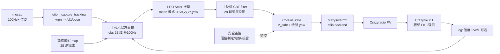

# NavVel（Crazyflie）sim2real 部署计划（deploy_plan）

> 创建：2026-09-08。范围：**仅计划文档**（方案/架构/数据流/风险/验收/里程碑），
> 不包含部署/真机执行代码——实现为后续会话。
> 配套：`geo_pillar_report.md`（交付模型与 eval 结果）、`project_summary.md`
> （sim 侧实现总结）、`env_design.md`、`simpleflight_migration_guide.md`。
> 参考工程：`thu-uav/SimpleFlight`（训练侧，本地 `refs/SimpleFlight`）、
> `thu-uav/crazyswarm_SimpleFlight`（真机侧，ROS2 + vrpn mocap + cflib）。

---

## 0. 交付模型与总体结论

**主部署 = 标称动力学 + 运行时 CBF filter（上位机复刻），pillar28 / T1500 口径：**

| 组件 | 来源 | 确定性 eval（sim） |
|---|---|---|
| 策略权重（PPO Actor，速度指令） | geo7 filter_only：`scripts/wandb/run-20260908_224733-c1r072di/files/checkpoint_final.pt` | arrival 0.941 · 0 碰 |
| 策略权重（备选同臂 dual） | geo7 dual：`scripts/wandb/run-20260908_224733-k4u0i8wg/files/checkpoint_final.pt` | arrival 0.938 · 0 碰 |
| 备选（无 filter 裸策略） | geo6 naive：`run-20260908_221545-1p1nz7wc` | arrival 0.805 |

- 部署形态：**策略（确定性 mean）+ 上位机 CBF 速度滤波** 同时在线（撤 filter 时
  OFF eval 掉到 ~0.68–0.70，且为训练分布外，不可裸部署）。
- 真机：Crazyflie 2.1（原装，不刷电机定制固件，无 Flow deck），定位靠 mocap；
  单机 + Crazyradio；上位机栈 = crazyswarm_SimpleFlight 路线
  （ROS2 + `motion_capture_tracking`(vrpn) + cflib backend）。
- 场地：可先**虚拟障碍**（上位机判定不可碰撞区域 + 安全保护），有实飞场地后放
  实体障碍（4 柱 + 12 球，与 sim 同构）。
- 已知边界（geo7 结论）：策略对 ±5% 动力学偏差即显著退化（0.94→0.54–0.64），
  **纯外层 DR 训练无法内化** → 真机参数偏差必须靠 **SysID 标定 + 推力补偿**
  控制到 <~3%，而非指望策略鲁棒。

**B1 更新（2026-09-09）——DR 掉点溯源，nominal 部署成立性增强**：
- geo7 DR 掉点（±5/±10% 下 0.94→0.64/0.35）**不是策略不鲁棒，而是 sim 特有假困难**：
  训练/评估里 DR 只随机化物理（mass/KF/KM），而低层 `LeePositionController` 是脚本按
  **标称**参数创建的 → 重力/推力补偿错配 → 末端悬停漂移；
- **B1 对照**（不重训，仅让低层 Lee 用随机化后的真实 per-env mass/KF，
  `+task.controller_sync_dr=true`）：同策略 ±10% 下完成度从 0.35–0.40 拉回
  **dual ON 0.953 / fo ON 0.895（0 碰）**，±5/±10/nominal≈打平 0.93–0.95；
- **真机含义**：Crazyflie 板载固件用自己的 SysID 参数自标定，天然消除该错配 →
  **低层按真机 SysID 标定即可，nominal（0.94）+ CBF filter 部署成立**，策略无需
  为动力学偏差重训或扛 ±10%；SysID 的目的从"补偿策略脆弱"修正为"保证 obs/低层
  与 sim 一致 + 部署质量"。

**CFB 更新（2026-09-09 19:1x CST）——sim 模型切换为 Crazyflie Brushless 42g**
- 交付真机实为 **CFB 无刷版（实测 42 g，含桨保护 + 动捕球）**；sim 已按论文
  arXiv:2603.05944 Table II 迁移（commit `0b88cc6` 17:50 / `774538f` 17:56，见 geo_pillar_report.md §8）。
- geo7（空心杯 32 g）权重在 CFB 下免训 eval = 0/256（~18:00）→ 必须重训；
- **阶段一**（17:57–18:21，4 seed × 20M warm + 小 DR）：nominal CFB 0.938–0.969（0 碰，~19:00 eval）；
  但 ±20% DR 掉到 0.46–0.47 → 需阶段二；
- **阶段二**（19:13 启动，3 seed × 20M）：warm 最优 seed4（0.969）+ DR 放大到论文档
  （inertia/t2w/f2m ±20%）+ **`task.controller_sync_dr=true`**（训练时低层按真机固件语义适配随机参数）；
- **交付权重（CFB，2026-09-09 ~19:45 定）**：阶段二 ctrlSync-1
  `scripts/wandb/run-20260909_191309-hpzc2m3r/files/checkpoint_final.pt` ——
  nominal CFB **0.891** / ±20% DR **0.906**（0 碰）；备选 ctrlSync-3
  （`run-20260909_191309-pczh85ou`，nominal 0.891 / DR 0.883）。
  eval 口径须带 `+task.controller_sync_dr=true`（= 真机固件自标定，勿用标称低层口径）。
- 几何/obs 62 维/CBF 28 球/filter 口径不变；速度层 100Hz 部署结论不变。真机参数以 CFB 42g +
  论文标定为准（SysID 复核悬停油门）。标称极致备选：阶段一 seed4（nominal 0.969）。

**filter ON vs OFF 对比 + 实飞选型（2026-09-09 ~19:5x CST，CFB + controller_sync_dr 口径）**：

| 模型 | nominal **ON** | nominal **OFF** | ±20% DR ON | ±20% DR OFF |
|---|---|---|---|---|
| **ctrlSync-1**（主） | 0.891 | **0.855**（0 碰） | 0.906 | 0.805（0 碰） |
| ctrlSync-3（备） | 0.891 | 0.793（1 碰） | 0.883 | — |
| seed4（标称极致） | 0.969 | 0.668（1 碰） | — | — |

- ctrlSync-1 **对 filter 依赖最低**：撤上位机 CBF 后 nominal 0.855 / ±20% DR 0.805（全 0 碰）→
  裸策略即可作 CBF 未就绪时的过渡试飞；
- seed4 高度依赖 filter（OFF 0.668、有碰撞），仅适合"CBF 完美实现 + SysID 偏差 <2%"。
- **实飞 .pt（推荐主选 ctrlSync-1，默认带 filter）**：
  `/home/lz/lzspace/drones/OmniDrones/scripts/wandb/run-20260909_191309-hpzc2m3r/files/checkpoint_final.pt`
  （nominal 0.891 / ±20% DR 0.906，0 碰）；
  备选 seed4：`.../run-20260909_180042-r02a809m/files/checkpoint_19693568.pt`（nominal 0.969，依赖 filter）。

---

## 1. sim ↔ real 映射

### 1.1 数据流（部署形态）



### 1.2 obs 62 维的真机重建（逐块，顺序必须与 sim 完全一致）

sim 拼装顺序（`nav_vel._compute_state_and_obs`）：

| # | 块 | 维度 | sim 来源 | 真机来源与重建方法 |
|---|---|---|---|---|
| 1 | `rpos` | 3 | target_pos − drone_pos | 目标点（世界系已知常量）− mocap 位置（换算到场地系） |
| 2 | `rot` | 4 | 四元数 **wxyz**（Isaac 约定） | mocap 四元数（vrpn 通常 xyzw → **必须转 wxyz**，与 Isaac 一致） |
| 3 | `vel_w` | 6 | 世界系线速度 3 + 角速度 3 | ①首选 CF 板载 EKF 速度（mocap 模式下板载已融合，经 log 遥测）；②备选 mocap 位置差分 + 低通滤波；角速度可用板载陀螺（log）。**注意 sim 中这 6 维是 vel_w（世界系），且 obs 用的是 `self.vel`（=vel_w，世界系 6 维），勿填机体系** |
| 4 | `heading` | 3 | 机头方向单位向量（世界系） | 由姿态四元数旋转体轴 X 到世界系 |
| 5 | `up` | 3 | 机体 Z 轴单位向量 | 同上（体轴 Z） |
| 6 | `throttle` | 4 | 4 个转子一阶响应油门 `[0,1]` 再 `×2−1` | **sim-real gap（见 §6.3）**：用 log 遥测电机 PWM/65535 近似（crazyswarm2 log 或 cflib logging）；取不到时退化为常数（悬停 PWM ≈ 0.55→obs 值 0.1）或固定 0。需在 M2 一致性验证中消融影响 |
| 7 | `rheading` | 3 | target_heading − heading | 部署 target_heading 取常量（推荐 = 起终点连线方向 yaw=0 或固定 0）；sim 训练时 target_heading 每局随机，策略对任意 rheading 都见过，固定值在分布内 |
| 8 | `time_encoding` | 4 | t/T，T=1500 | 上位机计数器：起飞后每步 +1/1500（4 维填同一值）。**必须与 sim 一致：eval 固定 rollout 1500 步，真机从起飞即开始计数；到达后仍继续计（success_terminate=false）** |
| 9 | obstacle block | 32 | 最近 8 障碍 × [rpos_xyz/5 clip±1, r_o/0.5 clip[0,1]]，按距离升序 | 静态障碍 map（§1.3）与 mocap 位置在线计算；**注意是「最近 8 个」按距离升序、无效槽补 0，且用的是逻辑半径 r_o（柱层球 0.354 / 自由球档位），不是 CBF 半径** |

总维度核对：3+4+6+3+3+4+3+4+32 = **62** ✓。

### 1.3 障碍 map（28 逻辑球，静态、上位机常量表）

真机场地障碍与 sim pillar28 同构，**一次标定、写入常量表**（不要在线估计）：

- 4 根立柱 = 每根 **4 层外接圆球 r=0.354**，球心 z = 0.754 / 1.354 / 1.954 / 2.554
  （覆盖 z∈[0.4, 2.6] 全高，等效 0.5×0.5×3 m 柱）；
- 12 个自由球（半径档 [0.20, 0.30, 0.40] 现场量测）；
- 合计 **M=28 逻辑球全激活**；
- 判定半径 `r_s = r_o + drone_radius(0.15) + inflation(0.05)`；
- 表面净空 `d_i = ‖p − p_oi‖ − r_s`；碰撞 = `d_min < 0.05`（几何边沿）；
- 柱心 xy 现场布置时满足：`|x| ≤ keepout_x(2.5) − 0.354`（出生走廊）、柱间/球间
  gap ≥ 0.25、起点/终点净空（init ≥ r_s+0.15，goal ≥ r_s+0.35）、
  y 可在全幅 ±2.8 布障；
- **坐标标定流程**：mocap 场地标定（L 型角点）→ 定义场地系（原点=房间中心地面、
  x 指向 goal 方向、z 向上，与 sim env frame 一致）→ 用 mocap 标记球逐一点测
  28 球球心（或柱用四角平均 + 半径公式）→ 录入 yaml 常量表。
  自由球若为虚拟障碍则直接按设计坐标录入（物理不摆放）。

### 1.4 动作 → 下发

- 策略输出 4D `[vx, vy, vz, yaw]`（世界系速度 + 绝对 yaw 目标；sim 中 yaw 经
  `target_yaw × π` 作为**绝对偏航角**进入 Lee 控制器，限幅 |yaw|≤1.5 rad）；
- **推理用确定性 mean**（`ExplorationType.MODE`，与 eval 口径一致；绝不采样 std）；
- CBF 只投影平动 3 维，**yaw 直通**；
- 限幅：CBF 前先 `clamp ±v_max(1.8)`（与 sim `CBFVelocityFilter` 一致）；
  yaw 限幅 ±1.5 rad（与 `VelController` 一致）；
- 下发（二选一，M3 阶段实验定案）：
  - **方案 P（位置积分器）**：上位机 `p_set += v_safe·dt`，以
    `cmdFullState(pos=p_set, yaw=abs_yaw)` 下发，板载 Mellinger 跟踪——
    最贴近 sim（sim 的 Lee 低层也是"当前位姿 + 目标速度"的跟踪语义）；
  - **方案 V（velocity 模式）**：cflib `send_velocity_world_setpoint(vx,vy,vz,
    yaw_rate)`，绝对 yaw 由上位机把 `yaw` 与当前航向差折算为短时 yaw-rate——
    注意 yaw-rate 积分漂移，需每步重折算；
  - 推荐先验方案 P；两方案均在 M3 无障试飞中做低层跟踪对比再定案。

### 1.5 板载控制器选型与「无需重训」论证

- **Crazyflie 2.1 原装固件**（无需刷自定义固件）内置两种高层控制器，均支持速度模式：
  - **PID**（cascade，默认）：串级 PID，velocity 模式入口
    `send_velocity_world_setpoint(vx, vy, vz, yaw_rate)`（世界系速度 + yaw rate）；
  - **Mellinger**：几何控制器（SE(3) 位置/速度跟踪），全状态入口
    `send_full_state_setpoint(pos, vel, acc, yaw, omega)`，可**直接喂绝对 yaw**。
- **关键结论：不需要为部署重新训练模型。** 本策略是速度层（velocity-command）
  规划器，与底层控制器解耦：
  - sim：`policy → [vx,vy,vz,yaw] → VelController → LeePositionController → 电机推力`；
  - 真机：`policy → [vx,vy,vz,yaw] → 板载 PID/Mellinger（速度模式）→ 电机推力`。
  - 被替换的只是「速度指令 → 电机」这一段底层闭环；policy 的权重、观测（62 维）、
    动作空间（4D 世界系速度 + yaw）全部保持不变。
- **控制器与 sim 的同源性对照**：

  | 板载控制器 | 类型 | 对应 sim 侧 | 速度入口 |
  |---|---|---|---|
  | **Mellinger** | 几何 SE(3) | **与 `LeePositionController` 同源**（Lee 2010 即 Mellinger 2011 几何控制器的前身/同期工作） | `send_full_state_setpoint` |
  | PID（cascade） | 串级 PID | 对应 DSLPID / VelController 思路 | `send_velocity_world_setpoint` |

  → 真机优先选 **Mellinger**：与训练时的 Lee 几何控制器同族，低层闭环特性最接近，
   sim-to-real gap 最小；这正是 §1.4 方案 P（`cmdFullState` + 绝对 yaw）的下发对象。
- **唯一需要适配的是 yaw 语义**（不是重训）：
  - sim 中 `a[3]` 是**绝对偏航角**（`yaw = a[3]·π`，限幅 ±1.5 rad）；
  - Crazyflie 的 velocity setpoint 要的是 **yaw rate**；
  - 用 Mellinger + full_state 时直接给绝对 yaw（方案 P）；用 PID velocity 模式时
    上位机把 yaw 与当前航向差折算为 yaw-rate（方案 V），需每步重折算防积分漂移。
- 真正的风险不在「控制器种类」，而在 **sim-to-real 动力学偏差**（§6）：策略对
  ±5% 偏差即显著退化（geo7 已证 0.94→0.54），故以 SysID 标定 + 推力补偿压到
  <3% 为准，而非指望重训/DR。

---

## 2. CBF filter 上位机复刻方案

### 2.1 数学（与 sim `utils/cbf.py` 逐式一致）

对 28 个逻辑球（含 4×4 柱层球 + 12 自由球，全激活）：

$$
h_i = \|p - p_{oi}\| - r_{si}^{cbf}, \qquad
r_{si}^{cbf} = \underbrace{r_o + 0.15 + 0.05}_{r_s} + r_{safety\_margin}
$$

**geo7 实际训练/eval 参数（照抄，勿臆测）**：

| 参数 | 值 | 说明 |
|---|---|---|
| `use_brake_term` | **false** | geo7 未加制动项 → `cbf_extra = r_safety_margin = 0.1`（无 `v_max²/(2a_max)` 项） |
| `r_safety_margin` | 0.1 m | |
| `alpha` | 1.0 | CBF 收敛率 |
| `filter_iterations` | 3 | 迭代投影轮数 |
| `max_vel` | 1.8 m/s | 投影前平动指令 clamp |
| 投影对象 | 平动 3 维 | yaw 不动 |
| 约束 | $n_i^\top v + \alpha h_i \ge 0$ | $n_i=(p-p_{oi})/\|p-p_{oi}\|$ |

### 2.2 算法流程（复刻要点，实现语言可 numpy/C++）

1. 输入：位置 p、策略速度 v_nom（先 clamp ±1.8）、28 球（球心、r_cbf、全激活）；
2. 迭代 3 轮：每轮计算全部 `g_i = n_i·v + α·h_i`；取 `δ = max(0, −min_i g_i)`；
   若 δ=0 提前退出；沿**违约最严重的那个**法向做闭式回推
   `v ← v + δ·n_best`（单约束闭式投影，多障碍下按最违反约束迭代修正）；
3. 输出 v_safe（绝不放大指令：回推只在半平面外侧进行）。

**数值一致性验证（M2 里程碑，必做）**：用同一组 (p, v_nom, 28 球) 输入，对拍
上位机实现与 `omni_drones/utils/cbf.py::filter_velocity` 的输出（误差 <1e-6），
并跑 `scripts/cbf_test.py` 的用例集。这是安全组件的唯一验收方式。

### 2.3 柱体建模与离散化

- 柱体**不另做精确 CBF**：直接沿用 sim 的「4 层外接球」近似（sim 已验证全程
  碰撞边沿 ≤2 次/窗 ≈0，柱外接建模安全成立）；
- 28 球 × 3 迭代 = 84 次闭式投影/步，纯代数，CPU 单步 <0.1 ms @100Hz
  预算占比可忽略（§3）；
- 备选增强（可选，不阻塞交付）：若真机保守度不足，可把柱的 4 层球再加密为
  6–8 层（缩小层间凹槽）或对柱启用 brake 项——**任何改动都必须先回 sim 复评
  eval 口径再上真机**。

### 2.4 真机 CBF 的保守性缓冲（部署专用）

sim 假设「投影即执行、零延迟」；真机存在 mocap 延迟 + 下行延迟 + 低层跟踪
滞后（§3）。启动策略：

- **阶段 1（首飞）**：`margin 0.1 → 0.2`（或临时开 brake 项 `v_max²/(2a_max)`）
  保守上线，验证无碰撞裕量；
- **阶段 2（收紧）**：实测最小净空分布后逐步收紧回 sim 参数（margin 0.1、
  brake off），使部署分布趋近训练分布；
- 每次收紧必须重跑 10 次以上固定穿越验证。

---

## 3. 频率、时序与通信延迟预算

**控制节拍：100 Hz（10 ms），与 sim dt=0.01 严格一致。**

| 环节 | 预算/量级 | 说明 |
|---|---|---|
| mocap 测量+传输延迟 | ~5–20 ms | vrpn 经 UDP，要求上位机与 mocap 主机**有线连接**（SimpleFlight 同款建议）；100Hz+ 输出 |
| obs 重建 + 推理（MLP 62→4，mean） | <1 ms（CPU） | 无需 GPU；torch jit/export onnx 或纯 numpy 权重导出均可 |
| CBF 投影（28 球×3） | <0.1 ms | |
| cmdFullState 发布 + cflib + Crazyradio 下行 | ~2–5 ms（均值） | Crazyradio 2M 链路，单机无拥塞 |
| 板载高层控制器执行 | 机内 | 原装固件速度/位置环 |
| **端到端（观测→执行）** | **≈15–35 ms** | 相当于 1.5–3.5 个控制步滞后 |

**滞后风险与对策**：

- CF 默认 setpoint 超时 ~0.5 s：链路瞬时丢包时保持最后指令，不会失控；
- 端到端 ~3 步滞后会使 CBF「投影即执行」假设略乐观 → 以 §2.4 保守性缓冲对冲；
- 上位机主循环必须**硬实时化**：固定 10 ms 节拍（高精度 sleep/timer），
  用「最新位姿 + 最新指令」策略，禁止因单帧超时拖累整体节拍；
  持续 >50 ms 无新位姿/无法下发 → 进入安全降级（§5）；
- mocap 抖动（±mm 级噪声在速度差分中被放大）→ 速度量尽量用板载 EKF 输出
  （CF mocap 模式下板载已估计速度），或对差分做 10–20 Hz 低通。

---

## 4. 位置/姿态源与坐标系对齐

- **位置/姿态源**：已有 OptiTrack/Vicon，ROS2 驱动 `motion_capture_tracking`
  （type: vrpn），100Hz+，精度要求：**位置 ±5 mm 级（OptiTrack/Vicon 标称
  亚毫米，足够）；姿态 ±2°**。CF 机身在 6×6 场地内需保证 >4 个反光标记无遮挡
  （标定场地时验证立柱遮挡角）。
- **速度源**：优先 CF 板载 EKF 速度（log 遥测）；备选 mocap 差分 + 低通。
- **坐标系对齐（M2 里程碑专项）**：
  1. mocap 世界系 → 场地系：L 型标定，原点 = 场地中心地面（z=0 地面）、
     x 指向 goal 方向、z 向上 → 使 sim 的 env frame `(-2.8,0,0.5)→(2.8,0,1.0)`
     可直接平移使用；
  2. 四元数顺序：Isaac = **wxyz**；vrpn/mocap 驱动多输出 **xyzw** → 换算
     （放反 roll/pitch 会立即导致姿态环发散，首飞前用已知姿态（平放/侧倾）
     做一次静态核对）；
  3. 机头方向定义：CF 机头 = +x 体轴（带 LED 板方向），mocap 刚体轴向必须与
     之对齐（在 mocap 软件里定义刚体坐标系），否则 heading/up 与 yaw 指令
     全部错位；
  4. z 基准：起飞点地面 z=0；起终点 (…, 0.5) / (…, 1.0) 为**距地高度**，
     板载高度/气压不准，统一以 mocap z 为准。

---

## 5. 安全流程：起飞 / 降落 / 急停 / 接管 / 兜底

三层安全，从内到外：

1. **CBF filter（硬后备 #1）**：策略指令经 28 球投影后才下发；
2. **几何碰撞监控（独立于策略）**：上位机每步独立算 `d_min`（含柱层球）：
   - `d_min < 0.10`（>碰撞阈 0.05 的预警圈）→ 记录/减速提示；
   - `d_min < 0.05` → **视为碰撞事件**（虚拟障碍时同样判碰撞）；
3. **独立急停与接管（硬后备 #2，不经过策略/推理进程）**：
   - Crazyradio 链路急停（cflib 发送 landing/stop setpoint，或 0 推力）；
   - 手操设备：crazyswarm2 GUI/游戏手柄随时人工接管（crazyswarm_SimpleFlight
     栈已支持）；建议物理急停键 + 软件急停按钮双通道；
   - 上位机心跳看门狗：推理/位姿任一超时 >50 ms 连续 N 步 → 自动悬停或降落。

**飞行流程（每架次）**：

- **起飞**：人工（手柄）起飞至 z≈0.5 起点附近悬停 3–5 s → 策略接管开始计数；
  或脚本化起飞 ramp（低速爬升，策略在 T<50 内不接管）。首飞必须人工。
- **穿越**：策略 100Hz 运行 1500 步（15 s）；到达后（rpos<0.5 且保持 50 步）
  仍继续飞满窗（success_terminate=false 语义）；**时间到后进入人工悬停 → 降落**；
- **异常终止**：碰撞预警、OOB（|x|>3 或 |y|>3 或 z>3 / z<0.15）、mocap 丢帧、
  下行超时 → 自动悬停（保命）→ 人工降落；
- **降落**：只在空旷区、人工执行；禁止在策略运行中自动降落。
- 备件与场地：桨叶/电池备件、护网或围挡、虚拟障碍阶段禁入飞行区。

---

## 6. 真机参数偏差风险与 SysID checklist

geo7 结论（必须遵守的前提）：**策略 ±5% 质量/推力偏差就掉到 0.54–0.64，
纯外层 DR 训练救不回**（低层标称 Lee 控制器不感知偏差）→ 真机与 sim 标称
（mass 0.0321、推力常数 2.35e-8、电机 2315 rps）的偏差必须控制在 <~3%。

**SysID / 标定 checklist（M1–M2 里程碑完成）**：

- [ ] 称重：整机质量（含电池）与 sim 标称 0.0321 kg 对比；
- [ ] 悬停 PWM：室内悬停实测 4 电机 PWM 均值 → 反推推力常数偏差（sim 公式
      `thrust = k_f·ω²`，ω = PWM/65535·2315）；
- [ ] 推力补偿：若偏差 >3%，优先在**固件层补偿**（CF thrust base / 推力曲线
      重映射，使「速度指令 → 加速度」行为逼近 sim 标称），
      而不是靠 DR 重训；
- [ ] 姿态环核对：阶跃响应（roll/pitch 小指令）带宽与 sim Lee 标称
      （姿态带宽 ~10 rad/s、速率阻尼 ~20）对比；差异大则用板载 PID 参数
      调整逼近；
- [ ] 电机时间常数：sim `time_constant 0.025`（一阶滞后）与真机电机响应对比；
- [ ] 决定分支：
  - 偏差 <~3% → **nominal 部署**（本计划主路线，无需重训）；
  - 偏差 3–8% → 固件推力补偿后再评；仍差 → 小范围 DR（±3~5%，40M+）或
    动力学参数入 obs（geo 报告候选 B，需增维重训）——**后续研究，不进本计划
    主交付**；
- [ ] mocap 噪声/延迟实测（§3 表格落地为实测值）。

---

## 7. 验收标准（N=20 固定穿越）

沿用 sim 严格单命口径（`eval_ckpt.py` 模板），真机等价执行：

| 项 | 口径 |
|---|---|
| 任务 | 固定穿越 `start(−2.8, 0, 0.5) → goal(2.8, 0, 1.0)`，T=1500 步（15 s），障碍 28 逻辑球（柱层球+自由球） |
| 次数 | **N = 20 次**（同一场地布局、同一 ckpt、确定性 mean） |
| arrival_rate | 一次飞行中曾满足 `‖rpos‖<0.5` 且**连续保持 ≥50 步（0.5 s）**的比例，**≥0.8**（sim 标称 0.94） |
| 碰撞 | 与 28 逻辑球几何边沿 `d_min<0.05` 的碰撞架次 = **0**（含柱层球；虚拟障碍同口径判定） |
| 定位误差 | mocap 定位残差记录；到达点与目标点 3D 误差均值 ≤ ~0.2 m（sim pos_err 量级） |
| 辅助指标（记录不设门槛） | 到达时间、最小净空 min_clearance、CBF 介入次数、端到端延迟、OOB/急停次数 |
| 失败归因 | 与 sim 同构：crash / OOB / 碰撞 / 超时未到 四类归因，20 次记录 |

- 分阶段验收：M4 空旷场地虚拟障碍 20 次 → M5 实体障碍场地 20 次（最终验收）；
- 单次飞行的「一次命」定义：起飞后到降落/超时为一命，中途人工接管 = 该次失败
  （重新计数）。

---

## 8. 里程碑与所需资源

| 里程碑 | 内容 | 产出/退出条件 | 预估资源 |
|---|---|---|---|
| **M0 环境搭建** | 按 crazyswarm_SimpleFlight 路线搭 ROS2 工作区（Galactic/Ubuntu20.04 或按本机适配 Humble）、mocap vrpn 桥、cflib、Crazyradio 连通 | `ros2 launch crazyflie` 正常；mocap 位姿流稳定；遥测可读 | 1–2 天 |
| **M1 SysID 标定** | §6 checklist：质量/悬停 PWM/推力补偿/姿态环核对 | 偏差表 + 是否需补偿的结论 | 1–2 天 |
| **M2 sim-real 一致性（纯离线）** | ①obs 62 维重建脚本（喂 sim 轨迹回放 → 与 sim obs 逐位 diff<1e-6）；②CBF 上位机实现 vs `filter_velocity` 对拍；③坐标/四元数顺序核对 | 三份一致性报告全过（含 throttle 通道消融结论） | 2–3 天 |
| **M3 真机闭环（无障）** | 空旷场地：起飞→策略接管→悬停/低速小段位移→人工降落；低层下发方案 P/V 定案；延迟实测 | 无障下策略 100Hz 闭环稳定 ≥60 s；急停/接管链路演练通过 | 2–3 天 |
| **M4 虚拟障碍穿越** | 空旷场地 + 28 虚拟障碍（上位机判定+安全保护）；T1500 固定穿越 | 20 次：arrival≥0.8 且 0 碰撞 | 2–4 天（含调保守性缓冲） |
| **M5 实体障碍穿越** | 实体 4 柱 + 12 球场地（与 sim 同构布置），重复 M4 | 20 次同口径通过 = **最终验收** | 2–4 天 |
| **M6 收尾** | 数据/视频归档、sim-real 偏差回填报告（`deploy_report.md`）、结论（是否需后续 DR/自适应研究） | 报告完成 | 1 天 |

**资源清单**：

- 硬件：Crazyflie 2.1 ×2（备机 1）、Crazyradio PA ×1、备用桨叶/电池、
  场地护网（M5）、0.5×0.5×3 m 立柱 ×4 + 球障碍（M5，可用轻质泡沫柱+悬挂球）；
- 软件：mocap 已有（OptiTrack/Vicon + vrpn ROS2 驱动）；上位机工作站（本机）；
  crazyswarm2 栈（M0 安装）；`thu-uav/SimpleFlight` deployment 分支
  （pip install，供飞行脚本/状态接口参考）；`thu-uav/crazyswarm_SimpleFlight`
  （ros2_ws 基底）。
- 人力：单人可完成，M2/M4 建议两人（一人监护急停）。

---

## 9. 风险登记表（重点前 6）

| # | 风险 | 影响 | 缓解 |
|---|---|---|---|
| R1 | **低层控制器不匹配**：sim 为 Lee 标称速度跟踪，真机为原装固件高层控制器 | 速度跟踪带宽/姿态动态不同 → 末段精度与 CBF 余量偏移 | 优先选板载 Mellinger（与 sim Lee 同源，§1.5）；M1 姿态环核对；M3 无障对比（下发方案 P/V）；必要时板载 PID 调参逼近 sim；保守性缓冲 §2.4 |
| R2 | 端到端延迟 15–35 ms 破坏 CBF「即时执行」假设 | 高速近障裕量被吃掉 | 缓冲 margin 0.1→0.2 起步；有线 mocap 链路；硬实时主循环；收紧前实测净空 |
| R3 | obs 的 throttle 通道（转子油门状态）真机无同源量 | 输入分布偏移，策略可能退化 | PWM 遥测近似 + 常数替换消融（M2 定案）；最坏做无 throttle 通道的短 warm 重训（计划外备选） |
| R4 | 四元数顺序/机头轴向错位 | 姿态、heading、yaw 指令全面错乱 | M2 静态核对（平放/侧倾已知姿态）；mocap 刚体轴向定义 |
| R5 | mocap 遮挡（立柱遮挡反光球） | 位姿丢帧/跳变 → 安全降级 | 标定场地时验证无遮挡；看门狗自动悬停；标记布局优化 |
| R6 | 真机参数偏差 >3% | 策略大幅退化（geo7 ±5% 已证） | SysID + 固件推力补偿优先；不达标则中止 nominal 路线，转后续研究（参数入 obs/自适应） |
| R7 | 虚拟障碍阶段「判定碰撞」但无物理后果 → 流程不严肃 | 验收失真 | 碰撞判定与实体阶段完全同口径，0 碰撞为硬门槛；M5 实体复验 |
| R8 | 速度差分噪声（mocap） | obs vel 通道失真 | 板载 EKF 速度优先；差分+低通备选 |

---

## 10. 基于 crazyswarm_SimpleFlight 的落地方案（代码骨架迁移）

结论先行：**不能只替换 `model/` 里的权重文件**。`crazyswarm_SimpleFlight` 只能
当「通信 + 位姿」骨架复用，大脑（obs/动作/网络/CBF）必须按 NavVel 重写。

### 10.1 为什么不能只换模型参数（4 处硬不匹配，均核对过上游代码）

1. **动作空间不同**（最关键）：`fake/swarm/tf_swarm.py` 的 `Swarm.__init__`
   会 `setParam("flightmode.stabModeRoll/Pitch/Yaw", 0)`（关板载姿态环），
   `Swarm.act()` 用 `cf.cmdVel(action[0]*180, -action[1]*180, -action[2]*180,
   thrust*2**16)` 下发 **CTBR（机体角速度 + 推力）**——依赖定制固件的直驱语义。
   而 NavVel 输出的是**世界系速度 `[vx,vy,vz,yaw]`**，应走 `cmdFullState`
   （位置积分器）或 velocity 模式，`Swarm.act` 语义完全不兼容，必须重写。
2. **观测结构不同**：`fake/track.py` 的 obs = 未来 10 步轨迹 rpos(30) +
   线速度(3) + 旋转(9)（≈42 维，目标来自轨迹生成器）；NavVel obs = **62 维**
   （`rpos3 + drone_state[3:]20 + rheading3 + time4 + 障碍最近 8 槽 32`），
   需障碍 map + time_encoding + 滑动窗口，`_compute_state_and_obs` 必须重写。
3. **网络/权重不匹配**：上游 `rl_track.py` 用 SimpleFlight 自带 `omni_drones`
   的 `MAPPOPolicy/PPOPolicy` 加载 `model/deploy.pt`；NavVel 的 ckpt 来自
   `drones/OmniDrones/omni_drones/learning/ppo/ppo.py` 的 `PPOPolicy`
   （62→4、MLP `[256,256,256]`、`log_std` clamp）。state_dict 键/形状取决于
   网络定义，**权重文件必须配对的网络类一起用**，不能直接塞进上游模型。
4. **缺 CBF filter**：上游无 CBF；本方案需在策略输出与下发之间插入 28 球
   速度投影（§2 参数照抄）。

### 10.2 保留 vs 改动清单

**保留复用（通信 + 位姿骨架）**：

- `ros2 launch crazyflie launch.py backend:=cflib`、`crazyflies.yaml`
  （改 uri/initial_position）、`motion_capture.yaml`（vrpn hostname）；
- `crazyflie_py` 的 `Crazyswarm` / `Crazyflie` 类（`cmdFullState` / `takeoff` /
  `land` / `notifySetpointsStop`）；
- `fake/swarm/tf_swarm.py` 里的 **`TFSubscriber`（mocap 位姿）+
  `vel_Subscriber`（板载速度 log）** 数据采集部分。

**改动点（4 处）**：

| # | 文件/模块 | 改动内容 |
|---|---|---|
| 1 | `fake/swarm/tf_swarm.py` | ①删 `setParam("flightmode.stabMode*", 0)`（本方案不关姿态环）；②`act()` 从 `cmdVel(CTBR)` 改为 **`cmdFullState(pos, vel, acc, yaw, omega)`**（方案 P：`pos += v_safe·dt` 积分，绝对 yaw），或 `send_velocity_world_setpoint`（方案 V，M3 定案）；③`get_drone_state()` 返回 NavVel 的 23 维结构（pos3 + quat4(wxyz) + vel_w6 + heading3 + up3 + throttle4），throttle 先用常数/悬停 PWM 占位 |
| 2 | 新增 `FakeNavVel`（仿 `fake/track.py`） | `update_drone_state()` 构造 23 维 drone_state；`_compute_state_and_obs()` 按 `nav_vel.py` 顺序拼 **62 维**（含障碍最近 8 槽、`time_encoding`、`rheading`）；障碍 28 球从常量表读；`done` 到 T=1500 置位（部署不做 reward） |
| 3 | 模型加载（NUC 侧轻量推理） | **不 import `omni_drones`**（其 `__init__.py` 会 `from isaacsim import SimulationApp`，NUC 无 Isaac 会崩）。在训练机提取 ckpt 的 actor 权重，或用 `torch.jit`/手写复刻一个 62→4 的 mean 前向脚本（只依赖 torch/numpy），放 NUC 运行 |
| 4 | 新增 CBF 模块 | 把 `utils/cbf.py` 的 `filter_velocity` + `safety_radius_extra` 复制成独立纯函数（numpy/torch），插在「策略输出」与「`cmdFullState` 下发」之间，参数照抄 §2（alpha=1、margin=0.1、brake=false、iterations=3、clamp v≤1.8） |

### 10.3 关键接口改法（伪代码级，完整实现留到执行会话）

**动作下发（方案 P，位置积分器）**：

```text
# 每步：策略 → mean → CBF → 下发
v_nom = actor_mean(obs62)                       # 4D [vx,vy,vz,yaw]
v_saf = cbf_filter(pos, clamp(v_nom, ±1.8), balls28)   # 只投影前 3 维
p_set = p_set + v_saf * 0.01                    # 位置积分器
cf.cmdFullState(p_set, v_saf, [0,0,0], yaw_abs, [0,0,0])   # yaw 限幅 ±1.5
```

**起飞 / 降落（不用上游 Hover.pt）**：

```text
cf.takeoff(targetHeight=0.5)          # 到起点高度
人工确认悬停 → 策略接管（t=0 起计 1500 步）
…1500 步后…
cf.notifySetpointsStop(); cf.land(targetHeight=0.03)
```

### 10.4 NUC 上到底要放什么（不需要同步整个 drones 项目）

**结论：不需要把整个 `drones` 项目同步到 NUC**；而且**不能**把 `omni_drones`
当 Python 包在 NUC 上用——`omni_drones/__init__.py` 顶部就是
`from isaacsim import SimulationApp`，NUC 没有 Isaac Sim，`import omni_drones`
会直接失败。

NUC 上只需**四样轻量件**（M2 里程碑产出、随 ckpt 一起拷过去）：

1. **模型权重**：`checkpoint_final.pt`（一个文件）；
2. **轻量推理模块**（独立脚本，不 import `omni_drones`）：复刻 actor 网络
   （62→4，MLP `[256,256,256]` + mean 头，把 `LazyLinear` 换成显式 `Linear(62,…)`），
   用 `torch.load` 只取 `actor.*` 前缀权重，前向取 mean；
   可选 `torch.jit.script` 导出成单个 `.pt`，NUC 上连网络定义代码都不用带；
3. **CBF 纯函数**：把 `utils/cbf.py` 的 `filter_velocity` / `safety_radius_extra`
   复制成独立 numpy/torch 函数（§2 参数照抄）；
4. **障碍 map + 目标点 + 常量**：28 逻辑球、起终点、`time_encoding`/归一化
   常量（小 yaml 或代码常量）。

这样 NUC 的 Python 环境只需 **torch + numpy（+ crazyflie_py/crazyflie_examples
骨架）**，不需要 torchrl / hydra / Isaac Sim / 任何 `omni_drones`。

**两个必踩的坑**：

- **不要装 SimpleFlight 的 `omni_drones` 训练包**（它提供 `MAPPOPolicy` 等，与
  NavVel ckpt 不匹配且同样依赖 isaacsim）——本方案不 import 任何 `omni_drones`，
  天然规避同名包冲突；
- **ROS 环境依赖**：上述轻量推理只依赖 torch/numpy，ROS2 环境装 torch 即可；
  若连 torch 都想省，可把推理再导出成 ONNX 用 onnxruntime（可选优化）。
- 与里程碑对应：本节的改动落在 **M0（骨架搭起）→ M2（`FakeNavVel` obs/CBF 对拍
  + 轻量推理模块产出）→ M3（`Swarm.act` 下发方案 P/V 定案 + 真机闭环）**。
