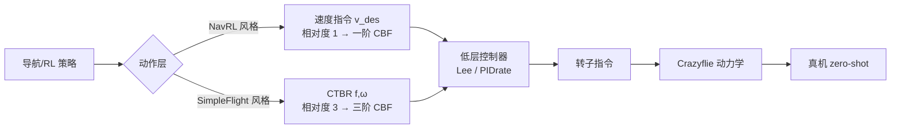

# How2Use — 无人机仓库用途 + NavRL/SimpleFlight/CBF-RL 整合研究指南

> 本文档回答三件事：
> 1. 当前仓库（OmniDrones fork, Isaac Sim 5.1 + RTX 5090）是干什么的，能训练无人机**控制**还是**导航**算法，怎么训练；
> 2. 三个外部项目 NavRL / SimpleFlight / CBF-RL 的核心方法与代码怎么用；
> 3. 你的整合研究思路（速度指令 + 训练期 CBF 滤波 → 动态障碍 → CTBR + 三阶 CBF 高速飞行）如何落地，给出可执行路线、数学与代码落点。

---

## 0. TL;DR

- **本仓库 = OmniDrones（多旋翼 RL 仿真平台）在 Isaac Sim 5.1 / Blackwell 上的可跑 fork**，同时覆盖**底层飞行控制**（Hover/Track 等）与**感知导航避障**（Forest/FlyThrough/Pinball，带 LiDAR）两类 RL 任务，还支持多机协作（Formation/Transport/Payload）。
- 训练入口：`OmniDrones/scripts/train.py`（Hydra），回放入口 `play.py`。算法用 `omni_drones/learning`（PPO/PPO-RNN/PPO-Adapt/MAPPO/HAPPO/SAC/TD3/MATD3…），算法类通过 Hydra `ConfigStore` 注册，`algo=ppo` 等直接可用。
- 本 fork 的默认**策略动作是"归一化转子指令"**（每旋翼 1 维，四旋翼 = 4 维，直接 `drone.apply_action`），而不是速度/CTBR 高层指令。要做"速度指令"或"CTBR"动作，需要像 SimpleFlight 那样**自己接入一层低层控制器（action_transform）**——这是你研究计划里最大的一块改造。
- NavRL / SimpleFlight / CBF-RL **都基于 OmniDrones 系代码**（NavRL、SimpleFlight 都是 OmniDrones 的 fork），但分别锁定了很老的 Isaac Sim 版本（2023.1 / 2022.2）与旧 torchrl（0.1.1）。**不能直接在本机 5.1 + torchrl 0.11.1 上跑，必须"移植代码"而非"安装运行"**。
- 你的三步研究本质是：**给"导航策略"换更优的"动作层/安全层"** —— 速度指令（一阶 CBF 安全化）→ 动态障碍 → CTBR（三阶 CBF 安全化、飞更快）。下面给出落地路径。

---

## 1. 这个仓库是干什么的

### 1.1 一句话

`OmniDrones`（清华，arXiv:2309.12825）是一个**面向多旋翼无人机强化学习研究**的仿真平台，构建在 NVIDIA **Isaac Sim** 之上，借鉴 Isaac Lab 抽象。当前仓库是**为 Isaac Sim 5.1.0 + RTX 5090(Blackwell) 打过补丁的 fork**（子模块 `tshiamor/OmniDrones` 分支 `isaacsim-5.1-blackwell`），并依赖本地 `./IsaacLab` v2.3.0。

### 1.2 能训练什么：控制 or 导航？（答案是"都可以"，按任务区分）

仓库的任务被组织为"RL 环境"，按层级大致分三类：

| 类别 | 典型任务（`cfg/task/` + `omni_drones/envs/`） | 观测 | 说明 |
|---|---|---|---|
| **底层飞行控制** | `Hover`（悬停）、`HoverRand`、`Track`（轨迹跟踪）、`TrackRand` | 自身状态（相对位置/四元数/速度/角速度/油门…）+ 时间编码 | 本质是"让网络学多旋翼动力学/底层控制"，可看作**控制算法**训练 |
| **感知导航避障** | `Forest`（静态森林）、`FlyThrough`、`Pinball` | **LiDAR 点云/扫描 + 自身状态** | 带感知的**导航/避障算法**训练（静态障碍） |
| **多机/任务级** | `Formation`、`Transport`/`Payload`（协作搬运）、`InvPendulum`、`Platform`、`Rearrange` | 含他机观测 | 多智能体 RL（MAPPO/HAPPO/QMIX…） |

所以：**这个平台既能训"让无人机稳定飞行/跟轨迹"的控制策略，也能训"看 LiDAR 找路避障"的导航策略**。它与 NavRL 的差别主要是：NavRL 是在此基础上加了**动态障碍**与**更完整的导航奖励/观测**；SimpleFlight 则是在此基础上把**动作层换成 Crazyflie 的 CTBR** 并做 sim-to-real。

### 1.3 机器人与动作（重要，关系到你的改造）

- 机器人注册在 `omni_drones/robots/drone/`：`Firefly`、`Hummingbird`、**`Crazyflie`**、`Iris`、`Neo11`、`Omav`、`Dragon`、`Air`；基类 `MultirotorBase`（`robots/drone/multirotor.py`）。
- **动作空间默认**：`MultirotorBase.action_spec` = `BoundedTensorSpec(-1, 1, num_rotors)`，即**每旋翼一维、归一化到 [-1,1] 的转子油门/转速指令**（四旋翼 4 维）。RL 循环里 `_pre_sim_step` → `self.drone.apply_action(actions)` 直接作用到转子（见 `envs/single/hover.py` 等）。
- 仓库**自带低层控制器模块**（`omni_drones/controllers/`）：`LeePositionController`（位置/速度→姿态→转子，`process_rl_actions` 把动作拆成 `[target_vel(3), target_yaw(1)]`）、`AttitudeController`、`RateController`。它们当前主要给**示例脚本/轨迹跟踪**用（如 `examples/00_play_drones.py`、`test_rate_controller.py`），本 fork 的 **RL 训练主循环并未把 controller 接进动作管线**（`train.py` 的 `action_transform` 只支持离散化选项）。
  > 结论：当前"直接能训"的是**转子级动作**；**速度指令 / CTBR 动作需要自己接一层"策略输出 → 低层控制器 → 转子"的 action_transform**（正是 SimpleFlight 的做法）。
- 动力学随机化已内置（`multirotor.py` 的 mass/inertia/drag/tau/t2w/f2m 随机化），供域随机化（DR）使用。

### 1.4 算法与训练框架

- 算法在 `omni_drones/learning/`，注册表 `ALGOS`（`learning/__init__.py`）：
  `ppo / ppo_rnn / ppo_adapt / mappo / mappo_old / happo / sac / td3 / matd3 / qmix / dqn / tdmpc` 等。
- 算法超参即 dataclass（如 `PPOConfig`），通过 **Hydra ConfigStore** 注册到 `algo` 组（见 `learning/ppo/ppo.py` 末尾 `cs.store("ppo", … group="algo")`）——所以 `algo=ppo` **无需** `cfg/algo/ppo.yaml` 也能用（没有该 yaml 文件是正常的）。`cfg/algo/*.yaml`（mappo/sac/td3/…）是另一类配置。
- 任务通过 `IsaacEnv.REGISTRY[task.name]` 查找（`envs/isaac_env.py`），task 名由 `cfg/task/*.yaml` 的 `name` 决定。
- torchrl 兼容层在 `omni_drones/utils/torchrl/compat.py`（本项目把旧 `CompositeSpec` 等重导出，覆盖 torchrl 0.3→0.11 的改名）。

---

## 2. 我该怎么训练（本机实操）

> 本机注意：conda 环境实际叫 **`lz_env`**（`conda activate lz_env`），torchrl 必须 **0.11.1**、tensordict 0.11.0（详见 `Build_drone.md` 与 `/memories/repo/drones-build.md`）。所有命令在 `OmniDrones/scripts/` 下执行。

### 2.1 先做链路冒烟（已验证的姿势）

```bash
conda activate lz_env
cd /home/lz/lzspace/drones/OmniDrones/scripts

# 1) 先确认能跑通：Hover + PPO，只迭代 1 轮，关 wandb
python train.py task=Hover algo=ppo headless=true wandb.mode=disabled max_iters=1

# 2) 换成 Crazyflie（验证本仓库 Crazyflie 资产/参数可用）
python train.py task=Hover algo=ppo headless=true wandb.mode=disabled \
    task.drone_model.name=Crazyflie max_iters=1
```

- `task=` 可选：`Hover HoverRand Track TrackRand FlyThrough Forest Pinball Formation TransportHover TransportTrack PayloadHover InvPendulumHover …`（对应 `cfg/task/` 下 yaml 的 `name`）。
- `algo=` 可选：`ppo ppo_rnn ppo_adapt mappo happo sac td3 …`。
- 常用覆盖项：`task.env.num_envs=256 task.env.max_episode_length=500 total_frames=250_000_000 max_iters=-1 eval_interval=… save_interval=… wandb.mode=disabled|online headless=true/false`。
- 观看向导：`wandb.mode=online` 需要先 `wandb login`；本项目默认 project=`omnidrones`、entity=`marl-drones`（可在 `cfg/train.yaml` 改）。

### 2.2 正式训练与回放

```bash
# 正式训练（后台/长任务建议 nohup 或 tmux；本机 tmux 配置在 OmniDrones/tmux_config）
python train.py task=Forest algo=ppo headless=true wandb.mode=online

# 回放/评估（会弹窗或 headless）
python play.py task=Hover algo=ppo checkpoint=/path/to/checkpoint.pt headless=true
```

- checkpoint 由 `save_interval` 控制保存，位置在 wandb run 目录 / 本地 `outputs/`（可搜 `*.pt`）。`scripts/play.yaml` 可配回放参数。
- LiDAR 导航训练示例：`python train_lidar.py task=Forest algo=ppo headless=true wandb.mode=disabled`（fork 自带）。

### 2.3 验证整条链路的建议顺序

1. `Hover + ppo + max_iters=1` ✅（证明 sim+torchrl+算法+数据采集 OK）
2. `Forest + ppo + max_iters=1`（证明 IsaacLab 地形 + LiDAR sensor 链路 OK）
3. 短跑 `total_frames=5e6` 看 reward/return 上升（wandb 或 log）
4. 放开正式训练
5. `play.py` 回放 + 有头渲染目视

> 若 `algo=ppo` 报 Hydra 找不到配置，先确认是否 import 了 `omni_drones.learning`（ConfigStore 注册在 import 时生效）；`train.py` 顶部 import 已覆盖。

---

## 3. 三个外部项目调研（用于整合的"零件"）

三者**代码血缘都是 OmniDrones**，因此"移植"比"重写"便宜，但都有版本鸿沟（见 §5）。

### 3.1 NavRL —— 动态环境安全导航 RL（RA-L 2025）

- 仓库：`https://github.com/Zhefan-Xu/NavRL`（MIT）；论文：*NavRL: Learning Safe Flight in Dynamic Environments*, IEEE RA-L 2025（arXiv:2409.15634）。训练代码基于 OmniDrones（acknowledge 明确写了），用 Isaac Sim **2023.1.0-hotfix.1** + `omni.isaac.orbit`（旧 Isaac Lab/Orbit API）搭建。
- **要解决的问题**：静态+动态障碍下的安全导航。**方法特色**：端到端 PPO 学导航（训练里直接 `drone.apply_action` 电机动作，Hummingbird），但部署框架面向"速度控制型"机器人（"NavRL can be extended to any robot that adopts a velocity-based control system"），配有感知 + 安全滤波模块（ros1/ros2 的 `perception.launch` / `safe_action.launch`）。
- **训练环境**（`isaac-training/training/scripts/env.py`，`NavigationEnv`）：
  - 观测 = **体/目标系自身状态**(到目标的单位方向、二维距离、Z 距离、速度 共 8 维) + **LiDAR 扫描**(范围4m, 360°水平/4 束) + **最近 N 个动态障碍状态**(相对位置(归一化方向+2D/3D距离)、**障碍速度**、**尺寸类别**，每障碍 10 维；`dyn_obs_num` 默认 5)。
  - 动态障碍：立方体（3D 浮空）与长圆柱（2D 不可绕高度）两类 × 多种尺寸，**随机取新目标点 + 每 ~2s 重采速度**做"随机游走"（`move_dynamic_obstacle`），障碍位置/速度每步 `write_data_to_sim` 更新。
  - 奖励：`reward_vel`(朝目标速度投影) + 1 + `log` 距离安全项(静态 `log(lidar_range - scan)`、动态 `log(distance - obs_radius)`) − 平滑惩罚 − 高度惩罚；碰撞/出界终止，碰撞额外 −50。
  - 训练规模示例：`1024 robots, 350 static, 80 dynamic obstacles`（RTX4090）；`python training/scripts/train.py headless=True env.num_envs=1024 env.num_obstacles=350 env_dyn.num_obstacles=80 wandb.mode=online`。
  - 网络：`scripts/ppo.py` 有 feature_extractor（含 `dyn_obs_num` 处理动态障碍特征）+ actor。
- **对我们的价值**：① 动态障碍的运动模型与"最近 N 障碍(位置/速度/尺寸)观测"设计可直接移植；② 导航奖励/终止设计；③ 其"速度控制接口 + 安全滤波"的部署哲学正好呼应 CBF 滤波。**注意**：它训练时动作是转子级，观测是在"目标坐标系"里表达——这些设计我们可复用，但动作层我们要替换成速度/CTBR。

### 3.2 SimpleFlight —— Crazyflie 的 sim-to-real 控制（RA-L 2025）

- 仓库：`https://github.com/thu-uav/SimpleFlight`（MIT）；论文：*What Matters in Learning A Zero-Shot Sim-to-Real RL Policy for Quadrotor Control? A Comprehensive Study*, IEEE RA-L 2025（arXiv:2412.11764）。
- **核心贡献**：基于 OmniDrones（Isaac Sim **2022.2.0**，torchrl 0.1.1）训练**输出 CTBR 指令**的 Crazyflie 跟踪策略，**零样本部署**到真机（crazyswarm_SimpleFlight 固件）。
- **动作层（你关心的"crazyflie 动作算法"）**：
  - RL 策略输出 **CTBR**（collective thrust + body rates）4 维指令；
  - 低层用 `action_transform: PIDrate`（配置在 `cfg/task/Track.yaml`）→ 即 `omni_drones/controllers/cf2x_pid.py` 的 `DSLPIDControl`（Crazyflie 固件风格 PID，位置/姿态内环）把 **CTBR/速度指令转成电机 RPM/PWM**；
  - Crazyflie 参数（质量 0.0321kg、惯量 1.4e-5/2.17e-5、力常数 2.35e-08、`time_constant: 0.025` 电机一阶滞后等）在 `robots/assets/usd/crazyflie.yaml`；`models/deploy.pt` 是官方跟踪策略权重。
  - 训练：`cd scripts && python train.py`（task 默认 Track，`cfg/train.yaml` 改 `run_name/task/mode`）；评估 `python eval.py`；Track 任务的 `use_eval/eval_traj/action_transform` 在 `cfg/task/Track.yaml`。
  - **论文 5 个关键点**（对你要"训得快又稳"很有参考价值）：输入空间设计（体坐标系相对位置/速度/角速率 + 动作历史/时延/随机化）、奖励设计（用 **action smoothness/acc/jerk/snap** 的**课程式递增权重** 鼓励平滑高速）、训练技巧（SysID、选择性 DR、时延/动作频率匹配等）。
- **对我们的价值**：① **Crazyflie + PIDrate（CTBR→电机）整条动作管线**可以直接移植为我们的"动作变换层"；② 高速跟踪的奖励/课程与 DR 配方；③ 动作 history / 观测在体坐标系表达等 sim-to-real 细节。

### 3.3 CBF-RL —— 把 CBF 安全滤波搬进 RL 训练（ICRA 2026）

- 论文：*CBF-RL: Safety Filtering Reinforcement Learning in Training with Control Barrier Functions*, **ICRA 2026**（arXiv:2510.14959, v6）。作者 Lizhi Yang / Blake Werner / Massimiliano de Sa / **Aaron D. Ames**（CBF 领域鼻祖组）。
- 代码：`https://github.com/lzyang2000/cbf-rl-demo`（导航示例，rsl_rl + IsaacGym 风格 vectorized env，分支 `navigation`）。
- **动机/方法**：只在部署时挂"在线安全滤波"虽然安全，但**策略本身不知道 CBF → 行为保守**。CBF-RL 把 CBF 约束**搬进训练**，两个关键属性：
  1. **CBF reward core（软约束/正则）**：把 CBF 不等式作为奖励惩罚项（`h<0` 或 `\dot h + αh<0` 时惩罚），让策略"内化"安全约束 → 更安全探索 + 收敛更快 + 对不确定性更鲁棒；
  2. **训练 rollout 的动作滤波**：对策略输出做安全投影，并且**给出离散时间上的闭式解**（论文证明了 continuous-time safety filter 可在离散 rollout 上用闭式表达部署），训练后**即使不挂在线滤波器也安全**。
- **Demo 的 4 种消融**（`UnifiedNavigationEnv` 参数化，正好是你做消融实验的模板）：
  - `naive`（标准 RL，无 CBF）
  - `cbf`（**hybrid**：CBF 动作滤波 + CBF 奖励惩罚）
  - `filter_only`（只滤波，无奖励惩罚）
  - `reward_only` / soft CBF（只奖励惩罚，无滤波）
  训练脚本 `train_{naive,cbf,filter_only,reward_only}.sh` → `python train.py --env cbf --use_cbf_action_filtering --use_cbf_reward_penalty --headless`；评估 `test.py` 输出成功率与失败原因；`plot_tb_reward_log_steps.py` 对比四条曲线。
- **对我们的价值**：① "在训练环境里做一阶 CBF 动作滤波 + 可选 reward penalty" 的**直接范式**；② 离散时间闭式滤波公式；③ 现成的消融实验矩阵。它目前是 **2D/3D 导航点机器人** demo——我们把它推广到四旋翼的"速度指令动作"（一阶）和"CTBR 动作"（三阶 HOCBF）就是创新点所在。

---

## 4. 你的整合研究：路线图与实现要点

### 4.0 总体架构（在哪个"动作层"放 CBF，决定 CBF 阶数）

四旋翼指令层级与"避障 CBF 的相对度"如下（这直接决定你说的"一阶 vs 三阶"）：



- **速度指令层**：障碍距离函数 $h_0=\|p-p_o\|-r$ 对速度输入相对度 = 1 → **一阶 CBF**（只约束速度）。
- **CTBR 层**：$u=(f,\omega)$ 只直接决定机身加速度的一阶变化（jerk），位置障碍函数相对度 = 3 → 需要 **三阶（高序）CBF**。这正是你说的"更快的飞行指令需要更高阶安全约束"的数学根源。

### 4.1 Step 1 —— Crazyflie 输出速度指令 + 训练期一阶 CBF 滤波

**目标**：策略输出"期望速度指令"，在 RL 训练环境里用一个一阶 CBF 安全滤波器把 PPO 输出的速度指令投影到安全集，使最终速度指令安全；并做 CBF 奖励正则。

**一阶 CBF 数学**（点机器人/速度指令；对四旋翼可把"停止距离"折进安全半径以考虑内环带宽）：
设第 $i$ 个障碍位置 $p_{o,i}$、速度 $v_{o,i}$（动态时需估计/已知，见 Step2），
$$h_i(p)=\|p-p_{o,i}\|-r_{s,i},\qquad r_{s,i}=r_{\text{drone}}+r_{\text{obs},i}+r_{\text{margin}}.$$
安全集 $\mathcal C_i=\{p:h_i\ge 0\}$。对速度输入 $u=v$：
$$\dot h_i=n_i^\top (v-v_{o,i}),\qquad n_i=\frac{p-p_{o,i}}{\|p-p_{o,i}\|}.$$
CBF 约束 $\dot h_i+\alpha h_i\ge0\ \Leftrightarrow\ n_i^\top v\ \ge\ n_i^\top v_{o,i}-\alpha h_i,$
即**对 v 是线性（半空间）约束**。策略输出 $v_{\text{nom}}$ 后做最小修正投影：
$$v^\*=\arg\min_{v}\tfrac12\|v-v_{\text{nom}}\|^2\ \ \text{s.t.}\ \ n_i^\top v\ge n_i^\top v_{o,i}-\alpha h_i,\ \forall i,$$
多障碍 = 多个半空间约束。单个最近障碍时**闭式解**：$v^\*=v_{\text{nom}}-\max(0,\ n^\top v_{\text{nom}}-n^\top v_o+\alpha h)\,n$（这就是 CBF-RL 说的"闭式滤波"；多约束可用小 QP 或用 OSQP/循环投影，注意保持 batch 化 & 可导或 stop-gradient）。滤波后可再叠加**奖励惩罚项**（CBF reward core）：
$$r_{\text{cbf}}=\lambda\, \mathbb 1\{\dot h+\alpha h<0\}\,(\dot h+\alpha h) \quad(\text{或对 }h<0\text{ 也惩罚}).$$

**落地要点（相对本仓库代码）**：
1. 新建任务环境（如 `HoverVel`/`NavVel`），**动作改为 4 维速度指令**：观测（自身状态）+ 输出 `[vx,vy,vz, yaw_rate]`。
2. 在 `_pre_sim_step`（参考 `envs/single/hover.py`）里：**先做 CBF 投影**（用 `torch` 全向量化），再把安全速度交给低层控制器转转子。低层控制器选择：
   - 用仓库自带 `LeePositionController.process_rl_actions`（它把 `[target_vel(3), yaw]` 转姿态→转子）——最省事；
   - 或移植 SimpleFlight 的 PIDrate（推荐，最终要跟 CTBR 共用同一低层）。
   > 注意本 fork 的 RL 循环默认不调用 controller，需要在你的 env 里**显式** `cmd = self.controller.process_rl_actions(actions); self.drone.apply_action(cmd)`，或仿照 SimpleFlight 实现 `action_transform` 分支并同步改 `scripts/train.py`。
3. CBF 模块：新建 `omni_drones/utils/cbf.py`（或 `nav_cbf/`）：输入 `(p,v,p_obs,v_obs,r,alpha)` → 输出安全 `v`；同一份函数既用于训练滤波，也用于部署。
4. 超参：$\alpha$（收敛率，约 0.5~5，需调）、安全半径 $r_{s}$（含无人机包络 + 障碍半径 + 速度/内环裕量；速度指令层建议加 $v_{\max}^2/(2a_{\max})$ 类制动项或把 $r_s$ 当可学/可调参数）、奖励惩罚权重 $\lambda$。
5. **消融对照（直接照抄 cbf-rl-demo 四组）**：naive / cbf(hybrid) / filter_only / reward_only。评估指标：成功率、碰撞率、到达时间、平均速度、CBF 违反次数、保守度（离障碍平均距离）。

### 4.2 Step 2 —— 动态障碍场景

**目标**：在 Step 1 环境加入动态障碍（这正是 NavRL 的主战场，也是 CBF 相对速度 $v_{o,i}$ 的来源）。

- 直接把 NavRL `NavigationEnv` 的动态障碍设计移植成**独立的障碍管理器**（不依赖旧 Orbit API，用纯 `torch` 状态机 + Isaac 写 prim）：
  - 障碍种类：浮空立方体（3D 绕行）与长圆柱（2D 绕行）→ 对应**不同 CBF**（3D 用球/盒，2D 用水平投影圆）；
  - 运动：每障碍一个"目标点"，到达（<0.5m）后换新目标；速度每 ~2s 重采（`vel_range`），`pos += vel*dt`；
  - 每步把状态写回 sim（`RigidPrimView`/`RigidObject.write_data_to_sim` 的 5.1 等价物）。
- 观测：给策略提供**最近 N 个障碍的相对位置 + 速度 + 尺寸类别**（NavRL 用 10 维/障碍），**也作为 CBF 的输入**（CBF 需要知道 $p_{o,i},v_{o,i},r_{o,i}$）。
- 训练时 CBF 使用真值障碍状态；**部署时**用感知（LiDAR/检测）估计 $p_o,v_o$，可加 NavRL 的"常速度假设/轨迹预测"来降低滤波过度保守。
- 注意点：CBF 对**动态障碍**约束是 $n^\top(v-v_o)+\alpha h\ge0$，即把 $v_o$ 项加进右侧；当障碍迎面快速逼近时，一阶 CBF 在速度受限下可能不可行 → 这正是 Step 3 用更高阶/更快动作（CTBR）的动机之一，也可在论文里作为"速度指令 vs CTBR 安全飞行包线"的对比点。

### 4.3 Step 3 —— CTBR 动作 + 三阶 CBF，飞得更快

**目标**：把动作层从"速度指令"升级为 SimpleFlight 的 **CTBR**（集合推力 $f$ + 机体角速度 $\omega=(\omega_x,\omega_y,\omega_z)$），为此设计**基于 CTBR 的三阶 CBF** 滤波器，训练新策略，使无人机能更快且安全地飞行；与"速度指令+CBF"基线对比。

**为什么三阶**：把状态取为 $x=(p,\,v,\,R,\,\omega_b)$，动力学
$$\dot p=v,\qquad \dot v=g+\tfrac{f}{m}R e_3,\qquad \dot R=R[\omega_b]_\times .$$
位置障碍 $h_0=\|p-p_o\|-r$。求导：一阶含 $v$（不受 $u$ 控制）、二阶含 $\dot v$（仍只由 $f,R$ 决定，不直接被 $u$ 控制）、**三阶（jerk）才线性进入 $u=(f,\omega_b)$ 与 $\dot f$**：
$$h_0^{(3)}\ \text{含}\ \ \underbrace{\tfrac{f}{m}\,R\,(\omega_b\times e_3)}_{\text{线性于 }\omega_b}\;+\;\underbrace{\tfrac{\dot f}{m}R e_3}_{\text{线性于 }\dot f}.$$
所以对 $u=(f,\omega_b)$ 相对度 = 3。**三阶(高序) CBF**：构造序列
$$h_1=\dot h_0+\alpha_1 h_0,\qquad h_2=\dot h_1+\alpha_2 h_1,\qquad h_3=\dot h_2+\alpha_3 h_2,$$
要求 $h_0,h_1,h_2,h_3\ge0$（后三个作为控制约束：$h_1\ge0$ 是速度层约束，$h_2\ge0$ 是加速度/推力方向约束，$h_3\ge0$ 是含 $\omega_b,\dot f$ 的 jerk 约束）。把 $h_3\ge0$ 展开即得到**对 CTBR 指令的线性/锥约束**：
$$\text{约束形式}\approx A_\omega(p,v,R,\ldots)\,\omega_b + A_f(\cdot)\,\dot f \ge b(p,v,R,p_o,v_o,\dot v_o,\ldots).$$
**离散时间处理（关键工程点，呼应 CBF-RL 的闭式离散滤波）**：CTBR 是零阶保持（每 $\Delta t$ 常数），故把 $\dot f\approx(f_{k+1}-f_k)/\Delta t$ 与策略输出 $(f_k,\omega_k)$ 一起代入，把"下一时刻推力 $f_{k+1}$ 也当作待求"或直接把约束写成关于当前可执行 CTBR 的不等式；滤波 QP 决策变量为（部分）CTBR + 虚拟 $\dot f$，再分配回 $f_{k+1}$。同时加入**状态约束**（推力上下限 $f\in[f_{\min},f_{\max}]$、角速度限幅、姿态/倾斜角限）——这些在 CTBR 层比速度层更真实，也是"高速下的安全"核心。

**落地要点**：
1. **先移植 SimpleFlight 的 Crazyflie + PIDrate 管线**到本 fork（不能直接用其旧代码，需适配 5.1 + torchrl 0.11）：
   - 机器人：把 `crazyflie.yaml` 参数 + `cf2x_pybullet.usd` 资产搬进 `omni_drones/robots/assets/usd/`（本 fork 已有 `Crazyflie`，核对参数是否与 SimpleFlight 一致，尤其是 `time_constant: 0.025` 电机滞后、力/力矩常数）；
   - 控制器：移植 `controllers/cf2x_pid.py`（`DSLPIDControl`，内含 crazyflie 固件 PID 与 PWM/RPM 映射）为 torch 模块；
   - **接入动作变换**：仿 SimpleFlight，在任务 yaml 设 `action_transform: PIDrate`，在 `scripts/train.py` 里按名字实例化该低层控制器作为 transform，使策略输出变成 4 维 CTBR（或先用 `RateController`/新增 `ThrustRateController` 简化）。注意本 fork `train.py` 目前没有此分支，需要扩展（参考 `utils/torchrl/transforms.py` 里已存在的 `RateController/AttitudeController` Transform 雏形）。
2. **在训练环境里实现三阶 CBF 滤波**：新建 `cbf3.py`：输入策略 CTBR 与全状态/障碍 → 输出安全 CTBR。同样提供 `filter_only / reward_only / hybrid` 开关做消融。
3. 奖励/课程可借鉴 SimpleFlight 的 action smoothness + acc/jerk/snap **课程递增**，保证高速但不抖。
4. **与速度指令基线公平对比**：同一环境/障碍/种子下对比
   - 动作层：速度指令(一阶CBF) vs CTBR(三阶CBF)；
   - 指标：平均/峰值速度、到达时间、跟踪误差、碰撞率、CBF 违反次数、可行域(能安全通过的最窄缝/最快相对速度)、训练采样效率（CBF-RL 声称 reward core 提速收敛）。
5. 理论部分（写论文用）：给出四旋翼 CTBR 下的 HOCBF 递推与离散可行性条件；讨论推力/角速度限幅导致的滤波不可行时的 fallback（如放宽 $\alpha$、退到安全刹车）。

### 4.4 推荐的代码组织（落点，全部在 `OmniDrones/` fork 内）

```
OmniDrones/
├─ cfg/task/
│   ├─ NavVel.yaml            # 速度指令导航（Step1/2）
│   └─ NavCTBR.yaml           # CTBR 导航（Step3）
├─ cfg/algo/ppo.yaml          # (可选) 显式 PPO 超参 yaml
├─ omni_drones/
│   ├─ controllers/
│   │   ├─ cf2x_pid.py        # [移植] SimpleFlight DSLPIDControl (PIDrate)
│   │   └─ ...（保留 Lee/Attitude/Rate）
│   ├─ envs/
│   │   ├─ nav/               # 新导航任务目录（注册 NavigationEnv 系列）
│   │   │   ├─ nav_vel.py     #   速度指令任务（含 CBF1 hook）
│   │   │   ├─ nav_ctbr.py    #   CTBR 任务（含 CBF3 hook）
│   │   │   └─ dynamic_obstacles.py  # [移植] NavRL 动态障碍管理器
│   ├─ utils/
│   │   ├─ cbf.py             # 一阶 CBF：滤波闭式解 + reward core 工具
│   │   ├─ cbf3.py            # 三阶 CBF（HOCBF）推导/滤波 QP（torch 化）
│   │   └─ torchrl/transforms.py # 扩展：PIDrate/CTBR action_transform
│   └─ robots/assets/usd/crazyflie.yaml  # [核对/覆盖] SimpleFlight 参数
├─ scripts/
│   ├─ train.py               # 扩展 action_transform 分支（PIDrate/CTBR）
│   └─ train_nav.py           # (可选) 新入口
└─ scripts/experiments/       # 各消融实验 config（naive/filter_only/…）
```

建议新增任务时照抄 `Hover`/`Forest` 的骨架（`_design_scene/_set_specs/_reset_idx/_pre_sim_step/_compute_state_and_obs/_compute_reward_and_done`），并在 `omni_drones/envs/__init__.py`（或你新建包的 `__init__`）里 import 以注册进 `IsaacEnv.REGISTRY`。

### 4.5 里程碑 / 验收

| 阶段 | 内容 | 验收 |
|---|---|---|
| M0 | 本机链路打通（§2） | Hover/Forest ppo 短训 return 上升、play 正常 |
| M1 | Crazyflie + 速度指令动作任务跑通（无 CBF） | 能悬停/飞到目标，速度指令被低层跟踪 |
| M2 | CBF1 滤波接入 + 4 组消融（静态障碍） | 碰撞率↓、成功率↑；naive<filter_only≈hybrid 的合理趋势 |
| M3 | 动态障碍（NavRL 移植） | 动态场景下 CBF1 仍能保证安全，或暴露不可行案例 |
| M4 | Crazyflie+PIDrate(CTBR) 动作管线移植 | 与官方 Track 类似的跟踪表现 |
| M5 | CBF3 滤波 + 高速训练 | 与 CBF1/速度基线比：同安全性下平均速度↑、时间↓ |
| M6 | 鲁棒性/真机展望 | DR、时延、动作频率；可选 sim2real |

---

## 5. 关键坑与移植注意（重要）

1. **版本鸿沟**：NavRL 需要 Isaac Sim 2023.1.0-hotfix.1 + 旧 `omni.isaac.orbit`；SimpleFlight 需要 Isaac Sim 2022.2.0 + torchrl 0.1.1（submodule 锁 `tensordict 0.1.2+5e6205c / torchrl 0.1.1+e39e701`）。**二者都不能直接在本机 5.1.0 + torchrl 0.11.1 上跑**。移植策略：只搬"算法/公式/纯 torch 逻辑"，把 Isaac 相关调用重写成 Isaac Sim 5.1 / 本地 `isaaclab` v2.3 的 API（如 `RayCaster`→IsaacLab 2.x sensor、`TerrainImporter`→本地 IsaacLab、`RigidObject`→`RigidPrimView` 5.1 补丁）。
2. **动作语义**：本 fork RL 主循环默认动作=转子指令且 controller 字段未接入（§1.3）。移植速度/CTBR 时一定要确认 `env.action_spec` 与 `_pre_sim_step` 之间插入了你选的低层控制器，否则维度/物理语义全错。
3. **torchrl/tensordict 版本**：保持 0.11.1/0.11.0，import 一律走 `omni_drones.utils.torchrl.compat`（`CompositeSpec` 等），别直接 `from torchrl.data import CompositeSpec`（见 `Build_drone.md` §7.8）。
4. **Isaac Sim 5.1 / RTX5090**：驱动保持 580.xx 系列（580.173.02 已验证），别升 595+，否则无声原生崩溃（`Build_drone.md` §7.9）。conda 环境 `lz_env`。
5. **CBF 在 torchrl 数据流里的位置**：滤波要么放在 `env._pre_sim_step` 内（简单、天然 vectorized），要么做成 torchrl Transform（改动大但可复用/可记录滤波量）。滤波算子要保持**逐环境 batch** 且可向量化，避免 for 循环；若想让策略对滤波"有梯度感知"需保可导，否则 `detach()`。
6. **动态障碍的 CBF 需要 $v_o$**：训练用真值；评测/部署用估计（NavRL 的做法是感知+预测），论文里建议单独分析"速度估计误差对 CBF 安全性的影响"（这是很好的 robustness 章节）。
7. **三阶 CBF 的可行性**：高速+窄缝下约束可能不可行，需要**可行性恢复策略**（放宽 α、加虚拟输入 $\dot f$、或 fallback 到安全悬停/刹车），这是方法创新的空间，也是和"速度指令+一阶 CBF"对比时的自然卖点。

---

## 6. 参考链接汇总

- 本仓库：OmniDrones（Isaac Sim 5.1/Blackwell fork，子模块 `tshiamor/OmniDrones` 分支 `isaacsim-5.1-blackwell`）；上游 `https://github.com/btx0424/OmniDrones`（论文 arXiv:2309.12825；文档 https://omnidrones.readthedocs.io/）
- NavRL：仓库 `https://github.com/Zhefan-Xu/NavRL`；论文 IEEE RA-L 2025，arXiv:2409.15634（DOI 10.1109/LRA.2025.3546069）
- SimpleFlight：仓库 `https://github.com/thu-uav/SimpleFlight`；固件 `https://github.com/thu-uav/crazyswarm_SimpleFlight`；论文 arXiv:2412.11764
- CBF-RL：论文 arXiv:2510.14959（ICRA 2026）；示例代码 `https://github.com/lzyang2000/cbf-rl-demo`
- 本机构建/踩坑：`Build_drone.md`、`README.md`、`setup_env.sh`
