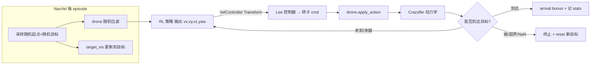

# M1 实施规划：随机目标点 + velocity 动作训练（为 CBF1 打地基）

> 创建时间：2026-09-04
> 前置：SimpleFlight 迁移已完成（见 `simpleflight_migration_guide.md` 附录 A，分支 `feat/crazyflie-pidrate`，commit `d02ca10`/`fd3486e`）。
> PIDrate 悬停已验证收敛（5M 帧，76% env 悬停在目标 10cm 内）→ 低层动作管线可用，进入 M1。
>
> ⚠️ **本文件是"规划/实施指导"，不是执行记录**。所有命令均为"待执行"，动手前按 §6 步骤逐条执行并回填结果。

---

## 0. TL;DR

- **做什么**：新建 `NavVel` 任务 —— Crazyflie 每轮**随机起点 + 随机目标点**，策略输出**速度指令**（`action_transform=velocity`），学会"从任意起点飞到任意目标并停住"。这是 CBF1（速度层一阶 CBF 滤波）的直接载体。
- **怎么做**：以 fork `Hover`（已含 info 键支持）为骨架复制改造，只改"目标/起点随机化 + 到达判定 + 奖励微调 + 终止判据"，动作侧**零改动**（`velocity` 分支已在 train.py/play.py 就绪）。
- **不做**：本 M1 不引入障碍、不接 CBF 滤波；但按 §7 预留 `cbf.py` 接口与数据通路，M2 直接插。
- **交付物**：`omni_drones/envs/single/nav_vel.py`、`cfg/task/NavVel.yaml`、注册改动、可选 `VelController` 速度限幅、评估扩展。

---

## 1. 目标与验收标准

| 项 | 内容 |
|---|---|
| 环境 | Crazyflie；sim.dt=0.01 (100Hz)；128 env（可 256/512 提吞吐） |
| 动作 | `[vx,vy,vz,yaw]`（世界系速度指令 + yaw），经 `VelController`(Lee) → 转子 |
| 每轮随机 | 起点 x,y∈[-3,3]·z∈[1,2.5]（避开目标）、目标 x,y∈[-3,3]·z∈[1.5,3]、目标 yaw∈[0,2π) |
| 观测 | `rpos(3) + drone_state[3:](20) + rheading(3) [+time_encoding]`（沿用 Hover） |
| **验收（M1 达成）** | eval_ckpt 式确定性评估：到达率 ≥80%（目标 0.5m 内保持 ≥2s 记一次到达）；mean 到达时间合理；无 NaN；训练 5M 帧内 `pos_error` 从 ~2-3 降到 <0.3 |

> 提示：目标"到达即切换"会造成非平稳（每个 episode 目标不同是正常的，属导航任务本质）。到 M2 再加"到点后给新目标/或保持"的课程。

---

## 2. 现状盘点（已核实）

**已就绪（迁移产物，直接可用）**
- `scripts/train.py` / `play.py` / `eval_ckpt.py`：`action_transform=velocity` 分支已能跑通（此前 Hover 悬停冒烟通过）。
- `omni_drones/controllers/lee_controller_crazyflie.yaml`：Crazyflie 的 Lee 增益已建（初始复制 hummingbird）。
- fork `Hover`（`envs/single/hover.py`）：已带 `info/drone_state/prev_action/policy_action` 支持；已有"每 env 一个目标可视 prim"机制（`target_vis = ArticulationView("/World/envs/env_*/target")`，reset 里 `set_world_poses(..., env_indices=env_ids)` 逐 env 更新）→ **天然支持每 env 独立目标**。
- env 注册机制：`IsaacEnv.__init_subclass__` 自动注册（`isaac_env.py` L199），只需在 `envs/single/__init__.py` 与 `envs/__init__.py` 加 import。

**需新增/改造**
| 项 | 现状 | 动作 |
|---|---|---|
| 随机目标任务 env | ❌ fork 无（`HoverRand.yaml` 的 name 其实是 `Hover`，只是域随机化版，**不是随机目标**） | 新建 `single/nav_vel.py` |
| 目标点 per-env | Hover 固定 `(0,0,2)` | 改为 per-env 随机 + reset 更新 |
| 到达判定/统计 | Hover 无 | 加 `arrive_radius` + stats（arrival/成功率） |
| 终止判据 | Hover 以"距固定点>4 或 z<0.2"为 misbehave | 改为"飞出工作空间 / NaN"（目标在空间内随机，不能再用相对固定点判界） |
| 速度限幅 | `VelController` 无 clip（策略可输出任意大速度） | 可选：给 `VelController` 加 `max_vel`/`max_yaw_rate` 限幅（见 §5.4） |
| CBF 桩 | 无 | 预留 `utils/cbf.py`（§7，本 M1 只建接口不实现逻辑） |

---

## 3. 总体设计



数据通路与 Hover 一致，仅 `target_pos` 从"常量"变"per-env 张量"，奖励/终止随之改为相对量/空间判据。

---

## 4. 观测 / 奖励 / 终止设计（建议值，均可配置）

### 4.1 观测（沿用 Hover，无需新增维度，为 CBF 预留注释）
```
obs = [ rpos(3)                      # 目标 - 无人机位置（相对目标，天然平移不变）
        drone_state[3:](20)          # 姿态/速度/heading/up 等自身状态
        rheading(3)                  # 目标航向 - 当前 heading
        (time_encoding 4, 可选) ]
```
- rpos 为"相对目标" → 训练对所有目标位置平移泛化，这正是随机目标任务能学出来的关键。
- 若想显式给"目标在世界系下的方向提示"，rpos 已含；M2 接障碍时再扩 obs（相对障碍 + 障碍速度）。

### 4.2 奖励（逐项，权重视 yaml）
沿用 Hover 并微调：
```
r = 1/(1 + (k_d*d)^2)                       # d=||rpos||，连续势场，指向目标
  + 1/(1+(k_d*d)^2) * (up + heading)        # 到点附近的姿态/航向质量（沿用）
  - λ_eff * effort
  - λ_sm  * smoothness（速度指令场景可先 0）
  + λ_arr * 1{arrived}                       # 到达稀疏奖励（新增）
  - λ_vel * ||v|| 过大惩罚（可选，替代限幅时用）
```
- **为什么保留连续距离项**：随机目标导致 episode 初始 d 可达 5m+，纯稀疏奖励难学；距离势场提供梯度。
- **到达**：`arrived := ||rpos|| < arrive_radius(=0.5) 且维持 ≥ hold_steps(=100=1s)`；给一次 `λ_arr`（建议 5~10）并把该 env 本轮标记为成功（供 stats）。到达后**不立即终止**（继续"保持到达状态"以学停稳），或按课程后期可选 `success_terminate=True`。

### 4.3 终止（truncated/terminated）
- `terminated`（misbehave）：`z < 0.15`（坠地）或 `|x|,|y| > bound(=5)`（飞出工作空间）或 `NaN`。
- `truncated`：`progress_buf >= max_episode_length`。
- ⚠️ 不要再用 Hover 的 `distance > 4`（那是相对固定点的判据，随机目标下会误杀）。

### 4.4 stats（进 wandb / eval_ckpt）
- 沿用：`return / episode_len / pos_error(EMA) / uprightness / heading_alignment`。
- 新增：`arrival_rate`（本批到达数/环境数）、`time_to_arrive`（EMA）、`vel_norm`（EMA）。

---

## 5. 代码实施步骤（文件级）

### 5.1 复制骨架并改名
- 复制 `omni_drones/envs/single/hover.py` → `omni_drones/envs/single/nav_vel.py`；
- `class Hover(IsaacEnv)` → `class NavVel(IsaacEnv)`；docstring 改写；文件名内方法结构全保留。

### 5.2 `__init__` 改造（读入 yaml 参数 + 建立 per-env 目标）
```python
# yaml 新键（§5.5）
self.target_pos_range = torch.as_tensor(cfg.task.target_pos_range)   # [[xlo,ylo,zlo],[xhi,yhi,zhi]]
self.init_pos_range   = torch.as_tensor(cfg.task.init_pos_range)
self.arrive_radius    = cfg.task.get("arrive_radius", 0.5)
self.arrive_bonus     = cfg.task.get("arrive_bonus", 5.0)
self.bound            = cfg.task.get("bound", 5.0)
self.success_terminate= cfg.task.get("success_terminate", False)

self.target_pos_dist = D.Uniform(*self.target_pos_range)   # (3,)
self.init_pos_dist   = D.Uniform(*self.init_pos_range)
# target_pos 由 (num_envs,1,3) 张量承载（替代 Hover 的固定常量）
self.target_pos = self.target_pos_dist.sample((self.num_envs, 1)).to(self.device)
self.target_heading = torch.zeros(self.num_envs, 1, 3, device=self.device)
self.arrival_buffer = torch.zeros(self.num_envs, 1, dtype=torch.bool, device=self.device)
self.arrive_timer   = torch.zeros(self.num_envs, 1, dtype=torch.long, device=self.device)
```
> 采样/间距注意：init 与 target 太近会让任务退化成"悬停"；可采样后对 `||init-target||<1.5` 的 env 重采目标（向量化重采循环 ≤2 次即可）。

### 5.3 关键方法改动点
| 方法 | 改动 |
|---|---|
| `_design_scene` | 与 Hover 相同（target prim + ground + drone 模板）；每 env 目标由 IsaacEnv 自动复制模板 |
| `_set_specs` | observation 结构沿用（rpos 已是相对量）；`stats_spec` 追加 `arrival_rate / time_to_arrive / vel_norm`（`arrival_rate` 用 0/1 均值即可） |
| `_reset_idx` | ① 采样该批新 init 位姿并 `set_world_poses/velocities`；② 采样新 `self.target_pos[env_ids]` 与目标 yaw，`target_vis.set_world_poses(pos, rot, env_indices=env_ids)` 同步可视；③ 重置 `arrival_buffer/timer`、stats |
| `_compute_state_and_obs` | `self.rpos = self.target_pos - self.drone_state[..., :3]`（已是张量相减，无需改逻辑）；返回 td 同 Hover（含 info/stats） |
| `_compute_reward_and_done` | 距离项改用**当前帧** `d=||rpos||`；算 `arrived`（连续到达维持计时）；奖励加 `arrive_bonus`；`misbehave` 改为空间判据；`self.stats` 记 `arrival_rate` 等 |
| `_pre_sim_step` | **不改**（沿用 Hover 的 info 回写 + apply_action；velocity 的换算在 Transform 层已完成） |

### 5.4 可选增强：`VelController` 速度限幅
策略输出 `v∈R^4` 直接进 Lee，初期可能输出过大速度/抖动。建议给 `utils/torchrl/transforms.py::VelController` 增加可配置限幅（默认不动行为）：
```python
# __init__: self.max_vel = getattr(controller, "max_vel", None)  # 或从 yaml 传入
# _inv_call: v = v.clamp(-self.max_vel, self.max_vel)
```
> 若走"奖励惩罚"路线（§4.2 的 -λ_vel）则可先不加限幅。二选一或都用（限幅保安全、惩罚促平滑）。

### 5.5 任务配置 `cfg/task/NavVel.yaml`（新）
以 `cfg/task/HoverCrazyflie.yaml` 为底：
```yaml
name: NavVel
defaults: [ /base/env_base@_here_, /base/sim_base@_here_ ]
env:
  num_envs: 128
  max_episode_length: 600
sim: { dt: 0.01, substeps: 1 }          # Crazyflie 100Hz
drone_model: { name: Crazyflie, controller: null }
action_transform: velocity              # 关键：速度指令
time_encoding: true
# ---- M1 随机目标 ----
target_pos_range: [[-3.0, -3.0, 1.5], [3.0, 3.0, 3.0]]
init_pos_range:   [[-3.0, -3.0, 1.0], [3.0, 3.0, 2.5]]
min_init_target_dist: 1.5
arrive_radius: 0.5
arrive_hold_steps: 100                  # 0.01s*100 = 保持 1s 算到达
arrive_bonus: 5.0
success_terminate: false
bound: 5.0
# 奖励权重（可先沿用 Hover 量级再调）
reward_effort_weight: 0.1
reward_action_smoothness_weight: 0.0
reward_distance_scale: 1.6
# 域随机化（可选，先关）
# randomization: { drone: { train: { ... } } }
```

### 5.6 注册
- `omni_drones/envs/single/__init__.py`：`from .nav_vel import NavVel`
- `omni_drones/envs/__init__.py`：`from .single import ... , NavVel`（注意 Forest/Pinball 在 try 里，NavVel 放主 import 行）

---

## 6. 执行与验证步骤（**待执行**，动手后按序回填）

> 命令都在 `OmniDrones/scripts/`、`conda activate lz_env`。每步通过再进下一步。

1. **Phase 0 – 骨架冒烟**（确认 velocity 动作在 NavVel 无随机目标时也能跑）：
   先不接随机目标（或先固定目标），跑 1 轮：
   ```bash
   python train.py task=NavVel algo=ppo headless=true wandb.mode=disabled max_iters=1
   ```
   通过标准：不报 KeyError、rollout/checkpoint 正常、`Mass: 0.0321`。
2. **Phase 1 – 随机目标实现后冒烟**：同上，`max_iters=1` 无 NaN；短训
   ```bash
   python train.py task=NavVel algo=ppo headless=true wandb.mode=disabled \
       total_frames=5_000_000 save_interval=50
   ```
   看 `train/stats.pos_error` 是否从 ~2-3 下降、`arrival_rate` 是否出现 >0。
3. **Phase 2 – 数值评估**（`eval_ckpt.py` 若想统计到达率需小扩展：读 `base_env.stats` 的 arrival 相关键或按 rpos<radius 计数）：
   ```bash
   python -u eval_ckpt.py task=NavVel algo=ppo headless=true wandb.mode=disabled \
       +checkpoint=/path/to/checkpoint_XXXX.pt +rollout_steps=400
   ```
   判据见 §1 验收表。
4. **有头目视（可选）**：`python play.py task=NavVel algo=ppo headless=false +checkpoint=... action_transform=velocity`，看无人机逐个飞向随机目标。

---

## 7. CBF1 预留接口（本 M1 只搭骨架，M2 填充）

> 目标：M2 在不动训练入口的前提下，把"速度指令 → 一阶 CBF 滤波 → Lee"插进去。

### 7.1 新建 `omni_drones/utils/cbf.py`（本 M1 仅建接口与占位）
```python
# 签名草案（batch、全向量化、与 IsaacEnv 数据流兼容）
def velocity_cbf_filter(
    p: torch.Tensor,        # (B,1,3) 无人机位置
    v_nom: torch.Tensor,    # (B,1,3) 策略期望速度（世界系）
    p_obs: torch.Tensor,    # (B,K,3) 最近 K 个障碍位置
    v_obs: torch.Tensor,    # (B,K,3) 障碍速度（静态=0）
    r_safe: torch.Tensor,   # (B,K,)  安全半径（含无人机包络+障碍半径+裕量）
    alpha: float = 1.0,
    v_max: float = 3.0,
) -> torch.Tensor:          # (B,1,3) 滤波后安全速度
    # 一阶 CBF: h=||p-po||-r_safe;  半空间约束 n^T v >= n^T v_o - alpha*h
    # 单最近障碍闭式投影；多障碍可小 QP / 循环投影（全部保持可导或 detach）
    raise NotImplementedError("M2 实现")
```

### 7.2 两种插入位置（M2 二选一，先在此注明利弊）
| 方式 | 位置 | 利 | 弊 |
|---|---|---|---|
| A. env 内 hook | `NavVel._pre_sim_step`：先读策略动作 v_nom（transform 前需取原始动作，注意顺序）再滤波 | 简单、可逐 env batch | 需要能拿到"滤波前"的速度指令 |
| B. 独立 Transform | `CBFVelocityFilter` 放在 `VelController` **之前**（策略输出→滤波→Lee），读 `info/drone_state` + 障碍 obs | 与训练/回放/评估入口零耦合，天然 vectorized | 需要 env 先把障碍真值放进 info/obs |

> 推荐 **B**：滤波逻辑放 Transform，与 SimpleFlight 动作管线一致，且之后 CBF3（CTBR）同构。
> 需要 M2 给 env 增加 `info/obstacles`（最近 K 障碍的 p/v/r），作为策略 obs 与 CBF 输入共用。
> reward-core 惩罚：`r -= λ*max(0, -(h_dot+alpha*h))` 放进 `_compute_reward_and_done`（需 CBF 值回传，可在 env 内算真值）。

### 7.3 消融开关（M2 用，预留在 yaml）
```yaml
cbf:            # M2 占位
  mode: none        # none | filter_only | reward_only | hybrid
  alpha: 1.0
  reward_penalty_w: 1.0
```

---

## 8. 里程碑 / 风险 / 坑

### 8.1 里程碑
| 阶段 | 内容 | 验收 |
|---|---|---|
| M1-P0 | NavVel 骨架（velocity 动作）跑通 | max_iters=1 无错 |
| M1-P1 | 随机起点/目标 + 到达判定 + 空间终止 | 短训 pos_error↓、arrival_rate>0 |
| M1-P2 | 5M-10M 帧收敛 | eval 到达率≥80%、mean 到位时间合理（512 env 下按 20M 帧跑 ≈ 5M@128 的单 env 样本预算，见 §10） |
| M2（后） | 静态障碍 + CBF1（4 组消融） | 见 how2use §4.5 |

### 8.2 风险与坑
1. **随机目标下的稀疏性**：初始 d 大 → 必须保留连续距离势场；`reward_distance_scale` 调大(≈1.6)使近场梯度强。
2. **起点/目标重叠**：加 `min_init_target_dist`，否则 env 退化、学到无意义策略。
3. **速度指令无界**：Lee 对超大 v 会饱和/震荡；用 §5.4 限幅或 -λ_vel 惩罚，且观察 `vel_norm`。
4. **misbehave 判据**：切勿沿用 Hover 的相对固定点判据；用空间 bound。
5. **到达即重置 vs 保持**：先 `success_terminate=False` 让策略学"停稳"；若学成"到点后绕圈"，再加保持计时与二次目标。
6. **rpos/heading 的量纲**：都是相对量，天然平移不变 → 随机目标泛化依赖它，不要改成绝对坐标 obs（会显著变难）。
7. **eval 统计**：`EpisodeStats` 只统计"真终止"；随机目标任务大多 truncated 结束 → 看收敛用 `eval_ckpt.py`/新增 arrival 统计，别只看 train.py 打印。
8. 若要更高吞吐：`num_envs` 提到 256~512（RTX5090 富余），`total_frames` 相应放大。**2026-09-04 已设 512/20M；实测 GPU util 仅 ~30%、显存 5.9/32GB（见 §10），进一步提效应靠 num_envs↑/batch↑/train_every↑，而非只加帧数。**

---

## 9. 本文件状态跟踪（完成后更新）
- [x] P0 骨架 + 注册 + yaml 就绪 —— **2026-09-04 13:12**
- [x] P1 随机目标 + 到达/终止逻辑 —— **2026-09-04 13:12**
- [x] P2 基线 20M@512 训练完成（wandb `fly-hust/RL90` run `nnsyqhs7`，15:25-15:34）—— **❌ 未学会**：pos_error≈3.3-3.85、arrival=0、|rpos|<0.1=0/512（详见执行记录）
- [x] P2 A 组短测完成（run `5v3zpwtg`，minibatch4+epochs8，1M 帧）—— 同样无改善信号（pos_error≈3.97）
- [x] P2 A 组延长 10M 完成（run `18xvsp4x`）—— **❌ 仍无改善**（pos_error≈3.95、arrival=0）⇒ **超参排除，主因在任务/动作侧**
- [x] 代码修复完成（commit `de9fa95`）：VelController 速度限幅（`max_vel`，tanh+scale）+ `NavVel.yaml` arrive_hold_steps 50
- [x] P2 限幅版短测 2M 帧（run `631bzoor`）—— pos_error 未见下降（2M 样本不足）；单测确认限幅代码正确
- [x] P2 限幅版 10M 完成（run `85euw6fm`）—— **❌ 仍无效**（pos_error≈3.84、arrival=0）⇒ 速度限幅也排除
- [x] vclip-200M 完成（run `ehl0180y`，1024 env，用户自跑）—— **❌ 2 亿帧仍无效**；视频确认"全程下坠"
- [x] 思路②修复（commit `3395531`）：软重置 `soft_respawn` + 高度存活惩罚 + 冒烟通过
- [x] P2 软重置 10M 短测完成（run `8a6o88a8`）—— **✅ 首个改善信号**：ep_len 599、vel_norm 3.5→1.9（不再下坠）、pos_err 3.9→3.35、arrival 首次>0
- [x] Stage0 收敛修复完成（commit `69b50ad`，参考 obstacle guide §1.2/§6/§8.3）：分死因惩罚+early-death+timeout+PBRS+vel_limit 模长限幅(1.8m/s)+arrive_bonus 10
- [x] P2 Stage0-fix 10M 完成（run `gpj89oup`）—— **❌ 未优于纯软重置版**（return −110、entropy 不降）⇒ 惩罚量级与 soft_respawn 多命机制冲突，需重新标定/消融
- [x] P2 消融 **B（关惩罚只留 PBRS+软重置）50M 完成**（run `pqo7ezo5`，19:08-19:19，https://wandb.ai/fly-hust/RL90/runs/pqo7ezo5）—— **❌ PBRS 未突破**：pos_error 全程平台 3.33-3.46、final eval 3.39、arrival 0.0017，熵 2.75→1.23 塌缩（策略自信收敛到"悬停不导航"局部最优）；return +82.7 正常 ⇒ 死亡惩罚非噪声源，但 PBRS(2.0)+软重置也带不动策略离开局部最优
- [x] P2 消融 **A（惩罚调小：crash/oob 5 / timeout 2 / early_death 0.5）50M 完成**（run `ip3qvb89`，19:20-19:31，https://wandb.ai/fly-hust/RL90/runs/ip3qvb89）—— **❌ 同样失败**：熵发散 5.96→7.82（策略趋于随机）、eval pos_error 3.35、arrival=0
- [x] P2 结论：**4 配置全卡 pos_error 3.34-3.46 / arrival≈0 ⇒ 非惩罚/PBRS 问题，任务/奖励结构缺可学导航梯度**（详见上文"消融 B/A 完整结果"）
- [x] **⭐ P2 根因定位 + 修复（19:33-19:44）——所有 RL 失败的终极根因 = Lee 速度控制器对 Crazyflie 失稳下坠**：
  - 课程 v0（近目标 1m）也学不会 → 用 `expert_probe.py`（脚本直飞，同款 VelController→Lee 链路）仍飞不到 → 用 `vel_probe.py`（命令 +X 恒速）证实：无人机在飞但**方向与指令无关**，且**纯悬停命令也以 vz≈−2.3m/s 下坠**；
  - `motor_hover_probe.py`（绕过控制器直接给恒定油门≈mg）→ 基本能悬停 ⇒ **执行器/映射正常，问题在 Lee 控制器本身**；
  - 归因：Lee 的 attitude/rate 增益经代码里 `@ I⁻¹` 归一，Crazyflie 惯量仅 1.4e-5 → 原 hummingbird 增益(0.7/0.1) 等效 ~5e4 rad/s²，远超电机可达 ~800 → **姿态环饱和失稳、无法保持水平 → 推力分流 → 下坠**（最早 200M"持续下坠"就是这个，软重置只是掩盖）；
  - **修复**：`lee_controller_crazyflie.yaml` 调低 attitude_gain→[0.0014,0.0014,0.0022]、angular_rate_gain→[0.00028,0.00028,0.00043]（等效姿态带宽~10rad/s）；
  - **验证**：悬停命令末速 vz≈−0.05（原 −2.3）；+X 1.2m/s 实际 vx≈1.03、`<dx/|disp|>=0.933`；专家探针 **256/256 全部到达（|rpos| 终值 0.055m）**；
  - 新增调试工具：`scripts/{expert_probe,vel_probe,motor_hover_probe}.py`。
- [x] **✅ P2 修复后重训成功（19:47-19:57，run `9eb3e923`，URL https://wandb.ai/fly-hust/RL90/runs/9eb3e923）——M1 达成**：B 风格（无惩罚+soft_respawn+survival+PBRS），50M 帧。
  - wandb final eval：`pos_error=0.188`、**`arrival=0.990`**、`return=770`、`heading=0.754`、熵收敛（近确定性）；
  - `eval_ckpt` 确定性复核（400 步）：pos_error mean=0.240（min 0.019/max 1.50）、`|rpos|<0.1=191/1024`、uprightness 0.999、return +366；
  - **对照**：修复前所有 run eval pos_error 卡 3.34-3.46/arrival≈0 → 修复后 **pos_error 0.19-0.24、arrival 0.99** ⇒ 根因坐实，RL 本身一直没问题。
- [x] P2 收敛/达标（pos_error↓、到达率≥80%）—— **✅ 达成：arrival 99%、pos_error 0.19-0.24（< 验收 0.3m）**
- [x] **M1 收尾已 commit + tag**：commit `75e5ed3`（修复 yaml + 3 探针脚本），tag `m1-achieved`（分支 `feat/crazyflie-pidrate`）
- [ ] （M2 入口）静态障碍 + CBF1（见 `navvel_obstacle_migration_guide.md`）—— 待做
- [ ] P2 收敛/达标（pos_error↓、到达率≥80% 等）
- [ ] P2 超参短测对照（§10：B/C 两组——已无必要跑，超参已排除）
- [ ] （M2 入口）cbf.py 接口 + env 障碍 info
- 时间戳：2026-09-04 15:36（最近更新，详见下）

### 执行记录（2026-09-04 13:12）
- 新增 `omni_drones/envs/single/nav_vel.py`（`NavVel`，基于 Hover 派生、去 payload、加随机目标/到达/空间终止/stats）与 `cfg/task/NavVel.yaml`；注册到 `envs/single/__init__.py` + `envs/__init__.py`。
- 冒烟：`python train.py task=NavVel algo=ppo headless=true wandb.mode=disabled max_iters=1` ✅（Mass=0.0321、rollout_fps≈22k、stats 含 arrival/vel_norm、600 帧 eval 渲染正常、无报错）。
- commit：`e237786`（分支 feat/crazyflie-pidrate）。
- **待办（P2）**：正式训练
  ```bash
  python train.py task=NavVel algo=ppo headless=true wandb.mode=online wandb.project=RL90 \
      total_frames=5_000_000 save_interval=50
  ```
  再 `eval_ckpt.py` 看 pos_error↓ / arrival 上升；达标（到达率≥80% 等）后进入 M2（CBF1）。

### 执行记录（2026-09-04 15:2x，P2 基线 + GPU/超参分析）
- `cfg/task/NavVel.yaml`：`num_envs 128→512`，commit `4b80e79`。
- 冒烟 @512：`train.py task=NavVel algo=ppo headless=true wandb.mode=disabled max_iters=1` ✅（rollout_fps≈90k、Mass=0.0321、无 OOM）。
- P2 基线（对照组）启动：`total_frames=20_000_000 save_interval=50`，wandb `fly-hust/RL90` run **`nnsyqhs7`**（NavVel-ppo-512env-20M，15:25 启动，URL https://wandb.ai/fly-hust/RL90/runs/nnsyqhs7）。
  - 20M 理由：512/128=4×，保持与计划 5M@128 相同的**每 env 采样预算**（≈39k/env）。
- **GPU 观察（训练中 nvidia-smi）**：util≈30-32%、显存 5.9/32GB、功耗 115/600W → GPU 远未饱和（详见 §10）。
- **学习趋势（11.5M 帧采样）**：`pos_error` 停在 ~3.9-4.0 未降、`arrival=0`、`episode_len≈81`、熵 5.67→2.4 仍在降 → 基线疑似学得慢/奖励或动作尺度需检查（§10.4）。
- **基线 20M 训练完成（15:34，run nnsyqhs7）**：1220 iter / ~9 min；final eval（train.py 内嵌 600 帧）`pos_error=3.85, arrival=0, episode_len≈82, entropy=1.40`。
- **eval_ckpt 确定性评估（15:35，`checkpoint_final.pt`, 400 步）**：`pos_error mean=3.33 (std1.21, min0.49, max7.61)`；`|rpos|<0.1 count = 0/512`；`arrival=0`；`uprightness=0.945`；`episode_len mean≈46, max≈96`（< `arrive_hold_steps=100` → arrival 结构上几乎不可能触发）；`xy drift mean≈2.15`。
  → **结论：默认超参（epochs4/minibatch16/train_every32 @512 env）20M 帧学不会导航**；多数 episode 是"飞出去/坠地"被提前终止。下一步按 §10.4/§10.5 排查：先跑 A 组短测判断是否超参问题；若仍不降 → 优先实施 §5.4 速度限幅 / `-λ_vel` 惩罚或奖励势场改造。
- **A 组短测（15:39-15:40，run `5v3zpwtg`，URL https://wandb.ai/fly-hust/RL90/runs/5v3zpwtg）**：`minibatch=4 + epochs=8` @512 env、1M 帧（61 iter，~22s rollout）；final eval `pos_error=3.97, arrival=0, episode_len≈81, entropy=4.78`。
  → **1M 帧内无改善信号**（与基线同期 ~3.95-4.0 持平）。超参是否主因需更长帧数才能定论；但已倾向"超参不是主因"，建议要么 A 延到 5M 复核，要么直接转 §5.4 代码修复。
- **A 组延长 10M（15:58-16:02，run `18xvsp4x`，URL https://wandb.ai/fly-hust/RL90/runs/18xvsp4x）**：同上超参、9.99M 帧 / 610 iter / ~4 min；final eval `pos_error=3.95, arrival=0, episode_len≈82`；全程 pos_error 平坦 3.91-4.02（203 个采样点），熵 5.67→~2。
  → **❌ 超参排除**：每帧梯度量翻倍（epochs8+minibatch4）跑 10M 帧仍无任何到位信号。三组一致失败（基线20M / A-1M / A-10M，eval pos_error≈3.85-3.97、arrival 全为 0）⇒ 主因不在超参，转 **§5.4 代码修复**（VelController 速度限幅 / `-λ_vel` / 奖励势场 / 终止判据），并建议先用 `play.py` 可视化确认"乱飞-提前终止"行为。
- **代码修复（16:5x，commit `de9fa95`）**：`VelController` 增加可配置 `max_vel`（None=保持旧无界行为），有值时 `tanh→[-1,1]` 后按 `[v_max,v_max,v_max,π]` 缩放（与 `PIDRateController` 一致，修复策略速度无界→乱飞→提前终止）；`train.py/play.py/eval_ckpt.py` 三处从 `cfg.task.max_vel` 传入；`NavVel.yaml` 设 `max_vel: 2.5`、`arrive_hold_steps 100→50`（0.5s，让短 episode 也能触发 arrival）。
- **限幅版短测（16:58-17:00，run `631bzoor`，URL https://wandb.ai/fly-hust/RL90/runs/631bzoor）**：`NavVel-ppo-vclip2.5-2M`，512 env、2M 帧（~2min）。
  - 结果：final eval `pos_error≈3.86`、`arrival=0`、`episode_len≈81`；全程 pos_error 平坦 ~3.9-4.0，**2M 帧内未见下降**（与基线同期相同，属样本不足）。
  - 单测验证（无仿真直调 `VelController._inv_call`）：`max_vel=2.5` 时超大动作 v=±40 → **±2.5**、yaw→±π；`None` 保持无界 ✅ 代码路径正确。
  - 说明：`vel_norm≈3.5` 仍偏高是**实际机体速度**（含坠地/自由落体等不受控阶段），不代表限幅失效。限幅版需更长帧数才能下结论 → 下一步建议跑 10M（与 A-10M 同预算）对比。
- **限幅版 10M 完成（17:04-17:09，run `85euw6fm`，URL https://wandb.ai/fly-hust/RL90/runs/85euw6fm）**：9.99M 帧 / 610 iter。
  - final eval `pos_error=3.84, arrival=0, episode_len≈82.6, entropy=2.87`。
  - **❌ 结论：速度限幅也未解决训练无效**。同预算对比（eval）：
    | run | 帧数 | eval pos_err | arrival | ep_len | vel_norm |
    |---|---|---|---|---|---|
    | 基线20M `nnsyqhs7` | 19.99M | 3.85 | 0 | 82.0 | 3.56 |
    | A-10M `18xvsp4x`（epochs8/mb4） | 9.99M | 3.95 | 0 | 82.3 | 3.53 |
    | vclip-10M `85euw6fm`（max_vel2.5） | 9.99M | 3.84 | 0 | 82.6 | 3.56 |
  - 关键线索：**三组 `vel_norm≈3.5-3.6` 几乎相同**（即使限幅 2.5 也一样）→ 机体速度主要由**自由落体/坠地**贡献，episode 平均 ~82 步 ≈ 从 2-2.5m 坠地所需时间 → 主导终止的是"飞不起来/持续下坠"，不是水平乱飞。
  - **已排除**：超参（epochs/minibatch/train_every）、动作无界（max_vel）。剩余排查方向（见 §10.5）：先用 wandb 视频 `recording_610_*.mp4` 目视确认下坠行为；再看"悬停先验/生存奖励/课程/终止判据"等。
- **vclip-200M（17:13-?，run `ehl0180y`，URL https://wandb.ai/fly-hust/RL90/runs/ehl0180y）**：用户自跑 `NavVel-ppo-vclip2.5-200M`，**num_envs=1024**、~2.0 亿帧（19,998 万）、fps≈118k。
  - final eval `pos_error=3.91, arrival=0, episode_len≈85` → **❌ 2 亿帧仍无效**。至此累计排除：超参 / 限幅 / 帧数(2亿) —— 视频确认"全程下坠、不会悬停"。
- **思路②修复（18:45-18:49，commit `3395531`）**：针对"下坠→提前终止→学不会"：
  1. **软重置 soft_respawn**：坠地/超界/NaN 不再终止 episode，而是在 `_compute_reward_and_done` 末尾把该 env 重生（`_respawn`：随机新起点、**同一目标**、清零到达计时），episode 续到 600 步 → arrival 可达、出现长程信号；
  2. **高度存活惩罚** `survival_penalty_weight=0.1`：`r -= λ*max(0, z_ref-z)`（z_ref=1.0），掉低时轻微惩罚促保持高度；
  3. `NavVel.yaml` 新增 `soft_respawn / survival_penalty_weight / z_ref`；`num_envs` 用户已改 1024。
  - 踩坑记录：掩码广播 bug `misbehave(1024,1) & ~truncated.squeeze(-1)(1024,) → (1024,1024)` 导致 `set_world_poses` 形状错乱（[18874368,3]），已修（先 squeeze 到 1-D 再与非）；并补 `drone._reset_idx` 保物理缓冲一致。
  - 冒烟：`max_iters=1` ✅（rollout 171k fps、Final Eval 600 帧渲染正常）。
- **软重置 10M 短测（18:49-18:52，run `8a6o88a8`，URL https://wandb.ai/fly-hust/RL90/runs/8a6o88a8）**：1024 env、9.99M 帧（305 iter，~2.5min）。
  - **✅ 首个实质改善信号**（对比历史：pos_error 卡死 ~3.85-4.0）：
    | 指标 | 此前(基线/A/vclip/200M) | 软重置 10M |
    |---|---|---|
    | eval ep_len | ~82 | **599**（软重置后跑满 600） |
    | eval pos_err | 3.84-3.95 | **3.35**（↓） |
    | eval arrival | 0 | **0.0039**（首次非 0） |
    | vel_norm | ~3.5（自由落体） | **~1.9**（不再下坠，正常飞行速度） |
    | return | ~8-9 | ~65 |
  - 分析：`vel_norm 3.5→1.9` 证实**下坠被治愈**（不再自由落体）；`ep_len=599` 说明 episode 能跑满、长程信号存在；`pos_error 3.9→3.35` 是历史首次离开平台（部分来自不再坠到边界），但离"系统性飞向目标"(<1m) 还远，熵仍 ~4 → 需继续训练或配合课程。
  - **结论：机制方向对了（软重置/存活），10M 样本尚不足以收敛 → 下一步加长训练（如 50M@1024 ≈ 12min）或引入目标距离课程。**
- **Stage0 收敛修复（19:00，commit `69b50ad`）**：参考 `navvel_obstacle_migration_guide.md` §1.2/§6/§8 落地：
  1. **VelController 限幅重构**（guide §8.3）：去掉 tanh 逐轴缩放 → **方向保持的模长限幅** `max_vel=1.8` + `max_yaw_rate=1.5`（新 `vel_limit:` 配置块，train/play/eval_ckpt 三处装配；单测确认 v 只压模长不翻方向、yaw 截断正确）；
  2. **分死因一次性惩罚**（guide §6.4）：`reward_crash_penalty=20` / `reward_oob_penalty=20` / `reward_timeout_penalty=10`（600 步内从未到达）→ 明确"乱飞死掉"负信号（配合 soft_respawn=每"条命"扣）；
  3. **early-death 反比放大**（guide §6.2 式 (2)）：`reward_early_death_weight=2`，`-w*clamp(T_ed/存活步,1,10)`，T_ed=300；
  4. **PBRS 目标进度项**（guide §1.2-3）：`reward_pbrs_weight=2.0, pbrs_gamma=0.995`，spawn/respawn 后 rebase 基线，避免 teleport 假进度；
  5. `arrive_bonus 5→10`（调大测试，§1.2-2）。
  - 冒烟：`max_iters=1` ✅（rollout≈167k fps、Final Eval 正常）。
- **待运行（Stage 0 正式短测）**：`python -u train.py task=NavVel algo=ppo headless=true wandb.mode=online wandb.project=RL90 wandb.run_name=NavVel-ppo-stage0fix-10M total_frames=10_000_000 save_interval=50` → 看 pos_error 是否加速下探、arrival 是否爬升、return 量级。
- **Stage0-fix 10M 结果（19:01-19:04，run `gpj89oup`，URL https://wandb.ai/fly-hust/RL90/runs/gpj89oup）**：
  - final eval：`pos_error=3.46`、`arrival=0.0020`、`ep_len=599`、**`return=-110`**、`entropy≈6.0`（未下降）。
  - **❌ 未优于纯软重置版（8a6o88a8：pos 3.35 / arrival 0.0039 / entropy 4.06↓）**。
  - 分析：一次性死亡惩罚（crash/oob 各 −20、early-death 放大至多 −20）在 **soft_respawn 每"条命"都扣** 的情况下，600 步 episode 内多次死亡 → 惩罚堆积（return −110），远大于 PBRS/势场每步 O(0.01-0.1) 的正信号 → 奖励被惩罚噪声主导，熵不降、学不到导航。**结论：惩罚量级是按"episode 一次性死亡"标定的（kaiwu 模型），与 soft_respawn 多命机制冲突，需重新标定（调小）或分开关闭做消融。**

### 消融 B/A 完整结果（19:08-19:31，三路对照——B/A 均 ❌ 未解决导航）

| run | 配置（均为 soft_respawn+survival+PBRS2.0+vel_limit） | 帧数 | **eval pos_error** | **eval arrival** | entropy 终值/走向 | return(训练) |
|---|---|---|---|---|---|---|
| `8a6o88a8`（纯软重置对照） | 无惩罚、无 PBRS | 10M | 3.35 | 0.0039 | 4.06（仍在学） | ~+65 |
| `gpj89oup`（Stage0-fix） | 大惩罚 20/20/10/2 | 10M | 3.46 | 0.0020 | ~6.0（不降） | −110 |
| **B `pqo7ezo5`**（惩罚=0 只留 PBRS） | crash/oob/timeout/early_death 全 0 | **50M** | 3.39 | 0.0017 | **1.23（塌缩）** | +82 |
| **A `ip3qvb89`**（温和惩罚） | 5 / 5 / 2 / 0.5 | **50M** | 3.35 | **0** | **7.82（发散）** | ~+34 |

- **B 结论**：惩罚清零后 return 正常(+82)、熵 2.75→1.23 持续下降（确认"惩罚不是噪声源"），但 **pos_error 全程平台 3.33-3.46**、eval arrival 0.0017 → 策略**自信塌缩到"悬停/小范围漂移"的局部最优**（熵降了但根本没学会朝目标飞）。PBRS(2.0)+距离势场梯度不足以把策略带离惰性区。
- **A 结论**：温和惩罚阻止了熵塌缩，但**熵反而发散 5.96→7.82**（策略趋于随机、advantage 无有效方向），eval arrival=0、pos_error 平台 → 惩罚梯度在此奖励结构下无有效引导。
- **三路归纳**：4 种配置 eval pos_error 全卡在 **3.34-3.46**、arrival≈0 → **不是惩罚量级/PBRS 权重的问题**，是**"远随机目标+微势场"这个任务/奖励结构本身没有可学的导航梯度**（熵要么塌缩要么发散，都不产生朝目标的位移）。已排除：超参 / 速度限幅 / 帧数(2亿) / 死亡惩罚 / PBRS。
- **下一步方向（结构性，不再盲目加帧）**，候选见 §9 待办：
  1. **确诊动作/观测链路**：目标放近或固定（课程 v0：init-target 距离 <1.5m 甚至目标=起点附近），若"近目标"能学会 → 问题在远距离探索；若连近目标都到不了 → 查 rpos/obs/VelController 是否有 bug（优先用 play.py 目视/单点注入脚本验证）；
  2. **奖励重构**：当前 `1/(1+(kd)²)` 势场远处太平 → 改分段线性势场 / 增加"朝向目标的速度分量"稠密项（`r ∝ v·rpos_hat`）或把 `reward_distance_scale` 大幅调大；
  3. **课程化**：距离从近到远 / 先固定目标坐标再随机（对应 guide 的 curriculum 思路）。
- 冒烟（A 的软重置惩罚区分 crash/oob、early_death 阈值、PBRS rebase 等）均正常；两 run 各 50M、~9.5 min。

---

## 10. GPU 利用率观察与训练超参调优（2026-09-04 新增）

> 背景：P2 基线（512 env）跑起来后 `nvidia-smi` 显示 **util≈30-32%、显存 5.9/32GB、功耗 115/600W**，
> GPU 远未吃饱。本文解释原因、哪些旋钮能调、以及建议的短测方案。

### 10.1 为什么利用率低（读了代码后的结论）

1. **任务本身轻**：512 台 Crazyflie（各 4 关节）+ 512 个无碰撞 target prim，物理负载很小；sim `dt=0.01, substeps=1`。
2. **网络小**：actor/critic 都是 `256×3` MLP + LayerNorm（`omni_drones/learning/ppo/ppo.py`）。
3. **更新粒度细**：`frames_per_batch = num_envs × train_every = 512×32 = 16384`；`num_minibatches=16` →
   每次 optimizer step 只喂 **1024 行** 小 batch，每 iter 串行做 `4×16=64` 次小 step → kernel 小、调度/同步开销占比大。
4. 每 iter 约 0.45s，其中 rollout ~0.27s（≈60%），update ~0.18s —— **只调 update 的增益有限，根本方向是让 rollout 与 update 的 batch 都更大**。

### 10.2 重要：这些超参在哪定义 / 哪些能 CLI 覆盖

- **仓库里没有 `cfg/algo/ppo.yaml`**（不是丢了）：ppo 配置是**代码里的 Hydra 结构化配置**——
  `omni_drones/learning/ppo/ppo.py::PPOConfig` + `ConfigStore.store("ppo", group="algo")`（ppo_priv/ppo_adapt/ppo_gru… 同理）。
- **CLI 可直接覆盖（已验证）**：
  - `task.env.num_envs`（512→1024…）
  - `algo.train_every`（默认 32）
  - `algo.ppo_epochs`（默认 4）
  - `algo.num_minibatches`（默认 16）
  - `algo.priv_actor / priv_critic / checkpoint_path`
- **硬编码在 ppo.py（改代码才能动，现阶段不建议）**：`lr=5e-4`、`clip_param=0.1`、`entropy_coef=0.001`、
  `GAE(γ=0.99, λ=0.95)`、grad_clip=5、Huber(delta=10)。
- 若要正式调 lr/clip，需给 `PPOConfig` 加字段并接线（M2 后再考虑）。

### 10.3 各旋钮的作用（简单版）

| 旋钮 | 改法 | 作用 | 本场景预期 |
|---|---|---|---|
| `num_envs`↑ | 512→1024 | rollout 并行度↑、frames/batch↑、物理与网络 batch 都变大 | **最直接的"喂饱 GPU"手段**（显存余量 26GB，安全） |
| `num_minibatches`↓ | 16→4 | 每步 batch 1024→4096，优化步数 64→16，开销↓ | util↑、墙钟↑；采样效率通常不劣化 |
| `ppo_epochs`↑ | 4→8 | 同一批数据多学一遍，收集帧→学习量↑ | 利用闲置 GPU、同帧数内学更多；别配大 minibatch 一起拉爆 |
| `train_every`↑ | 32→64/128 | 每轮收集更多帧再更新，frames/batch 翻倍、同步频率↓ | rollout:update 比例更高、batch 更大 |

> 一句话直觉：**GPU 空闲 = 每个"数据块"太小 + 学得太少**。要么一次喂更多数据
> （num_envs↑ / train_every↑ / num_minibatches↓），要么每块数据多学几遍（ppo_epochs↑）。

### 10.4 建议的短测矩阵（512 env，每组 1~2M 帧即可看出差异；wandb 都进 RL90）

| 组 | 命令行追加（在基线命令基础上） | 关注点 |
|---|---|---|
| **基线**（已在跑 nnsyqhs7，对照用） | （train_every32 / epochs4 / minibatch16） | 现成曲线 |
| **A 粗粒度多轮更新** | `algo.num_minibatches=4 algo.ppo_epochs=8` | 同帧数学更多；若基线是"学得慢"这组最该试 |
| **B 长 rollout 大 batch** | `algo.train_every=64 algo.num_minibatches=4` | rollout:update 比例↑、同步↓ |
| **C 加环境（可选）** | `task.env.num_envs=1024` | 直接压榨 GPU；样本/墙钟最高 |

每跑一次开 `nvidia-smi`（或看 wandb）记录：util%、rollout_fps、`pos_error` 下降斜率、`arrival` 首次>0 的帧数。
建议顺序：先 **A**（若 pos_error 仍不降，问题多半在奖励/动作尺度，不是超参）→ 再 **B/C** 提吞吐。

### 10.5 观察与坑（当前基线跑出的信号，需跟进）

1. 基线到 ~14M/20M 帧：`pos_error≈3.9` 基本没动、`arrival=0`、平均 `episode_len≈81`（远小于 600）。
   → 平均 episode 比"到达保持 100 步"还短，多数轮次根本没机会触发 arrival；策略熵在降（5.7→2.2）但没转化为到位。
2. 可能原因（按嫌疑排序，供 M1-P2 收敛排查用）：
   - 动作尺度/无界：`vel_norm≈3.5` 一直很大，探索期常冲出 `bound_xy=5` 提前终止（对应 §8.2-3 / §5.4 限幅或 `-λ_vel` 惩罚，建议优先做）；
   - 奖励梯度不足：随机目标下 `d` 大时 `r_pos≈1/(1+(k d)²)` 太平（§8.2-1：`reward_distance_scale` 可再拉大或改用分段线性势场）；
   - 每 env 样本仍少：等 20M 跑完 + eval 再下结论。
3. **下一步（写入时间 15:30）**：等基线跑完 → `eval_ckpt.py` 看数值 → 按 §10.4 跑 A 短测；若 A 也不动，先做 §5.4 速度限幅/奖励惩罚再回来训。

### 10.6 短测/复跑命令模板（全部从 `OmniDrones/scripts/`、`conda activate lz_env`）

```bash
# A 组短测（1M 帧，wandb 在线）
python -u train.py task=NavVel algo=ppo headless=true wandb.mode=online wandb.project=RL90 \
    wandb.run_name=NavVel-ppo-A-mini4-ep8 total_frames=1_000_000 save_interval=50 \
    algo.num_minibatches=4 algo.ppo_epochs=8

# B 组短测
python -u train.py task=NavVel algo=ppo headless=true wandb.mode=online wandb.project=RL90 \
    wandb.run_name=NavVel-ppo-B-te64-mi4 total_frames=2_000_000 save_interval=50 \
    algo.train_every=64 algo.num_minibatches=4

# C 组（1024 env，吞吐极限测试）
python -u train.py task=NavVel algo=ppo headless=true wandb.mode=online wandb.project=RL90 \
    wandb.run_name=NavVel-ppo-C-1024env total_frames=4_000_000 save_interval=50 \
    task.env.num_envs=1024
```

> 提醒：`total_frames` 按"总 env 步数"计；env 数翻倍后若要保持每 env 样本预算需把 total_frames 也翻倍。

---

## 11. play.py 可视化与调试使用指导（2026-09-04 新增）

### 11.1 为什么直接 `python play.py` 没窗口
- `scripts/play.yaml` 默认 **`headless: true`**，且默认 `task=Hover`、无 checkpoint → 无头跑默认任务。
- 要看画面必须：① `headless=false`；② 明确 `task=NavVel`；③ 加载 checkpoint；④ 本机有图形会话（SSH 需 `ssh -X`/`-Y` 或桌面环境，否则不弹窗）。

### 11.2 正确命令模板（在 `OmniDrones/scripts/`、`conda activate lz_env`）
```bash
python play.py task=NavVel algo=ppo headless=false \
    +checkpoint=/home/lz/lzspace/drones/OmniDrones/scripts/wandb/run-<run_id>/files/checkpoint_final.pt
```
- 换 run：把 `<run_id>` 换成目标 run（`ls -t wandb/ | grep run-` 可查）。
- 速度限幅自动生效：`play.py` 同样从 `cfg.task.max_vel` 构造 `VelController`（commit `de9fa95` 后），无需额外参数。
- 只跑数值诊断（无 GUI，更快）：`eval_ckpt.py`，见 §6 Phase 2 / 上文。

### 11.3 用 play.py 看什么（排查"训练无效"）
1. 无人机是否**原地大速度抖动**（限幅前典型症状）——看 `target_vel` 是否常顶到上限；
2. 是否**直线冲向目标又冲过头/绕圈**——提示速度无界或奖励势场问题；
3. 是否**频繁坠地/飞出 bound_xy=5**——提前终止的根源，检查 `z_min/bound_xy/max_vel`；
4. 结合窗口左侧 stats 面板的 `pos_error/arrival` 对照飞行行为。


---

## wandb命令

wandb 没有"一条命令看 run"的完整 CLI，最实用的是 Python API（我上面就是用这个拉的对比）：

```python
conda activate lz_env
python - <<'EOF'
import wandb
api = wandb.Api()
r = api.run("fly-hust/RL90/18xvsp4x")      # 换 run id
print("URL:", r.url)
print("summary:", {k: round(v,4) for k,v in r.summary.items() if isinstance(v,(int,float))})
# 看随时间变化的历史曲线
rows = list(r.scan_history(keys=["env_frames","train/stats.pos_error","train/stats.arrival","train/stats.episode_len"]))
for row in rows[::max(1,len(rows)//8)]:
    print(row)
EOF
```

或不联网、只看本地日志（最直接）：

```bash
cd /home/lz/lzspace/drones/OmniDrones/scripts

# 1) 最新 run 的最终 summary（本地 json，秒回）
python3 -m json.tool wandb/run-20260904_155827-18xvsp4x/files/wandb-summary.json

# 2) 看 pos_error/arrival 全程趋势
grep -E "train/stats.(pos_error|arrival|episode_len)" \
    wandb/run-20260904_155827-18xvsp4x/files/output.log | head -20

# 3) 列出 wandb 目录里所有 run（按时间倒序）
ls -t wandb/ | grep run-
```
找 run id 的技巧：wandb 目录名就是 run-<时间戳>-<run_id>，比如 run-20260904_155827-18xvsp4x → id 18xvsp4x。