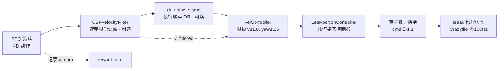
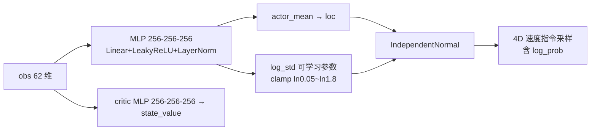

# OmniDrones 项目功能总结

> 生成日期：2026-09-08
> 代码基准：分支 `feat/crazyflie-pidrate`，HEAD `1d7e9df` + 工作区未提交修改
> （含 keepout_x 出生走廊、env_design 6×6×3 迁移、T1000、geo3 等最新进展）
> 范围：以本项目主线（NavVel 避障导航 + CBF 安全层 + Crazyflie）为主，附带
> OmniDrones 原生框架概览；sim2real 部署部分仅简述现状。
> 相关设计文档：`new_reward.md` / `new1_plan.md` / `new2_plan.md` / `m2_plan.md` /
> `m3_plan.md` / `env_design.md` / `arena1_plan.md` / `navvel_rl_interface.md` /
> `simpleflight_migration_guide.md`（均在 `drones/` 目录）。

---

## 0. 项目定位与总体架构

### 0.1 框架底座：OmniDrones（原生能力）

本仓库是 [OmniDrones](https://github.com/btx0424/OmniDrones)（Botian Xu 等，
多旋翼强化学习平台）的一个本地 fork，已移植到 **Isaac Sim 5.1 + RTX 5090
(Blackwell, SM120)**。框架原生提供：

- **仿真底座**：基于 Isaac Sim 的多无人机并行仿真（GridCloner 场景复制、
  ArticulationView/RigidPrimView 批量读写、`sim.dt` 可配、headless/渲染双模）；
- **机器人模型**（`omni_drones/robots/drone/`）：Firefly、Hummingbird、Neo11、
  Crazyflie 等多旋翼，YAML 参数化（质量/惯量/旋翼构型/推力常数）+ USD 资产；
- **执行器模型**（`actuators/rotor_group.py`）：旋翼推力一阶滞后
  （`time_constant`）、噪声注入、油门→推力换算；
- **控制器库**（`controllers/`）：LeePosition / Attitude / Rate 及 Transform
  封装（`utils/torchrl/transforms.py` 的 RateController/AttitudeController 等）；
- **RL 算法库**（`learning/`）：HAPPO、MAPPO、MATD3、TD3、SAC、DQN、QMIX、TDMPC，
  以及单智能体 PPO（本项目的核心算法）；
- **基准任务**（`envs/`）：Hover、FlyThrough、Track、Pinball、Forest、Payload、
  Transport、Formation、InvPendulum 等（多为多智能体 benchmark）。

### 0.2 本项目主线：NavVel 避障导航 + CBF 安全层

在框架之上，本项目开发了单智能体任务 **NavVel**（`envs/single/nav_vel.py`）：
**Crazyflie 微型四旋翼在 6×6×3 m 房间内，以速度指令飞往随机/固定目标点，
在静态球形障碍场中安全导航**。核心诉求是「障碍避让能力可安全部署」
（借鉴 CBF-RL 论文路线，见 `drones/MinerU_markdown_Yang_等_-_2026_-_CBF-RL...md`）。

配套自研/新增模块：

| 模块 | 文件 | 职责 |
|---|---|---|
| 任务环境 | `omni_drones/envs/single/nav_vel.py` | 任务逻辑、obs、reward、终止、课程、统计 |
| 障碍管理 | `envs/single/nav_vel_obstacles.py` | 纯 torch 球形障碍几何 + 布局采样 + obs 编码 |
| CBF 安全层 | `omni_drones/utils/cbf.py` | 速度域一阶 CBF：滤波器、违例量、奖励核心、Transform |
| 课程调度 | `omni_drones/utils/nav_curriculum.py` | 障碍密度自驱课程（纯逻辑，CPU 可测） |
| 任务配置 | `cfg/task/NavVel.yaml` | 全部任务/障碍/CBF/课程/奖励开关 |
| 训练入口 | `scripts/train.py` | PPO 训练 + 动作链装配（CBF/DR/控制器） |
| 评估入口 | `scripts/eval_ckpt.py` | 确定性评估、严格单命验收、扰动鲁棒、归因 |
| GUI 演示 | `scripts/demo_fly.py`、`record_fly.py`、`vis_traj.py` | 实飞演示/录屏/轨迹可视化 |
| 单元测试 | `scripts/cbf_test.py`、`obstacle_geometry_test.py`、`arena1_layout_check.py` | 纯 CPU 回归测试 |
| 低层控制器 | `controllers/cf2x_pid.py`、`lee_position_controller.py` | 真机同源控制器（sim2real） |

**控制动作链**（训练/评估共用，`train.py`/`eval_ckpt.py` 中以 torchrl
`Compose` 逆序装配）：

另有第二条**真机同源管线**（`action_transform=PIDrate`，从 SimpleFlight 移植）：
策略输出 CTBR（机体角速度指令 + 集合推力）→ `PIDRateController` 速率环 PID →
按固件语义（PWM 2^16）分配到四旋翼，供 sim2real 迁移使用（见第 2 节）。

---

## 1. 大模块一：RL 训练

### A. Obstacle Perception System（障碍感知系统）

障碍逻辑完全由 **`nav_vel_obstacles.py`（ObstacleManager）** 承担：
**纯 torch 张量运算、零 Isaac 依赖、CPU 可单测**——这是刻意设计：将来把
真值感知替换为雷达/相机估计时，只需替换此模块，环境/CBF/奖励不动。

**球形障碍模型**（三维，借鉴 NavRL/kaiwu 思路）：

- 障碍 i = 球（球心 `p_oi` + 逻辑半径 `r_o`，从多档 `[0.20, 0.30, 0.40]` 随机取）；
- 无人机视为半径 `drone_radius=0.15` + 膨胀 `inflation=0.05` 的球；
- **判定半径** $r_s = r_o + r_{drone} + inflation$；
- **表面净空** $d_i = \|p - p_{oi}\| - r_s$（>0 在外、<0 侵入）；
- **碰撞判定**：$d_{min} < collision\_margin(0.05)$（几何接触边沿）；
- **危险区**：$d_{min} < danger\_radius(0.6)$（进入即触发 log 距离惩罚 / 近障减速）。

**观测窗口（obs sliding window）**：

- 场景障碍数 `num_scene`（M，物理缓冲/prim 数）与 obs 槽位 `max_slots`（K=8）解耦；
- M>K 时每步实时取「距无人机最近的 K 个」按距离升序填入 → **obs 恒 62 维**，
  而碰撞/奖励/CBF 作用于全部 M 个障碍；
- 每槽编码：`[相对位置 rpos_xyz/5 clamp[-1,1], 逻辑半径 r_o/0.5 clamp[0,1]]`，
  无效槽补零；**策略观测只用几何半径，刻意不含 CBF 半径**（防过拟合滤波器内部参数）。

**布局采样（`sample_layout`）与可达性保证**：

- jittered 网格候选池 + 全环境向量化贪心选择；
- 硬约束：起/终点净空（`dist(障碍, 起点) ≥ r_s + init_clearance` 等，
  保证出生不在球内、目标保持区不被吞）、障碍互距
  （`dist(oi,oj) ≥ r_oi + r_oj + min_gap_between`）；
- 失败按 `spawn_relax` 逐轮放松 + 兜底 fallback（保证起点硬净空）；
- **keepout_x 出生走廊净空**（2026-09-08 新增）：障碍逻辑球面 x 不越过
  `|x| ≤ keepout_x(2.5)`（球心随半径收窄 `|x| ≤ keepout_x − r_o`），
  保护 x=±2.8 出生线。

**物理 prim 一致性**：物理球半径固定为最大档 0.4（免 reset 时改 USD 半径），
逻辑半径 ≤ 物理 → 几何判定先于物理接触；未激活槽位停放到 z=−100。

**obs 结构级安全通道（New2 改造）**：`task.obstacle.obs_safety = none |
clearance | cbf_margin | both`，在障碍块后追加标量通道（obs 62→63/64 维）：

- `clearance`：最小表面净空 `min_i d_i`；
- `cbf_margin`：**CBF 边界余量** $h = d_{min} - cbf\_extra$（0 穿越点 =
  CBF 滤波器介入边界）→ 策略在 obs 层学到「看到 h 收紧就提前减速/绕行」
  （介入前预测性特征，治事后惩罚梯度稀释问题）；
- 均为**纯几何量**，训练/部署同源，不依赖滤波器在线（sim2real 只需障碍位置可复算）。

### B. Reinforcement Learning Formulation

#### 训练环境

- **并行度**：`num_envs=1024`（GridCloner 复制，全 GPU 批量仿真）；
- **控制/仿真频率**：`sim.dt=0.01`（100 Hz，与 Crazyflie 真机一致）；
- **episode 长度**：`max_episode_length=1000`（当前工作区，10 s；历史曾为 600，
  换 T 会改 time_encoding 语义，旧 ckpt 不可 warm 续）；
- **任务空间**：6×6×3 m 房间（箱式越界 `arena_bound=[3,3]` + z≤3，与圆形
  `bound_xy` 为「或」关系）；
- **起终点采样 `episode_sampler`**：
  - `edge`（当前默认）：start 恒在 x=−2.8 线（左）、target 恒在 x=+2.8 线（右），
    y∈[−2.8,2.8]、z∈[0.4,2.4] 随机 → 每局必横穿场地中央，防「贴边逃逸不避障」；
  - `uniform`：全范围随机（旧默认，向后兼容）；
  - `fixed_init`/`fixed_target` 非 None 时恒优先（常量，eval 用，
    如 start(−2.8,0,0.5)→goal(2.8,0,1.0)）。
- **生命制**：当前默认**严格单命**（`soft_respawn=false` +
  `max_collisions=1`：坠地/OOB/碰撞一次即 terminated 不复活，与验收同构）；
  历史保留 soft_respawn 多命模式 + `reward_respawn_penalty`（每丢一条命扣一次罚）。

#### Observation / State / Action

**Observation（策略输入，62 维默认，向量化、环境系、平移不变）**：

| 块 | 维度 | 内容 |
|---|---|---|
| rpos | 3 | 目标相对位置（target − drone） |
| drone_state | 20 | 四元数 4 + 线速度（世界+机体系 6）+ 机头方向 3 + 机体 up 3 + 油门 4 |
| rheading | 3 | 目标朝向 − 机头朝向 |
| time_encoding | 4 | 进度 t/T 扩展（4 个相同值） |
| obstacle block | 32 | 最近 8 障碍 × [相对位置 3 + 半径 1]，归一化截断 |
| （可选）安全通道 | 0~2 | `obs_safety` 追加 clearance/cbf_margin 标量 |

**State / info（环境内状态与控制器/滤波器输入，非策略直接输入）**：

- `info.drone_state`（13）：位置 3 + 四元数 4 + 速度 6（供控制器 Transform）；
- `info.prev_action` / `info.policy_action`（4）：上一步指令 / 滤波前策略指令
  （供动作平滑惩罚与 CBF 奖励核心）；
- `info.obstacle_cbf`（M,4）：全部场景障碍 `[p_oi(3), r_si^cbf(1)]`，CBF 滤波器
  对**全部 M** 障碍安全（不只看 obs 窗口 K）；
- `intrinsics`（特权信息，priv 网络可选）：mass/inertia/com/KF/KM/tau_up/
  tau_down/drag_coef。

**Action（4D 连续）**：`[vx, vy, vz, yaw]` 世界系速度指令 + 目标偏航角，
由 `VelController` 限幅（`max_vel=1.8 m/s`、`max_yaw_rate=1.5 rad/s`）后交给
Lee 位置控制器。策略分布输出先经 CBF 滤波（可选）、再经 DR 噪声（可选）、
再限幅。动作层是速度指令（而非油门）是 CBF 可以附着的关键设计。

#### Reward 设计

奖励由 `task.reward_scheme` 选择主基座（四套并存、默认 legacy 逐位兼容），
再叠加通用可选项与障碍/CBF 项。以下按代码实际分支列出：

**（1）主基座四方案**

- **`legacy`（Hover 常驻版）**：
  $r = r_{pos} + r_{pos}\cdot(r_{up} + r_{spin}) + r_{effort} + r_{smooth} + r_{arrive} + r_{PBRS}$
  其中 $r_{pos}=1/(1+(k\|[rpos, rheading]\|)^2)$ 是位置势场（Hover 风格稠密基座）。
- **`navgoal`（论文式纯 motion）**：progress 势差 + time-scaled 到达，
  删除 Hover 常驻正基座（悬停=0、只有接近才得分）。
- **`r1`（motion-gated 接近引导）**：
  $w_g\cdot\frac{\text{relu}(v\cdot\hat{u}_{goal})}{v_{max}}\cdot\frac{1}{1+(k\cdot d)^2}$
  —— 仅「正朝目标运动」才按接近势给正，悬停/远离=0，越近越强。
- **`f1`（无核飞行主导，当前主线方案）**：
  $r = w_f\cdot\frac{\text{relu}(v\cdot\hat{u}_{goal})}{v_{max}} + r_{arrive}$
  —— 去掉距离核（远端=近端同强，治「起飞吸引力不够」）。可选扩展：
  - `reward_zone_weight` 圈内引导：进 `arrive_radius` 圈内把 fly 项替换为
    $w_f + k_{in}(1-d/R)$（边界连续无悬崖、随 d↓ 单调增，治「贴圈不进圈」）；
  - `reward_pbrs_weight>0` 时叠加 PBRS 距离势差；
  - `reward_time_cost` 每步时间成本（治 loiter）。

**（2）通用可选项**

- **到达**：`‖rpos‖<arrive_radius(0.5)` 连续保持 `arrive_hold_steps(50)` 步才判
  「到达」（防瞬时擦圈）；`arrive_bonus` 一次性奖励；
  `arrive_time_bonus` time-scaled 到达奖励 $w_t(1-t_{arr}/T)$（navgoal/r1/f1 可用）；
  `success_terminate=false`（到达不终止，继续飞满窗口，曾到达即锁存）。
- **PBRS**：$w(d_{t-1}-\gamma d_t)$，γ=0.995；重生/重置时 rebase 基线。
- **动作平滑**（navgoal/r1/f1）：$-w_s\|a_t - a_{t-1}\|^2$，作用在**速度指令层**
  （policy_action 差分），非油门层。
- **失败/时间惩罚**（可选开关，默认 0）：crash / oob / timeout 一次性罚、
  early-death 反比放大、respawn 罚。
- **Hover 遗留项**（legacy 用）：effort 指数项、up 姿态项、spin 转速项。

**（3）障碍项（ObstacleManager 几何驱动）**

- **log 距离惩罚**：危险区 0<d≤D 内 $-\lambda_{log}\log(d/D)$、侵入球内强罚
  （$+100d$ 梯度），对活动槽求和；
- **碰撞边沿一次性罚**：仅新进入接触（`new_edge`）扣 `reward_collision_edge`
  （每步 O(1) 量级，避免大惩罚把 return 打到极端）；
- **近障朝障飞减速**：$-\lambda_{slow}\cdot v_{\parallel}\cdot(1-d/D)$，
  只罚朝最近障碍的径向速度分量（近障区域）。

**（4）CBF 奖励核心（详见 D 节）**：violation / correction / gaussian / dual
四种 `penalty_src` + h 边界余量罚，均作用于滤波前策略指令 `v_nom`。

#### 终止与课程

- **terminated**：crash（z<z_min 或 NaN）/ OOB（箱式或圆形边界、z>z_max）/
  碰撞超限（单命=首碰）；soft_respawn 多命模式下改为原地重生；
- **truncated**：达到 `max_episode_length`；`success_terminate=true` 时到达即终；
- **终止原因归因 `term_cause`**：1=crash / 2=oob / 3=collide / 4=超时未到 /
  5=到达，供 eval 归因诊断（单命下有效）。
- **自驱课程 `ObstacleCurriculum`**（纯逻辑、环境内、CPU 可测）：
  - 全局单一 level（所有 env 同密度），levels 如 `[2,4,8,12,16]`；
  - 滚动窗口（3000 episodes）统计 **success = 本窗曾到达 ∧ 全窗 0 碰撞边沿**；
  - 升档门槛：success_rate ≥ 0.8 且 collision_rate ≤ 0.05 且距上次升档
    `min_frames=2M` 环境帧；
  - 可选 **margin gate**（New2/E3）：还需窗口 `margin_ok_rate ≥ margin_frac`
    （margin_ok = 整窗表面净空 ≥ 0.1 ≈ 从未进入 CBF filter 介入区，
    =「策略自己守边界」的 internalize 语义）；可选 allow_demote 降档。

#### 评估环境（eval_ckpt.py）

- **确定性 rollout**（`ExplorationType.MODE` 取均值）、无 reset 整窗跑
  `+rollout_steps`（须与训练 T 一致）；
- **严格单命验收口径**（模板已固化在脚本头部）：固定起终点
  `start(-2.8,0,0.5)→goal(2.8,0,1.0)`，`task.soft_respawn=false`，
  指标 = arrival（曾到达且保持 50 步）/ coll（曾发生接触边沿）/
  joint（到达 ∧ 0 碰撞）；
- **`+eval_points=fixed|train`**：固定点验收 vs 训练同分布（edge 随机起终点）
  泛化评估；
- **`+runtime_filter=true|false`**：带/撤 CBF 滤波器部署对照（internalize 判据）；
- **扰动鲁棒**：`+perturb=cmd_gauss|cmd_pulse`（策略指令注入高斯噪声/阵风脉冲，
  测滤波器吸收不安全指令的能力）；
- 未到达 env 的终止原因归因打印；`demo_fly.py` 提供 GUI 实飞（俯瞰/跟随相机、
  轨迹拖影、多 ckpt 轮换）。

### C. Network Design and Policy Training

**网络结构（PPO，`learning/ppo/ppo.py`，torchrl 架构）**：

- **Actor**：共享特征 MLP `[256,256,256]`（LazyLinear + LeakyReLU + LayerNorm）
  → 均值头 + 独立可学习 `log_std`（**clamp ∈ [ln0.05, ln1.8]**，2026-09-08 新增，
  防熵暴涨把均值学习信号淹没）；
- **分布**：`IndependentNormal`（对角高斯）；
- **Critic**：同构 `[256,256,256]` → 单值输出；
- **可选特权网络**（`priv_actor`/`priv_critic`）：obs 特征 `[128,128]` +
  intrinsics 上下文 `[64,64]` 拼接 → `[256,256]` 头（NavVel 默认不用）；
- 正交初始化（gain 0.01）。

**训练流程（`scripts/train.py` + PPO）**：

- GAE(γ=0.99, λ=0.95)、clip 0.1、value 损失 Huber(delta=10) + 双裁剪、
  `ValueNorm1` 回报归一化、Adam lr=5e-4、梯度裁剪 5；
- 采样 `train_every=32` 步 × 1024 env = 每 batch 32768 帧、`ppo_epochs=4`、
  `num_minibatches=16`；
- `entropy_coef` 可配置（默认 0.001，抗熵塌缩场景常调到 0.01~0.05）；
- **warm-start**：`algo.checkpoint_path`（PPO 加载）与 `+init_ckpt`
  （2026-09-08 新增，policy state_dict 续训，用于 8→16 障升密度迁移）；
- `SyncDataCollector` 采样 + `EpisodeStats` 窗口统计 + wandb 记录；
  `render_eval=false` 关闭最终渲染 eval（多臂并行时防 OOM）；
  `save_interval` 定期存 ckpt（`checkpoint_<frames>.pt` / `checkpoint_final.pt`）；
- 经验性要点（已固化在代码注释/日志中）：熵塌缩后须从未塌缩早期 ckpt warm +
  提熵重训；std clamp 保证探索有界；CBF/动作层各处的 `max_vel` 限幅防止无界
  高斯采样污染滤波与违例统计。

### D. CBF 部分（控制屏障函数安全层）

**数学（速度指令层的一阶 CBF，静态障碍 $v_o=0$）**，见 `utils/cbf.py`：

$$
h_i(p) = \|p-p_{oi}\| - r_{si}^{cbf},\quad
\dot{h}_i = n_i^\top v,\quad
n_i^\top v + \alpha h_i \ge 0
$$

其中 CBF 决策半径在几何判定半径之上再加净空：

$$
r_{si}^{cbf} = r_{si} + r_{safety\_margin}(0.1) + \underbrace{v_{max}^2/(2a_{max})}_{\text{制动余量（可关）}}
$$

（速度指令→Lee 控制器存在滞后，制动项为内环追赶留余量。）

**核心组件**：

- **`filter_velocity`**：把策略标称指令投影到各激活半平面交集中——
  **迭代闭式求解**（每轮只修正违约最严重的那个约束，`filter_iterations=3`），
  即 CBF-RL 针对多障碍物的离散闭式滤波器；
- **`cbf_violation`**：滤波**前**指令的总违例量 $\sum_i \min(0, n_i^\top v_{nom} + \alpha h_i)$
  （+ 可选侵入项 $\min(0,h_i)$），供奖励核心（soft-CBF）；
- **`CBFVelocityFilter`（Transform）**：装配在 `VelController` 之前
  （Compose 逆序），只投影平动 3 维（yaw 不动），并把滤波前指令写入
  `info.policy_action`；先 clamp ±v_max 再投影；`filter_grad=detach`。
- **`CmdGaussNoise`（M3-B DR）**：CBF 投影**之后**注入高斯速度噪声
  （`dr_noise_sigma`，论文式 20%·v_max），滤波器先保安全、噪声再打偏执行 →
  策略学会留裕量；
- **`h_boundary_penalty`**（New2/E1-v2）：$w_h\cdot\text{relu}(buffer - h)$，
  buffer=0 只罚已进滤波器决策区（h<0），buffer>0 提前在接近边界前开罚
  （软墙，类 CBF 版近障减速）。

**四臂对照 `cbf.mode`（与 CBF-RL 论文一致）**：

| mode | 运行时滤波 | 奖励核心 | 语义 |
|---|---|---|---|
| `none` | ✗ | ✗ | 纯 PPO（naive 基线） |
| `filter_only` | ✓ | ✗ | 只滤波不奖励 |
| `reward_only` | ✗ | ✓ | 只罚违例不滤波 |
| `hybrid` | ✓ | ✓ | 滤波 + 奖励核心（论文主线） |

**`penalty_src` 四种奖励核心（罚的对象）**：

- `nominal`：罚原始指令违例量 $w_1\cdot viol(v_{nom})$（原版 soft-CBF）；
- `correction`：罚滤波器实际纠偏量 $\|v_{filtered}-v_{nom}\|$（滤波没拦就不罚 →
  逼策略学「安全近穿」而非「保守绕行」）；
- `gaussian`：论文式高斯饱和核 $w_1(1-e^{-\|corr\|^2/\sigma^2})$（大纠偏饱和，
  治强 shaping 下线性罚过拽）；
- `dual`：**CBF-RL 论文式两项相加** $w_1\cdot viol(v_{nom}) +
  w_2(1-e^{-\|corr\|^2/\sigma^2})$（nominal viol 项 + gaussian correction 项
  同时启用，目标=训练中滤波让策略 internalize 安全、部署可免 runtime filter）。

**安全边界信息流**：障碍几何（pos/radius/active）经 `info.obstacle_cbf` 同时
供滤波器与奖励核心，obs/碰撞/奖励/CBF 共用同一数据源（ObstacleManager）；
CBF 半径刻意不进策略观测。

---

## 2. 大模块二：sim2real 部署（简述现状）

当前**尚未实机落地**（仓库内无板载部署节点/通信栈代码），仿真侧已完成
面向部署的准备，要点如下：

- **真机同源低层控制器**：
  - `cf2x_pid.py` 的 `DSLPIDControl` 与 SimpleFlight 参考工程逐字节一致
    （真机固件语义的位置环 PID）；
  - `PIDRateController` / `PID_controller_flightmare` 从 SimpleFlight 移植
    （CTBR 速率指令 + 机体角速度环 PID + 固件 PWM 分配 2^16 语义，
    含 `debug_step` 真机调试入口）——即 `action_transform=PIDrate` 管线；
  - `lee_controller_crazyflie.yaml`：Lee 控制器 Crazyflie 专用增益
    （已按小惯量重标定 attitude/angular-rate 增益，修复「照抄 Hummingbird 增益
    导致姿态环饱和坠落」的根因，见 m1 提交记录）。
- **真机 SysID 参数**：`crazyflie.yaml` 使用 Crazyflie 实测物理参数
  （mass 0.0321、惯量 1.4e-5、旋翼力/力矩常数、电机时间常数、推力限幅等），
  控制频率 100 Hz 与真机一致。
- **CBF 滤波器可直接迁移**：滤波是「位置 + 速度指令」的纯代数投影，真机部署
  只需障碍位置估计（定位/测距/雷达），且策略 obs 只含纯几何量、不依赖滤波器
  内部参数 → 训练/部署分布同源（New2 obs_safety 通道即为此设计）。
- **鲁棒性准备**：训练侧 DR 噪声（`dr_noise_sigma`）+ 评估侧扰动注入
  （`+perturb`）+ 严格单命验收口径，量化「策略+运行时滤波器」在指令扰动下的
  安全表现。
- **参考工程（`refs/`）**：`SimpleFlight`（低层控制器迁移源）、
  `crazyswarm2_kaiwu`（真机集群/通信参考）、`NavRL`（6×6×3 场景设计迁移源）。

---

## 3. 代码地图速查

| 关注点 | 入口 |
|---|---|
| 任务/obs/reward/终止/统计 | `omni_drones/envs/single/nav_vel.py` |
| 障碍几何/布局/obs 编码 | `omni_drones/envs/single/nav_vel_obstacles.py` |
| CBF 滤波/违例/奖励核心 | `omni_drones/utils/cbf.py` |
| 密度课程 | `omni_drones/utils/nav_curriculum.py` |
| 全部配置开关 | `cfg/task/NavVel.yaml` |
| PPO 网络与训练 | `omni_drones/learning/ppo/ppo.py` + `scripts/train.py` |
| 验收/扰动/归因评估 | `scripts/eval_ckpt.py` |
| GUI 实飞演示 | `scripts/demo_fly.py` |
| CPU 回归测试 | `scripts/cbf_test.py`、`scripts/obstacle_geometry_test.py`、`scripts/arena1_layout_check.py` |
| 控制器（Lee/PID/DSL） | `omni_drones/controllers/`、`cfg/lee_controller_crazyflie.yaml` |
| 机器人物理参数 | `omni_drones/robots/assets/usd/crazyflie.yaml` |
